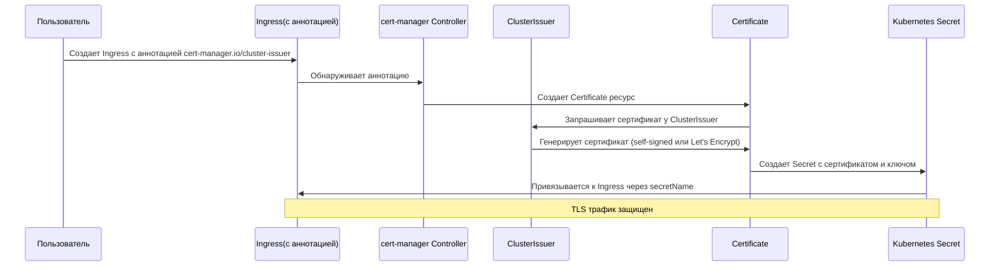

# cert-manager ArgoCD Application

Этот каталог содержит конфигурацию для развертывания cert-manager через ArgoCD.

<details>
<summary><strong>🚀 Быстрый старт</strong></summary>

---

**Минимальные шаги для развертывания cert-manager:**

1. **Примените ArgoCD Application:**
   ```bash
   kubectl apply -f argocd-apps/cert-manager/cert-manager.yaml
   ```

2. **Дождитесь готовности подов:**
   ```bash
   kubectl wait --for=condition=ready pod -l app.kubernetes.io/instance=cert-manager -n cert-manager --timeout=300s
   ```

3. **Создайте ClusterIssuer:**
   ```bash
   kubectl apply -f argocd-apps/cert-manager/clusterissuer-selfsigned.yaml
   ```

4. **Проверьте статус:**
   ```bash
   kubectl get clusterissuer selfsigned-issuer
   kubectl get pods -n cert-manager
   ```

📋 **Детальные инструкции:** см. секции ниже

</details>

<details>
<summary><strong>📋 Описание и компоненты</strong></summary>

---

**cert-manager** - это автоматический менеджер TLS сертификатов для Kubernetes. Он позволяет автоматически получать, обновлять и управлять TLS сертификатами из различных источников (Let's Encrypt, self-signed, внутренние CA и т.д.)

### Основные компоненты

- **cert-manager controller** - основной контроллер, управляющий сертификатами
- **cainjector** - внедряет CA сертификаты в веб-хуки и API сервер
- **webhook** - валидирует и мутирует ресурсы cert-manager

### Процесс получения сертификата



</details>

<details>
<summary><strong>📋 Структура файлов</strong></summary>

---

```
cert-manager/
├── cert-manager.yaml                   # ArgoCD Application для cert-manager
├── clusterissuer-selfsigned.yaml       # ClusterIssuer для self-signed сертификатов
├── clusterissuer-application.yaml      # ArgoCD Application для ClusterIssuer (опционально, требуется git-репозиторий)
└── README.md                           # Этот файл
```

</details>

<details>
<summary><strong>📋 Предварительные требования</strong></summary>

---

1. **Kubernetes кластер версии 1.23+**
   ```bash
   kubectl version --short
   ```

2. **ArgoCD установлен и настроен**
   ```bash
   kubectl get pods -n argocd
   ```

3. **k3s с Traefik Ingress** (k3s использует Traefik по умолчанию)
   ```bash
   kubectl get ingressclass
   # Должен быть ingressclass traefik
   ```

</details>

<details>
<summary><strong>⚙️ Установка: 1. Развертывание cert-manager</strong></summary>

---

Примените ArgoCD Application для cert-manager:

```bash
kubectl apply -f argocd-apps/cert-manager/cert-manager.yaml
```

### 2. Проверка статуса развертывания

```bash
# Проверить статус Application в ArgoCD
kubectl get application cert-manager -n argocd

# Проверить поды cert-manager
kubectl get pods -n cert-manager

# Детальная информация о подах
kubectl get pods -n cert-manager -o wide
```

Ожидаемый результат - все поды в состоянии `Running`:

```
NAME                                       READY   STATUS    RESTARTS   AGE
cert-manager-xxxxxxxxxx-xxxxx             1/1     Running   0          2m
cert-manager-cainjector-xxxxxxxxxx-xxxxx  1/1     Running   0          2m
cert-manager-webhook-xxxxxxxxxx-xxxxx     1/1     Running   0          2m
```

### 3. Проверка CRD

cert-manager устанавливает Custom Resource Definitions (CRD):

```bash
# Проверить установленные CRD
kubectl get crd | grep cert-manager

# Должны быть установлены:
# - certificates.cert-manager.io
# - certificaterequests.cert-manager.io
# - issuers.cert-manager.io
# - clusterissuers.cert-manager.io
# - challenges.acme.cert-manager.io
# - orders.acme.cert-manager.io
```

</details>

<details>
<summary><strong>⚙️ Установка: 2. Настройка ClusterIssuer</strong></summary>

---

ClusterIssuer - это кластерный ресурс, который настраивает cert-manager для генерации сертификатов. ClusterIssuer доступен во всех namespace кластера.

### Self-signed сертификаты (для тестовой среды)

Self-signed сертификаты не требуют доступа к интернету и подходят для тестовой среды.

#### Вариант 1: Ручное применение (рекомендуется)

```bash
# 1. Дождитесь готовности cert-manager
kubectl wait --for=condition=ready pod -l app.kubernetes.io/instance=cert-manager -n cert-manager --timeout=300s

# 2. Примените ClusterIssuer
kubectl apply -f argocd-apps/cert-manager/clusterissuer-selfsigned.yaml

# 3. Проверьте статус
kubectl get clusterissuer selfsigned-issuer
```

#### Вариант 2: Через ArgoCD Application (требует Git репозиторий)

Если у вас настроен Git репозиторий в ArgoCD:

1. Обновите `repoURL` в `clusterissuer-application.yaml`
2. Примените Application:
   ```bash
   kubectl apply -f argocd-apps/cert-manager/clusterissuer-application.yaml
   ```

### Let's Encrypt сертификаты (для production)

Для production окружения рекомендуется использовать Let's Encrypt. Создайте ClusterIssuer для Let's Encrypt:

```yaml
apiVersion: cert-manager.io/v1
kind: ClusterIssuer
metadata:
  name: letsencrypt-prod
spec:
  acme:
    server: https://acme-v02.api.letsencrypt.org/directory
    email: your-email@example.com  # Замените на ваш email
    privateKeySecretRef:
      name: letsencrypt-prod
    solvers:
    - http01:
        ingress:
          class: traefik
```

**Важно:** Для Let's Encrypt требуется:
- Доступность домена из интернета
- Правильная настройка DNS
- Доступность на портах 80/443 для HTTP-01 challenge

</details>

<details>
<summary><strong>💡 Использование с приложениями</strong></summary>

---

### GitLab

GitLab настроен для использования cert-manager через аннотацию в Ingress:

```yaml
global:
  hosts:
    https: true
  ingress:
    annotations:
      cert-manager.io/cluster-issuer: "selfsigned-issuer"
      traefik.ingress.kubernetes.io/router.entrypoints: web,websecure
      traefik.ingress.kubernetes.io/router.tls: "true"
    ingressClassName: traefik
    tls:
      enabled: true
```

После развертывания GitLab cert-manager автоматически:
1. Создаст Certificate ресурс
2. Сгенерирует TLS сертификат
3. Создаст Secret с сертификатом
4. Привяжет сертификат к Ingress

### Rancher

Для включения TLS в Rancher обновите конфигурацию:

```yaml
ingress:
  annotations:
    cert-manager.io/cluster-issuer: "selfsigned-issuer"  # или "letsencrypt-prod"
  tls:
    enabled: true
    source: secret
    secretName: rancher-tls
```

### Другие приложения

Для любого приложения с Ingress добавьте аннотацию:

```yaml
apiVersion: networking.k8s.io/v1
kind: Ingress
metadata:
  name: my-app
  annotations:
    cert-manager.io/cluster-issuer: "selfsigned-issuer"
spec:
  tls:
  - hosts:
    - my-app.lab-home.com
    secretName: my-app-tls
  rules:
  - host: my-app.lab-home.com
    http:
      paths:
      - path: /
        pathType: Prefix
        backend:
          service:
            name: my-app
            port:
              number: 80
```

</details>

<details>
<summary><strong>🔍 Проверка работы</strong></summary>

---

### Проверка ClusterIssuer

```bash
# Список всех ClusterIssuer
kubectl get clusterissuer

# Детали ClusterIssuer
kubectl describe clusterissuer selfsigned-issuer
```

### Проверка Certificate

После создания Ingress с аннотацией cert-manager автоматически создаст Certificate:

```bash
# Список всех Certificate
kubectl get certificate -A

# Детали Certificate
kubectl describe certificate <certificate-name> -n <namespace>
```

### Проверка Secret с сертификатом

```bash
# Список TLS секретов
kubectl get secret -A | grep tls

# Детали секрета
kubectl describe secret <tls-secret-name> -n <namespace>

# Просмотр сертификата
kubectl get secret <tls-secret-name> -n <namespace> -o jsonpath='{.data.tls\.crt}' | base64 -d | openssl x509 -text -noout
```

### Проверка Ingress

```bash
# Проверить Ingress с TLS
kubectl get ingress -A

# Детали Ingress
kubectl describe ingress <ingress-name> -n <namespace>
```

</details>

<details>
<summary><strong>🔧 Устранение неполадок</strong></summary>

---

### cert-manager не запускается

**Симптомы:**
```bash
kubectl get pods -n cert-manager
# Поды в состоянии Pending или CrashLoopBackOff
```

**Решение:**
```bash
# Проверить события
kubectl get events -n cert-manager --sort-by='.lastTimestamp'

# Проверить логи пода
kubectl logs -n cert-manager <pod-name>

# Проверить ресурсы кластера
kubectl top nodes
```

### ClusterIssuer не создается

**Симптомы:**
```bash
kubectl get clusterissuer
# ClusterIssuer отсутствует или в состоянии не Ready
```

**Решение:**
```bash
# Проверить, что cert-manager установлен
kubectl get pods -n cert-manager

# Проверить CRD
kubectl get crd clusterissuers.cert-manager.io

# Проверить события
kubectl describe clusterissuer selfsigned-issuer
```

### Certificate не создается или не Ready

**Симптомы:**
```bash
kubectl get certificate -A
# Certificate в состоянии False (не Ready)
```

**Причина:** Certificate не может быть создан или Secret имеет несоответствие.

**Решение:**
```bash
# 1. Проверить аннотацию в Ingress
kubectl get ingress <ingress-name> -n <namespace> -o yaml | grep cert-manager

# 2. Проверить события Certificate
kubectl describe certificate <certificate-name> -n <namespace>

# 3. Проверить CertificateRequest (если создан)
kubectl get certificaterequest -A
kubectl describe certificaterequest <request-name> -n <namespace>
```

### Certificate не Ready из-за несоответствия Secret

**Симптомы:**
```bash
kubectl describe certificate <certificate-name> -n <namespace>
# Ошибка: "existing private key in Secret does not match requirements"
# или "Secret was previously issued by different Issuer"
```

**Причина:** Secret был создан другим Issuer или имеет несоответствие в размере приватного ключа.

**Решение:**
```bash
# 1. Удалить старые TLS секреты
kubectl delete secret <tls-secret-name> <tls-secret-name>-ca <tls-secret-name>-chain -n <namespace>

# 2. Дождаться автоматического пересоздания (cert-manager создаст новые секреты)
kubectl get certificate <certificate-name> -n <namespace> -w

# 3. Проверить статус (должен стать Ready)
kubectl get certificate <certificate-name> -n <namespace>
```

**Пример для GitLab:**
```bash
# Удалить старые секреты GitLab
kubectl delete secret gitlab-wildcard-tls gitlab-wildcard-tls-ca gitlab-wildcard-tls-chain -n gitlab

# Проверить статус Certificate (должен автоматически пересоздаться)
kubectl get certificate gitlab-wildcard-tls -n gitlab
```

### Сертификат не обновляется

**Симптомы:**
Сертификат истек или не обновляется автоматически.

**Решение:**
```bash
# Проверить статус Certificate
kubectl describe certificate <certificate-name> -n <namespace>

# Проверить срок действия сертификата
kubectl get secret <tls-secret-name> -n <namespace> -o jsonpath='{.data.tls\.crt}' | base64 -d | openssl x509 -noout -dates

# Принудительно обновить Certificate (удалить и пересоздать)
kubectl delete certificate <certificate-name> -n <namespace>
# cert-manager автоматически создаст новый
```

### Ошибка веб-хука

**Симптомы:**
```
Error: Internal error occurred: failed calling webhook
```

**Решение:**
```bash
# Проверить веб-хук cert-manager
kubectl get validatingwebhookconfiguration | grep cert-manager
kubectl get mutatingwebhookconfiguration | grep cert-manager

# Проверить под веб-хука
kubectl get pods -n cert-manager -l app.kubernetes.io/component=webhook

# Проверить логи веб-хука
kubectl logs -n cert-manager -l app.kubernetes.io/component=webhook
```

</details>

<details>
<summary><strong>⚙️ Конфигурация и ресурсы</strong></summary>

---

### Текущее потребление ресурсов

- **cert-manager controller**: 100m CPU / 128Mi RAM (requests), 500m CPU / 256Mi RAM (limits)
- **cainjector**: 50m CPU / 64Mi RAM (requests), 200m CPU / 128Mi RAM (limits)
- **webhook**: 50m CPU / 64Mi RAM (requests), 200m CPU / 128Mi RAM (limits)

**Итого (requests)**: ~200m CPU, ~256Mi RAM  
**Итого (limits)**: ~900m CPU, ~512Mi RAM

### Изменение ресурсов

Для изменения ресурсов cert-manager отредактируйте `cert-manager.yaml`:

```yaml
helm:
  values: |
    resources:
      requests:
        cpu: 200m      # Увеличьте при необходимости
        memory: 256Mi
      limits:
        cpu: 1000m
        memory: 512Mi
```

### Обновление версии

Измените `targetRevision` в `cert-manager.yaml`:

```yaml
source:
  targetRevision: v1.17.0  # Новая версия
```

ArgoCD автоматически синхронизирует изменения.

</details>

<details>
<summary><strong>🔒 Безопасность</strong></summary>

---

### Self-signed сертификаты

⚠️ **Важно:** Self-signed сертификаты не являются безопасными для production:
- Браузеры будут показывать предупреждения
- Не подходят для публичных сервисов
- Используйте только для тестовой среды

### Let's Encrypt сертификаты

✅ **Для production:**
- Используйте Let's Encrypt для валидных сертификатов
- Настройте правильный DNS
- Обеспечьте доступность домена из интернета
- Используйте rate limits Let's Encrypt аккуратно

</details>

<details>
<summary><strong>⚠️ Важные замечания</strong></summary>

---

1. **Порядок развертывания (КРИТИЧЕСКИ ВАЖНО):**
   - **Шаг 1:** Разверните cert-manager через ArgoCD Application
   - **Шаг 2:** Дождитесь готовности всех подов cert-manager (все в состоянии Running)
   - **Шаг 3:** Создайте ClusterIssuer (selfsigned-issuer или другой)
   - **Шаг 4:** Проверьте, что ClusterIssuer в состоянии Ready
   - **Шаг 5:** Только после этого развертывайте приложения (GitLab, Rancher и т.д.)
   
   ⚠️ **Важно:** Если приложение развернуто ДО создания ClusterIssuer, могут возникнуть проблемы с Certificate. См. раздел "Устранение неполадок" ниже.

2. **ClusterIssuer vs Issuer:**
   - **ClusterIssuer** - кластерный ресурс, доступен во всех namespace
   - **Issuer** - namespace-scoped ресурс, доступен только в своем namespace
   - Для большинства случаев используйте ClusterIssuer

3. **Автоматическое обновление:**
   - cert-manager автоматически обновляет сертификаты перед истечением
   - По умолчанию обновление происходит за 30 дней до истечения

4. **Хранение секретов:**
   - TLS секреты хранятся в Kubernetes Secrets
   - Приватные ключи хранятся в отдельном Secret, указанном в ClusterIssuer

</details>