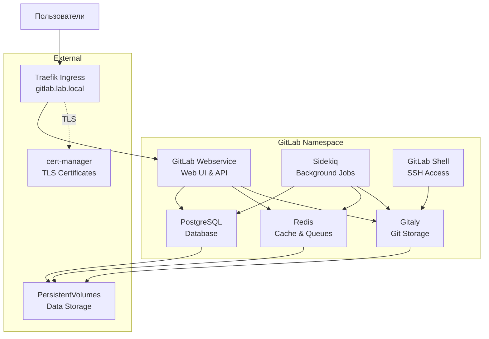

# GitLab ArgoCD Application

Этот каталог содержит конфигурацию для развертывания облегченной версии GitLab через ArgoCD.

**Настроено для k3s с Traefik Ingress и доменом gitlab.lab.local**

<details>
<summary><strong>🚀 Быстрый старт</strong></summary>

---

**Минимальные шаги для развертывания GitLab:**

1. **Настройте StorageClass (если еще не настроен):**
   ```bash
   # Установить local-path-provisioner
   kubectl apply -f https://raw.githubusercontent.com/rancher/local-path-provisioner/v0.0.24/deploy/local-path-storage.yaml
   
   # Установить local-path как StorageClass по умолчанию
   kubectl patch storageclass local-path -p '{"metadata": {"annotations":{"storageclass.kubernetes.io/is-default-class":"true"}}}'
   ```

2. **Разверните cert-manager (обязательно перед GitLab):**
   ```bash
   # Применить cert-manager Application
   kubectl apply -f argocd-apps/cert-manager/cert-manager.yaml
   
   # Дождаться готовности cert-manager
   kubectl wait --for=condition=ready pod -l app.kubernetes.io/instance=cert-manager -n cert-manager --timeout=300s
   
   # Создать ClusterIssuer
   kubectl apply -f argocd-apps/cert-manager/clusterissuer-selfsigned.yaml
   
   # Проверить ClusterIssuer
   kubectl get clusterissuer selfsigned-issuer
   ```

3. **Примените ArgoCD Application для GitLab:**
   ```bash
   kubectl apply -f argocd-apps/gitlab/application.yaml
   ```
   
   После развертывания cert-manager автоматически создаст Certificate на основе аннотаций Ingress.

4. **Примените Certificate с правильными настройками (опционально, если возникли проблемы):**
   ```bash
   # Удалить автоматически созданный Certificate
   kubectl delete certificate gitlab-wildcard-tls -n gitlab
   
   # Применить Certificate с правильной настройкой rotationPolicy
   kubectl apply -f argocd-apps/gitlab/certificate.yaml
   ```

5. **Дождитесь готовности подов (10-20 минут):**
   ```bash
   kubectl get pods -n gitlab -w
   # Все поды должны быть в состоянии Running
   ```

6. **Получите root пароль:**
   ```bash
   kubectl get secret gitlab-gitlab-initial-root-password -n gitlab -ojsonpath='{.data.password}' | base64 -d ; echo
   ```

7. **Войдите в GitLab:**
   - URL: `https://gitlab.lab.local`
   - Username: `root`
   - Password: (из шага 6)

📋 **Детальные инструкции:** см. секции ниже

</details>

<details>
<summary><strong>📋 Описание и компоненты</strong></summary>

---

GitLab - платформа для управления репозиториями и CI/CD. Данная конфигурация предназначена для развертывания облегченной версии GitLab с минимальным потреблением ресурсов.

### Включенные компоненты

- **GitLab Webservice** - основной веб-интерфейс GitLab
- **Sidekiq** - фоновая обработка задач (CI/CD jobs, уведомления)
- **Gitaly** - хранилище Git репозиториев
- **GitLab Shell** - SSH доступ к репозиториям
- **PostgreSQL** - встроенная база данных (можно заменить на внешнюю)
- **Redis** - встроенный кэш и очереди (можно заменить на внешний)

### Отключенные компоненты (для экономии ресурсов)

- **Minio** - объектное хранилище (отключен)
- **Prometheus** - встроенный мониторинг (отключен)
- **Grafana** - визуализация метрик (отключена)
- **Container Registry** - реестр контейнеров (отключен)
- **GitLab Pages** - статический хостинг (отключен)

### Архитектура развертывания



</details>

<details>
<summary><strong>📋 Структура файлов</strong></summary>

---

```
gitlab/
├── application.yaml       # ArgoCD Application манифест с inline Helm values
├── certificate.yaml       # Certificate ресурс для TLS (опционально)
└── README.md              # Этот файл
```

</details>

<details>
<summary><strong>📋 Предварительные требования</strong></summary>

---

1. **Kubernetes кластер версии 1.23+**
   ```bash
   kubectl version --short
   ```

2. **ArgoCD установлен и настроен**
   ```bash
   kubectl get pods -n argocd
   ```

3. **Traefik Ingress установлен** (в k3s установлен по умолчанию)
   ```bash
   kubectl get pods -n kube-system | grep traefik
   ```

4. **StorageClass настроен** для PersistentVolumes
   ```bash
   kubectl get storageclass
   ```

5. **Доступные ресурсы кластера:**
   - Минимум: 4 CPU, 8GB RAM
   - Ожидаемое потребление GitLab: ~1.45 CPU, ~3.0Gi RAM

6. **DNS настроен** для домена `gitlab.lab.local` (или измените в конфигурации)

</details>

<details>
<summary><strong>⚙️ Установка</strong></summary>

---

### 1. Настройка StorageClass

Настройте StorageClass для PersistentVolumes (если еще не настроен):

```bash
# Установить local-path-provisioner
kubectl apply -f https://raw.githubusercontent.com/rancher/local-path-provisioner/v0.0.24/deploy/local-path-storage.yaml

# Установить local-path как StorageClass по умолчанию
kubectl patch storageclass local-path -p '{"metadata": {"annotations":{"storageclass.kubernetes.io/is-default-class":"true"}}}'

# Проверить StorageClass
kubectl get storageclass
```

### 2. Развертывание cert-manager

GitLab требует cert-manager для работы с TLS сертификатами. Разверните cert-manager **до** развертывания GitLab:

```bash
# Применить cert-manager Application
kubectl apply -f argocd-apps/cert-manager/cert-manager.yaml

# Дождаться готовности cert-manager
kubectl wait --for=condition=ready pod -l app.kubernetes.io/instance=cert-manager -n cert-manager --timeout=300s

# Проверить статус подов
kubectl get pods -n cert-manager
```

Ожидаемый результат - все поды в состоянии `Running`:
```
NAME                                       READY   STATUS    RESTARTS   AGE
cert-manager-xxxxxxxxxx-xxxxx             1/1     Running   0          2m
cert-manager-cainjector-xxxxxxxxxx-xxxxx  1/1     Running   0          2m
cert-manager-webhook-xxxxxxxxxx-xxxxx     1/1     Running   0          2m
```

### 3. Создание ClusterIssuer

Создайте ClusterIssuer для генерации сертификатов:

```bash
# Применить ClusterIssuer
kubectl apply -f argocd-apps/cert-manager/clusterissuer-selfsigned.yaml

# Проверить статус ClusterIssuer
kubectl get clusterissuer selfsigned-issuer

# Должен быть в состоянии Ready
kubectl describe clusterissuer selfsigned-issuer
```

### 4. Применение ArgoCD Application для GitLab

Примените Application для GitLab:

```bash
# Применить Application
kubectl apply -f argocd-apps/gitlab/application.yaml

# Проверить статус Application
kubectl get application gitlab -n argocd

# Детали Application
kubectl describe application gitlab -n argocd
```

После развертывания cert-manager автоматически создаст Certificate на основе аннотаций Ingress.

### 5. Применение Certificate с правильными настройками (опционально)

Если возникли проблемы с автоматически созданным Certificate, примените Certificate с правильными настройками:

```bash
# Удалить автоматически созданный Certificate
kubectl delete certificate gitlab-wildcard-tls -n gitlab

# Удалить старые секреты
kubectl delete secret gitlab-wildcard-tls gitlab-wildcard-tls-ca gitlab-wildcard-tls-chain -n gitlab

# Применить Certificate с правильной настройкой rotationPolicy
kubectl apply -f argocd-apps/gitlab/certificate.yaml

# Проверить статус Certificate
kubectl get certificate gitlab-wildcard-tls -n gitlab
```

### 6. Проверка статуса развертывания

#### Через ArgoCD CLI

```bash
# Список Applications
argocd app list

# Статус GitLab Application
argocd app get gitlab

# Синхронизация (если не настроена автоматическая)
argocd app sync gitlab
```

#### Через ArgoCD UI

1. Откройте ArgoCD UI: `https://argocd.lab.local` (или соответствующий URL вашего ArgoCD)
2. Войдите с учетными данными admin
3. Найдите Application `gitlab`
4. Проверьте статус синхронизации

#### Через kubectl

```bash
# Проверить поды GitLab
kubectl get pods -n gitlab

# Наблюдение за подами в реальном времени
watch kubectl get pods -n gitlab

# Проверить Certificate
kubectl get certificate -n gitlab

# Проверить Ingress
kubectl get ingress -n gitlab
```

### Время развертывания

- **Ожидаемое время**: 10-20 минут
- Зависит от скорости загрузки образов и инициализации баз данных
- Все поды должны перейти в состояние `Running`
- Certificate должен стать Ready

</details>

<details>
<summary><strong>🔍 Доступ и первоначальная настройка</strong></summary>

---

### Доступ к GitLab

После успешного развертывания GitLab будет доступен по адресу:

- **URL**: `https://gitlab.lab.local`
- **Первый вход**: 
  - Username: `root`
  - Password: (см. раздел "Получение root пароля" ниже)

### Получение root пароля

Пароль генерируется автоматически и хранится в Kubernetes Secret:

```bash
kubectl get secret gitlab-gitlab-initial-root-password -n gitlab -ojsonpath='{.data.password}' | base64 -d ; echo
```

**Примечание**: Секрет создается после развертывания всех компонентов. Если секрет отсутствует, подождите несколько минут и проверьте снова.

### Первый вход

1. Откройте браузер: `https://gitlab.lab.local`
2. Войдите с:
   - Username: `root`
   - Password: (полученный из секрета)
3. Измените пароль при первом входе (рекомендуется)

### Создание тестового проекта

1. Создайте новый проект через UI (New project -> Create blank project)
2. Заполните название проекта и нажмите "Create project"
3. Инициализируйте репозиторий (если нужно):
   ```bash
   git clone https://gitlab.lab.local/root/test-project.git
   cd test-project
   echo "# Test Project" > README.md
   git add README.md
   git commit -m "Initial commit"
   git push -u origin main
   ```

</details>

<details>
<summary><strong>🔍 Проверка статуса развертывания</strong></summary>

---

### Проверка подов

```bash
# Список всех подов
kubectl get pods -n gitlab

# Детальная информация
kubectl get pods -n gitlab -o wide

# Проверка статуса конкретного пода
kubectl describe pod <pod-name> -n gitlab

# Наблюдение за подами в реальном времени
watch kubectl get pods -n gitlab
```

Ожидаемый результат - все поды в состоянии `Running`:

```
NAME                                     READY   STATUS    RESTARTS   AGE
gitlab-gitaly-0                         1/1     Running   0          5m
gitlab-gitlab-shell-xxxxxxxxxx-xxxxx    1/1     Running   0          5m
gitlab-postgresql-0                     1/1     Running   0          5m
gitlab-redis-master-0                   1/1     Running   0          5m
gitlab-sidekiq-all-in-1-xxxxxxxxxx      1/1     Running   0          5m
gitlab-webservice-default-xxxxxxxxxx    1/1     Running   0          5m
```

### Проверка логов

```bash
# Логи GitLab Webservice
kubectl logs -n gitlab -l app=webservice --tail=50

# Логи Sidekiq
kubectl logs -n gitlab -l app=sidekiq --tail=50

# Логи Gitaly
kubectl logs -n gitlab -l app=gitaly --tail=50

# Логи PostgreSQL
kubectl logs -n gitlab -l app=postgresql --tail=50

# Логи Redis
kubectl logs -n gitlab -l app=redis --tail=50
```

### Проверка сервисов и Ingress

```bash
# Сервисы
kubectl get svc -n gitlab

# Ingress
kubectl get ingress -n gitlab

# Детали Ingress
kubectl describe ingress -n gitlab

# Проверка доступности через curl
curl -I https://gitlab.lab.local
```

### Проверка PersistentVolumes

```bash
# PersistentVolumes
kubectl get pv

# PersistentVolumeClaims
kubectl get pvc -n gitlab

# Детали PVC
kubectl describe pvc -n gitlab
```

### Использование ресурсов

```bash
# Использование ресурсов подами
kubectl top pods -n gitlab

# События в namespace
kubectl get events -n gitlab --sort-by='.lastTimestamp'

# Статус всех ресурсов
kubectl get all -n gitlab
```

</details>

<details>
<summary><strong>⚙️ Конфигурация и ресурсы</strong></summary>

---

### Текущее потребление ресурсов (облегченная версия)

**Вычислительные ресурсы:**

- **Webservice**: 500m CPU / 1Gi RAM (requests), 1000m CPU / 2Gi RAM (limits)
- **Sidekiq**: 250m CPU / 512Mi RAM (requests), 500m CPU / 1Gi RAM (limits)
- **Gitaly**: 250m CPU / 512Mi RAM (requests), 500m CPU / 1Gi RAM (limits)
- **PostgreSQL**: 250m CPU / 512Mi RAM (requests), 500m CPU / 1Gi RAM (limits)
- **Redis**: 100m CPU / 256Mi RAM (requests), 200m CPU / 512Mi RAM (limits)
- **GitLab Shell**: 100m CPU / 256Mi RAM (requests), 200m CPU / 512Mi RAM (limits)

**Итого (requests)**: ~1.45 CPU, ~3.0Gi RAM  
**Итого (limits)**: ~2.9 CPU, ~5.5Gi RAM

**Хранилище:**

- **Gitaly**: 10Gi (репозитории)
- **PostgreSQL**: 8Gi (база данных)
- **Redis**: 4Gi (кэш и очереди)

**Итого**: ~22Gi PersistentVolume

### Изменение домена

Отредактируйте `application.yaml`:

```yaml
global:
  hosts:
    domain: lab.local
    hostSuffix: gitlab
```

Затем синхронизируйте Application в ArgoCD.

### Настройка ресурсов

Для изменения ресурсов отредактируйте соответствующие секции в `application.yaml`:

```yaml
gitlab:
  webservice:
    resources:
      requests:
        cpu: 500m
        memory: 1Gi
      limits:
        cpu: 1000m
        memory: 2Gi
```

### Использование values.yaml файла

Вместо inline values в `application.yaml` можно использовать отдельный файл `values.yaml`. Для этого отредактируйте `application.yaml`:

```yaml
source:
  helm:
    valueFiles:
      - values.yaml
```

### Обновление версии GitLab

Измените `targetRevision` в `application.yaml`:

```yaml
source:
  targetRevision: "7.0.0"  # Конкретная версия
  # или
  targetRevision: "*"      # Последняя версия (по умолчанию)
```

ArgoCD автоматически синхронизирует изменения.

### Обновление конфигурации

1. Отредактируйте `application.yaml` или `values.yaml`
2. Закоммитьте изменения в Git
3. ArgoCD автоматически обнаружит изменения и синхронизирует (если включена автоматическая синхронизация)

</details>

<details>
<summary><strong>🔧 Устранение неполадок</strong></summary>

---

### Поды в состоянии Pending

**Причина**: Недостаточно ресурсов или проблема с StorageClass

**Решение**:
```bash
# Проверить события
kubectl describe pod <pod-name> -n gitlab

# Проверить доступные ресурсы
kubectl top nodes

# Проверить StorageClass
kubectl get storageclass
kubectl describe storageclass <storage-class-name>
```

### Поды в CrashLoopBackOff

**Причина**: Ошибка в конфигурации или недостаточно ресурсов

**Решение**:
```bash
# Просмотреть логи пода
kubectl logs -n gitlab <pod-name> --previous

# Проверить события
kubectl describe pod <pod-name> -n gitlab

# Проверить ресурсы
kubectl top pod <pod-name> -n gitlab
```

### Ingress не работает

**Причина**: Проблема с DNS или настройками Traefik

**Решение**:
```bash
# Проверить Ingress
kubectl describe ingress -n gitlab

# Проверить Traefik
kubectl get pods -n kube-system | grep traefik

# Проверить логи Traefik
kubectl logs -n kube-system -l app.kubernetes.io/name=traefik
```

### База данных не инициализируется

**Причина**: Проблема с PersistentVolume или ресурсами

**Решение**:
```bash
# Проверить PVC
kubectl get pvc -n gitlab
kubectl describe pvc <pvc-name> -n gitlab

# Проверить логи PostgreSQL
kubectl logs -n gitlab -l app=postgresql

# Проверить PersistentVolume
kubectl get pv
kubectl describe pv <pv-name>
```

### GitLab недоступен после развертывания

**Причина**: Компоненты еще инициализируются

**Решение**:
```bash
# Проверить статус всех подов
kubectl get pods -n gitlab

# Дождаться готовности всех подов (STATUS = Running, READY = 1/1)
# Это может занять 10-20 минут

# Проверить логи webservice
kubectl logs -n gitlab -l app=webservice --tail=100
```

### Application не синхронизируется в ArgoCD

**Решение**:
```bash
# Проверить логи ArgoCD
kubectl logs -n argocd -l app.kubernetes.io/name=argocd-application-controller

# Проверить статус Application
kubectl describe application gitlab -n argocd

# Попробовать синхронизировать вручную
argocd app sync gitlab
```

### Ошибка upgrade check (unsupported upgrade path)

**Симптомы**:
```
Error: It seems you are attempting an unsupported upgrade path
```

**Причина**: GitLab обнаружил существующие данные в базе данных и считает, что это обновление, а не новая установка.

**Решение**: Удалите namespace gitlab для чистой установки (⚠️ это удалит все данные):

```bash
# Удалить namespace gitlab (включая все данные)
kubectl delete namespace gitlab

# Дождаться полного удаления
kubectl get namespace gitlab

# После удаления namespace примените Application снова
kubectl apply -f argocd-apps/gitlab/application.yaml
```

**Важно**: Это действие удалит все данные GitLab (репозитории, пользователи, настройки). Используйте только для новой установки или тестовой среды.

### Namespace находится в состоянии Terminating

**Симптомы**:
```
unable to create new content in namespace gitlab because it is being terminated
```

**Причина**: Namespace `gitlab` удаляется, но процесс удаления застрял (обычно из-за финализаторов или ресурсов, которые не могут быть удалены).

**Решение**: Дождаться полного удаления namespace или принудительно завершить удаление:

```bash
# Проверить статус namespace (выполнить на control plane ноде, например 192.168.40.145)
kubectl get namespace gitlab

# Если namespace застрял в состоянии Terminating, можно попробовать:
# 1. Проверить, какие ресурсы остались
kubectl api-resources --verbs=list --namespaced -o name | xargs -n 1 kubectl get --show-kind --ignore-not-found -n gitlab

# 2. Если нужно принудительно удалить (осторожно!)
# Экспортировать определение namespace и удалить финализаторы
kubectl get namespace gitlab -o json > /tmp/gitlab-ns.json
# Отредактировать файл, удалив секцию "finalizers"
# Затем применить:
kubectl replace --raw "/api/v1/namespaces/gitlab/finalize" -f /tmp/gitlab-ns.json

# Или более простой способ - проверить финализаторы и удалить их через patch:
kubectl patch namespace gitlab -p '{"metadata":{"finalizers":[]}}' --type=merge

# Дождаться полного удаления
kubectl get namespace gitlab

# После удаления namespace ArgoCD сможет создать новый namespace и установить GitLab
```

**Примечание**: Выполняйте команды на control plane ноде кластера (например, 192.168.40.145).

</details>

<details>
<summary><strong>🔒 Включение SSL/TLS</strong></summary>

---

⚠️ **ВАЖНО: Правильный порядок развертывания**

1. **Сначала разверните cert-manager:**
   ```bash
   kubectl apply -f argocd-apps/cert-manager/cert-manager.yaml
   ```

2. **Дождитесь готовности cert-manager:**
   ```bash
   kubectl wait --for=condition=ready pod -l app.kubernetes.io/instance=cert-manager -n cert-manager --timeout=300s
   ```

3. **Создайте ClusterIssuer:**
   ```bash
   kubectl apply -f argocd-apps/cert-manager/clusterissuer-selfsigned.yaml
   ```

4. **Проверьте ClusterIssuer:**
   ```bash
   kubectl get clusterissuer selfsigned-issuer
   # Должен быть в состоянии Ready
   ```

5. **Только после этого развертывайте GitLab** (уже настроен для использования cert-manager)

**Если GitLab развернут до ClusterIssuer:**

Если GitLab был развернут до создания ClusterIssuer, Certificate может быть в состоянии `False`. Исправление:

```bash
# Удалить старые TLS секреты
kubectl delete secret gitlab-wildcard-tls gitlab-wildcard-tls-ca gitlab-wildcard-tls-chain -n gitlab

# cert-manager автоматически создаст новые секреты
# Проверить статус
kubectl get certificate gitlab-wildcard-tls -n gitlab
# Должен стать Ready
```

**Ошибка "private key does not match requirements" (rotationPolicy):**

Если возникает ошибка о несоответствии приватного ключа, нужно обновить Certificate с правильной настройкой `rotationPolicy`:

**Вариант 1: Обновить существующий Certificate (рекомендуется)**

```bash
# Обновить Certificate через kubectl patch
kubectl patch certificate gitlab-wildcard-tls -n gitlab --type merge -p '{"spec":{"privateKey":{"rotationPolicy":"Always"}}}'

# Удалить старые секреты для пересоздания
kubectl delete secret gitlab-wildcard-tls gitlab-wildcard-tls-ca gitlab-wildcard-tls-chain -n gitlab

# Проверить статус (должен стать Ready)
kubectl get certificate gitlab-wildcard-tls -n gitlab
```

**Вариант 2: Применить готовый манифест Certificate**

```bash
# Удалить автоматически созданный Certificate
kubectl delete certificate gitlab-wildcard-tls -n gitlab

# Удалить старые секреты
kubectl delete secret gitlab-wildcard-tls gitlab-wildcard-tls-ca gitlab-wildcard-tls-chain -n gitlab

# Применить Certificate с правильными настройками
kubectl apply -f argocd-apps/gitlab/certificate.yaml

# Проверить статус
kubectl get certificate gitlab-wildcard-tls -n gitlab
```

**Конфигурация для Let's Encrypt (production):**

Для production окружения используйте Let's Encrypt:

1. Создайте ClusterIssuer для Let's Encrypt (см. cert-manager README)
2. Обновите конфигурацию GitLab:
   ```yaml
   global:
     hosts:
       https: true
     ingress:
       annotations:
         cert-manager.io/cluster-issuer: "letsencrypt-prod"  # Вместо selfsigned-issuer
       tls:
         enabled: true
   ```

</details>

<details>
<summary><strong>💡 Рекомендации по оптимизации</strong></summary>

---

### Дальнейшее снижение потребления ресурсов

1. **Уменьшить реплики** (уже установлено на 1)
2. **Дополнительно снизить CPU/memory limits** при необходимости
3. **Отключить неиспользуемые функции GitLab** в настройках приложения

### Настройка автоматических бэкапов

1. **Использовать встроенные возможности GitLab**:
   - Настроить периодические бэкапы через GitLab settings
   - Настроить хранение бэкапов на внешнем хранилище

2. **Использовать внешние инструменты**:
   - **Velero**: Для бэкапа Kubernetes ресурсов и PersistentVolumes
   - **Kasten K10**: Комплексное решение для бэкапа
   - **pg_dump**: Для ручных бэкапов PostgreSQL

3. **Бэкапы Gitaly репозиториев**:
   - Настроить периодические бэкапы через GitLab backup
   - Использовать внешнее хранилище (S3, NFS)

### Миграция на внешние базы данных

Для production окружения рекомендуется использовать внешние PostgreSQL и Redis:

1. **Подготовка внешнего PostgreSQL**:
   ```yaml
   global:
     psql:
       host: external-postgres.example.com
       port: 5432
       password:
         secret: gitlab-postgres-password
         key: password
   ```

2. **Подготовка внешнего Redis**:
   ```yaml
   global:
     redis:
       host: external-redis.example.com
       password:
         secret: gitlab-redis-password
         key: password
   ```

3. **Миграция данных**:
   - Создать бэкап из встроенной БД
   - Восстановить во внешней БД
   - Обновить конфигурацию

### Интеграция с внешними системами аутентификации

1. **LDAP/Active Directory**:
   - Настроить через GitLab Admin Area -> Settings -> LDAP
   - Или через `values.yaml` (требуется дополнительная настройка)

2. **OAuth провайдеры** (GitHub, Google, GitLab.com):
   - Настроить через GitLab Admin Area -> Settings -> General -> Sign-in restrictions
   - Добавить OAuth application в провайдере

3. **SAML SSO**:
   - Настроить через GitLab Admin Area -> Settings -> SAML
   - Требуется GitLab Premium/Ultimate (для Community Edition недоступно)

</details>

<details>
<summary><strong>⚠️ Важные замечания</strong></summary>

---

⚠️ **Для тестовой среды:**
- Используется insecure режим (HTTP)
- Отключены тяжелые компоненты (Minio, Prometheus, Grafana, Registry)
- Уменьшенные ресурсы
- Встроенные PostgreSQL и Redis

✅ **Для production окружения:**
- Обязательно включите SSL/TLS
- Настройте cert-manager
- Увеличьте ресурсы
- Используйте внешние PostgreSQL и Redis
- Настройте регулярные бэкапы
- Настройте мониторинг (интеграция с существующим Prometheus)
- Используйте внешний ingress controller с SSL termination
- Настройте мониторинг и алертинг

</details>