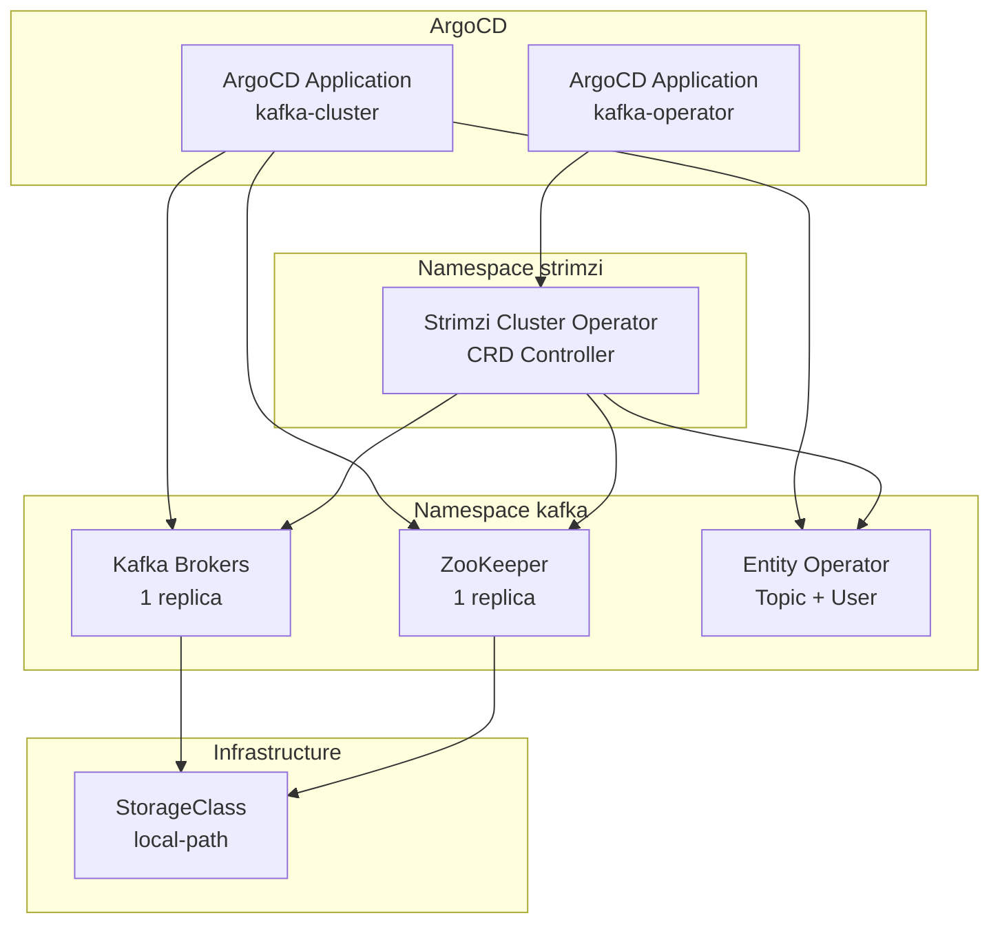

# Kafka (Strimzi) ArgoCD Application (k3s)

Конфигурация для развертывания Apache Kafka через Strimzi Operator и Kafka Cluster в **k3s** с ArgoCD. Стиль развертывания аналогичен MinIO: Operator (Helm) + Cluster (манифесты из Git).

<details>
<summary><strong>🚀 Быстрый старт</strong></summary>

---

**Минимальные шаги для развертывания Kafka:**

1. **StorageClass:** в k3s по умолчанию есть `local-path`. Проверка: `kubectl get storageclass`.

2. **Примените ArgoCD Application для Strimzi Operator:**
   ```bash
   kubectl apply -f argocd-apps/kafka/operator/application.yaml
   ```

3. **Дождитесь готовности Operator (1–2 минуты):**
   ```bash
   kubectl get pods -n strimzi -w
   # Под strimzi-cluster-operator должен быть в состоянии Running
   ```

4. **Создайте Kafka Cluster (через ArgoCD Application):**
   ```bash
   kubectl apply -f argocd-apps/kafka/cluster/application.yaml
   ```

5. **Дождитесь готовности Kafka (3–5 минут):**
   ```bash
   kubectl get pods -n kafka -w
   # Поды my-cluster-kafka, my-cluster-zookeeper, entity-operator должны быть Running
   ```

6. **Подключение к Kafka (внутри кластера):**
   - **Bootstrap (plain):** `my-cluster-kafka-bootstrap.kafka.svc.cluster.local:9092`
   - **Bootstrap (TLS):** `my-cluster-kafka-bootstrap.kafka.svc.cluster.local:9093`

7. **Kafka UI (веб-интерфейс) + Ingress (опционально):**
   ```bash
   kubectl apply -f argocd-apps/kafka/ui-application.yaml -n argocd
   ```
   Манифест лежит в **kafka/** (не в ui/), чтобы при sync в namespace kafka не создавался лишний Application. После sync: **https://kafka-ui.lab.local** (добавьте в hosts IP узла k3s).

📋 **Детальные инструкции:** см. секции ниже

</details>

<details>
<summary><strong>🔍 Проверка в кластере</strong></summary>

---

Выполняйте команды **на узле k3s** (например, SSH на `192.168.40.145`) или с машины, где в `KUBECONFIG` указан API-сервер этого кластера.

```bash
# Контекст и узлы
kubectl config get-contexts
kubectl get nodes -o wide

# ArgoCD Applications для Kafka
kubectl get applications -n argocd -l app.kubernetes.io/name=kafka 2>/dev/null || \
  kubectl get applications -n argocd | grep -E "kafka-operator|kafka-cluster"

# Strimzi Operator (namespace strimzi)
kubectl get pods -n strimzi
kubectl get all -n strimzi

# Kafka Cluster (namespace kafka)
kubectl get pods -n kafka
kubectl get kafka -n kafka
kubectl get svc -n kafka

# Статус Kafka CR (готовность брокеров)
kubectl get kafka my-cluster -n kafka -o jsonpath='{.status.conditions[*].type}{"\n"}{.status.conditions[*].status}' 2>/dev/null
kubectl describe kafka my-cluster -n kafka | grep -A 20 "Status:"
```

**Ожидаемый результат:** в `strimzi` — под `strimzi-cluster-operator-*` в Running; в `kafka` — поды `my-cluster-kafka-*`, `my-cluster-zookeeper-*`, `entity-operator-*` в Running, сервис `my-cluster-kafka-bootstrap` на портах 9092/9093.

</details>

<details>
<summary><strong>📋 Описание и компоненты</strong></summary>

---

Apache Kafka — распределённая платформа для потоковой обработки событий. Strimzi Operator управляет жизненным циклом Kafka в Kubernetes через CRD.

### Архитектура развертывания



### Компоненты

- **Strimzi Cluster Operator**: Управляет Kafka, ZooKeeper, KafkaTopic, KafkaUser через CRD
  - Развертывается через Helm chart: `https://strimzi.io/charts`
  - Версия chart: **0.38.0** — образ оператора совместим со старыми CPU (без x86-64-v2), как в MinIO
  - Namespace: `strimzi`
  - Следит за namespace: `kafka`

- **Kafka Cluster (my-cluster)**: Одноузловой кластер для dev/test
  - ZooKeeper: 1 реплика, 5Gi PVC
  - Kafka: 3.6.0, 1 реплика, 10Gi PVC, listeners plain:9092 и tls:9093
  - Entity Operator: Topic Operator + User Operator

- **Доступ:**
  - Внутри кластера: `my-cluster-kafka-bootstrap.kafka.svc.cluster.local:9092` (plain), `:9093` (tls)

- **Kafka UI**: веб-интерфейс [UI for Apache Kafka](https://github.com/provectus/kafka-ui) (provectuslabs/kafka-ui). Развёртывается в namespace `kafka`, подключается к `my-cluster-kafka-bootstrap:9092`. Ingress: `https://kafka-ui.lab.local` (Traefik + cert-manager).

</details>

<details>
<summary><strong>📋 Структура файлов</strong></summary>

---

```
kafka/
├── operator/
│   └── application.yaml   # ArgoCD Application для Strimzi Operator (Helm chart)
├── cluster/
│   ├── application.yaml  # ArgoCD Application для Kafka Cluster (указывает на Git)
│   └── kafka.yaml        # Strimzi Kafka CRD (ZooKeeper + Kafka + Entity Operator)
├── ui/
│   ├── deployment.yaml   # Kafka UI (provectuslabs/kafka-ui)
│   ├── service.yaml
│   └── ingress.yaml     # kafka-ui.lab.local (Traefik, TLS)
├── ui-application.yaml   # ArgoCD Application для Kafka UI (в kafka/, не в ui/ — иначе sync создаст Application в kafka)
└── README.md            # Этот файл
```

**Пояснение:**

- **`operator/application.yaml`**: ArgoCD Application для Strimzi Operator через Helm. Создаёт namespace `strimzi`, устанавливает CRD и Operator. Operator настроен на наблюдение за namespace `kafka`.

- **`cluster/application.yaml`**: ArgoCD Application, источник — Git, путь `argocd-apps/kafka/cluster`. Sync-wave: "1" (после operator). Назначение — namespace `kafka`.

- **`cluster/kafka.yaml`**: Custom Resource `Kafka` в namespace `kafka`. Описывает ZooKeeper, брокеры Kafka (1 реплика), Entity Operator, storage и ресурсы.

- **`ui-application.yaml`**: ArgoCD Application для Kafka UI. Источник — Git, путь `argocd-apps/kafka/ui`. Sync-wave: "2" (после cluster). Разворачивает Deployment + Service + Ingress в namespace `kafka`.

- **`ui/`**: Deployment (образ provectuslabs/kafka-ui:v0.7.2, env: bootstrap `my-cluster-kafka-bootstrap.kafka.svc.cluster.local:9092`), Service 8080, Ingress с хостом `kafka-ui.lab.local` (cert-manager, Traefik).

</details>

<details>
<summary><strong>📋 Предварительные требования</strong></summary>

---

1. **Kubernetes 1.27+** (для Strimzi 0.49)
2. **ArgoCD** установлен и настроен
3. **StorageClass** (например, `local-path` в k3s)
4. Репозиторий **k3s-test** добавлен в ArgoCD (или применяете манифесты из локального Git)

</details>

<details>
<summary><strong>📋 Создание топиков и пользователей</strong></summary>

---

Топики и пользователи можно создавать через Strimzi CRD в том же namespace `kafka` (применять вручную или через Git):

**Пример топика (KafkaTopic):**
```yaml
apiVersion: kafka.strimzi.io/v1beta2
kind: KafkaTopic
metadata:
  name: my-topic
  namespace: kafka
  labels:
    strimzi.io/cluster: my-cluster
spec:
  partitions: 3
  replicas: 1
```

**Пример пользователя (KafkaUser):**
```yaml
apiVersion: kafka.strimzi.io/v1beta2
kind: KafkaUser
metadata:
  name: my-user
  namespace: kafka
  labels:
    strimzi.io/cluster: my-cluster
spec:
  authentication:
    type: scram-sha-512
  authorization:
    type: simple
    acls:
      - resource:
          type: topic
          name: my-topic
        operations:
          - Read
          - Write
```

После создания KafkaUser в кластере появится Secret с credentials (например, `my-user`).

</details>

<details>
<summary><strong>⚠️ Ошибка «CPU does not support x86-64-v2»</strong></summary>

---

**Симптомы:** под Strimzi operator в состоянии CrashLoopBackOff, в логах: `Fatal glibc error: CPU does not support x86-64-v2`.

**Причина:** новые образы Strimzi (0.49+) собираются под x86-64-v2; старые CPU (или VM без передачи нужных инструкций) не поддерживают этот уровень.

**Решение (как в MinIO):** в репозитории зафиксированы **Strimzi 0.38.0** и **Kafka 3.6.0** — образы совместимы с baseline x86-64. Не поднимайте версию chart/operator без проверки на вашем железе.

</details>
