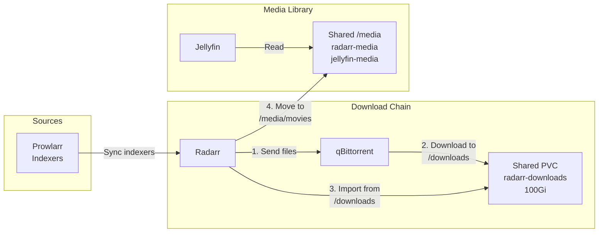

# Media Server Stack ArgoCD Application

Этот каталог содержит конфигурацию для развертывания медиа-стека через ArgoCD: Jellyfin (медиа-сервер), Prowlarr (менеджер источников), qBittorrent (BitTorrent клиент) и Radarr (менеджер видеотеки).

<details>
<summary><strong>🚀Быстрый старт</strong></summary>

---

**Минимальные шаги для развертывания Media Server Stack:**

0. git clone https://github.com/mistermedved01/k3s-test

0. cd k3s-test

1. **Разверните cert-manager (обязательно первым):**
   ```bash
   kubectl apply -f argocd-apps/cert-manager/cert-manager.yaml
   kubectl wait --for=condition=ready pod -l app.kubernetes.io/instance=cert-manager -n cert-manager --timeout=300s
   kubectl apply -f argocd-apps/cert-manager/clusterissuer-selfsigned.yaml
   kubectl get clusterissuer selfsigned-issuer
   ```

2. **Примените ArgoCD Applications (в указанном порядке):**
   ```bash
   # Jellyfin
   kubectl apply -f argocd-apps/media-server-stack/jellyfin/jellyfin.yaml
   
   # Prowlarr
   kubectl apply -f argocd-apps/media-server-stack/prowlarr/prowlarr.yaml
   
   # qBittorrent (создает общий PVC radarr-downloads)
   kubectl apply -f argocd-apps/media-server-stack/qbittorrent/qbittorrent.yaml
   
   # Radarr (использует PVC radarr-downloads от qBittorrent)
   kubectl apply -f argocd-apps/media-server-stack/radarr/radarr.yaml
   ```

3. **Дождитесь готовности (5-10 минут):**
   ```bash
   kubectl get pods -n jellyfin -w
   kubectl get pods -n prowlarr -w
   kubectl get pods -n radarr -w  # qBittorrent и Radarr в namespace radarr
   ```

4. **Получите временный пароль qBittorrent:**
   ```bash
   kubectl logs -n radarr deployment/qbittorrent | grep -i "temporary password"
   ```

6. **Войдите в приложения:**
   - **Jellyfin**: `https://jellyfin.lab.local`
   - **Prowlarr**: `https://prowlarr.lab.local`
   - **qBittorrent**: `https://qbittorrent.lab.local` (логин: `admin`, пароль: из логов)
   - **Radarr**: `https://radarr.lab.local`

📋**Детальные инструкции:** см. секции ниже

</details>

<details>
<summary><strong>📋Описание и компоненты</strong></summary>

---

Media Server Stack - это набор приложений для управления личной медиа-коллекцией:

- **Jellyfin** — медиа-сервер для управления и потоковой передачи личной коллекции мультимедиа
- **Prowlarr** — менеджер источников медиаконтента (индексеры для торрентов и Usenet)
- **qBittorrent** — BitTorrent клиент для получения медиа-контента для личной коллекции
- **Radarr** — менеджер личной видеотеки для организации домашнего видео

### Архитектура развертывания



### Ключевые моменты взаимодействия

1. **Prowlarr → Radarr**: Синхронизация индексеров (источников медиа)
2. **Radarr → qBittorrent**: Отправка файлов для получения
3. **qBittorrent → Radarr**: Импорт завершенных файлов из `/downloads`
4. **Radarr → Jellyfin**: Уведомления о новых файлах в `/media/movies`
5. **Jellyfin**: Чтение медиа из `/media/movies`

### Общее хранилище

- **Downloads**: PVC `radarr-downloads` (100Gi) - монтируется в qBittorrent и Radarr (namespace `radarr`)
- **Media**: PVC `radarr-media` и `jellyfin-media` должны указывать на одну директорию на хосте (через local-path или NFS)

</details>

<details>
<summary><strong>📋Структура файлов</strong></summary>

---

```
media-server-stack/
├── README.md                    # Этот файл
├── jellyfin/
│   ├── jellyfin.yaml            # ArgoCD Application (Kustomize)
│   ├── kustomization.yaml       # Kustomize конфигурация
│   ├── base/                    # Kustomize ресурсы
│   │   ├── deployment.yaml
│   │   ├── service.yaml
│   │   ├── ingress.yaml
│   │   ├── pvc.yaml
│   │   └── namespace.yaml
│   └── README.md                # Документация Jellyfin
├── prowlarr/
│   ├── prowlarr.yaml            # ArgoCD Application (Kustomize)
│   ├── kustomization.yaml       # Kustomize конфигурация
│   ├── base/                    # Kustomize ресурсы
│   │   ├── deployment.yaml
│   │   ├── service.yaml
│   │   ├── ingress.yaml
│   │   ├── pvc.yaml
│   │   └── namespace.yaml
│   └── README.md                # Документация Prowlarr
├── qbittorrent/
│   ├── qbittorrent.yaml         # ArgoCD Application (Kustomize)
│   ├── kustomization.yaml       # Kustomize конфигурация
│   ├── base/                    # Kustomize ресурсы
│   │   ├── deployment.yaml
│   │   ├── service.yaml
│   │   ├── ingress.yaml
│   │   ├── pvc.yaml             # Создает radarr-downloads PVC
│   │   └── configmap-webui-fix.yaml  # Скрипт для исправления WebUI
│   └── (README см. этот файл)
└── radarr/
    ├── radarr.yaml               # ArgoCD Application (Kustomize)
    ├── kustomization.yaml       # Kustomize конфигурация
    ├── base/                    # Kustomize ресурсы
    │   ├── deployment.yaml
    │   ├── service.yaml
    │   ├── ingress.yaml
    │   ├── pvc.yaml
    │   └── namespace.yaml
    └── README.md                # Документация Radarr
```

**Примечание**: Namespace'ы создаются автоматически через `CreateNamespace=true` в Application манифестах.

</details>

<details>
<summary><strong>📋Предварительные требования</strong></summary>

---

1. **Kubernetes кластер версии 1.23+**
   ```bash
   kubectl version --short
   ```

2. **ArgoCD установлен и настроен**
   ```bash
   kubectl get pods -n argocd
   ```

3. **k3s с Traefik Ingress** (k3s использует Traefik по умолчанию)
   ```bash
   kubectl get ingressclass
   # Должен быть ingressclass traefik
   ```

4. **cert-manager установлен и настроен** (см. секцию "Быстрый старт")
   ```bash
   kubectl get clusterissuer selfsigned-issuer
   ```

5. **DNS настроен** для доменов:
   - `jellyfin.lab.local`
   - `prowlarr.lab.local`
   - `qbittorrent.lab.local`
   - `radarr.lab.local`

</details>

<details>
<summary><strong>⚙️Установка</strong></summary>

---

### Порядок развертывания

⚠️ **ВАЖНО**: Соблюдайте порядок для корректной работы TLS и зависимостей.

1. **cert-manager** (обязательно первым)
2. **Jellyfin** (опционально, но рекомендуется)
3. **Prowlarr** (опционально, но рекомендуется)
4. **qBittorrent** (создает общий PVC `radarr-downloads`)
5. **Radarr** (использует PVC `radarr-downloads` от qBittorrent)

### 1. Развертывание cert-manager

cert-manager требуется для работы с TLS сертификатами. Разверните cert-manager **до** развертывания приложений:

```bash
# Применить cert-manager Application
kubectl apply -f argocd-apps/cert-manager/cert-manager.yaml

# Дождаться готовности cert-manager
kubectl wait --for=condition=ready pod -l app.kubernetes.io/instance=cert-manager -n cert-manager --timeout=300s

# Проверить статус подов
kubectl get pods -n cert-manager
```

Ожидаемый результат - все поды в состоянии `Running`:
```
NAME                                       READY   STATUS    RESTARTS   AGE
cert-manager-xxxxxxxxxx-xxxxx             1/1     Running   0          2m
cert-manager-cainjector-xxxxxxxxxx-xxxxx  1/1     Running   0          2m
cert-manager-webhook-xxxxxxxxxx-xxxxx     1/1     Running   0          2m
```

### 2. Создание ClusterIssuer

Создайте ClusterIssuer для генерации сертификатов:

```bash
# Применить ClusterIssuer
kubectl apply -f argocd-apps/cert-manager/clusterissuer-selfsigned.yaml

# Проверить статус ClusterIssuer
kubectl get clusterissuer selfsigned-issuer

# Должен быть в состоянии Ready
kubectl describe clusterissuer selfsigned-issuer
```

### 3. Развертывание Jellyfin

```bash
# Применить Application
kubectl apply -f argocd-apps/media-server-stack/jellyfin/jellyfin.yaml

# Проверить статус Application
kubectl get application jellyfin -n argocd

# Дождаться готовности
kubectl get pods -n jellyfin -w
```

**URL**: `https://jellyfin.lab.local`

### 4. Развертывание Prowlarr

```bash
# Применить Application
kubectl apply -f argocd-apps/media-server-stack/prowlarr/prowlarr.yaml

# Проверить статус Application
kubectl get application prowlarr -n argocd

# Дождаться готовности
kubectl get pods -n prowlarr -w
```

**URL**: `https://prowlarr.lab.local`

### 5. Развертывание qBittorrent

```bash
# Применить Application
kubectl apply -f argocd-apps/media-server-stack/qbittorrent/qbittorrent.yaml

# Проверить статус Application
kubectl get application qbittorrent -n argocd

# Дождаться готовности
kubectl get pods -n radarr -w
```

**Проверка PVC**:
```bash
kubectl get pvc -n radarr
# Должны быть:
# - qbittorrent-config (5Gi)
# - radarr-downloads (100Gi) ← общий PVC
```

**URL**: `https://qbittorrent.lab.local`

### 6. Развертывание Radarr

```bash
# Применить Application
kubectl apply -f argocd-apps/media-server-stack/radarr/radarr.yaml

# Проверить статус Application
kubectl get application radarr -n argocd

# Дождаться готовности
kubectl get pods -n radarr -w
```

**Проверка PVC**:
```bash
kubectl get pvc -n radarr
# Должны быть:
# - radarr-config (10Gi)
# - radarr-media (50Gi)
# - radarr-downloads (100Gi) ← тот же PVC, что у qBittorrent
```

**URL**: `https://radarr.lab.local`

### Проверка статуса развертывания

#### Через ArgoCD UI

1. Откройте ArgoCD UI: `https://argocd.lab.local`
2. Войдите с учетными данными admin
3. Найдите Applications: `jellyfin`, `prowlarr`, `qbittorrent`, `radarr`
4. Проверьте статус синхронизации

#### Через kubectl

```bash
# Проверить Applications
kubectl get applications -n argocd | grep -E "jellyfin|prowlarr|qbittorrent|radarr"

# Проверить поды
kubectl get pods -n jellyfin
kubectl get pods -n prowlarr
kubectl get pods -n radarr  # qBittorrent также в namespace radarr

# Проверить Ingress
kubectl get ingress -A | grep -E "jellyfin|prowlarr|qbittorrent|radarr"
```

### Время развертывания

- **Ожидаемое время**: 5-10 минут для каждого приложения
- Зависит от скорости загрузки образов
- Поды должны перейти в состояние `Running`
- Certificate должны стать Ready

</details>

<details>
<summary><strong>🔍Доступ и первоначальная настройка</strong></summary>

---

### Доступ к приложениям

После успешного развертывания приложения доступны по следующим адресам:

- **Jellyfin**: `https://jellyfin.lab.local`
- **Prowlarr**: `https://prowlarr.lab.local`
- **qBittorrent**: `https://qbittorrent.lab.local`
- **Radarr**: `https://radarr.lab.local`

### Первый вход в Jellyfin

1. Откройте `https://jellyfin.lab.local`
2. Первый вход - настройка мастера (языка, пароля и т.д.)

### Первый вход в Prowlarr

1. Откройте `https://prowlarr.lab.local`
2. Первый вход - настройка мастера (языка, пароля и т.д.)

### Первый вход в qBittorrent

1. Откройте `https://qbittorrent.lab.local` или `https://qbittorrent.lab.local:30443`
   - **Если видите «default backend - 404»:** заходите обязательно по **hostname** (`qbittorrent.lab.local`), не по IP. Ingress не матчит запросы по `https://192.168.40.145:30443`. Добавьте в hosts: `192.168.40.145 qbittorrent.lab.local` и откройте `https://qbittorrent.lab.local:30443`.

2. **Учетные данные для первого входа:**
   - **Логин**: `admin`
   - **Пароль**: **временный пароль из логов** (qBittorrent генерирует его при каждом запуске, если пароль не установлен)
   - Получите пароль: `kubectl logs -n radarr deployment/qbittorrent | grep -i "temporary password"`
   - Пример: `The WebUI administrator password was not set. A temporary password is provided for this session: 4TyYY4cnH`
   - **Важно**: После первого входа обязательно установите постоянный пароль в Settings → Web UI → Authentication

3. **Если форма входа не отображается:**
   - **Очистите кеш браузера и cookies** для `qbittorrent.lab.local`:
     - Chrome/Edge: F12 → Application → Cookies → удалите все для домена
     - Или используйте режим инкогнито
   - Попробуйте прямой путь: `https://qbittorrent.lab.local/login`
   - Проверьте, что конфиг создан правильно:
     ```bash
     kubectl exec -n radarr deployment/qbittorrent -- \
       cat /config/qBittorrent/qBittorrent.conf | grep -i "WebUI.*Auth"
     ```
     Должно быть: `WebUI\Authentication=true`

4. **Если видите "Unauthorized" без формы входа:**
   
   Деплоймент qBittorrent уже включает скрипт (`configmap-webui-fix` → `/custom-cont-init.d`), который при каждом старте пода отключает Host header validation и CSRF для доступа через ingress. После `kubectl apply` / синка ArgoCD перезапустите под: `kubectl delete pod -n radarr -l app=qbittorrent` и подождите 1–2 минуты. Если проблема остаётся:
   
   **Вариант A: Отключите CSRF protection вручную (временно):**
   ```bash
   kubectl exec -n radarr deployment/qbittorrent -- \
     sh -c 'sed -i "s/WebUI\\\\\\\\CSRFProtection=true/WebUI\\\\\\\\CSRFProtection=false/" /config/qBittorrent/qBittorrent.conf'
   kubectl delete pod -n radarr -l app=qbittorrent
   ```
   
   **Вариант B: Используйте port-forward (обход Ingress):**
   ```bash
   kubectl port-forward -n radarr deployment/qbittorrent 8080:8080
   # Откройте: http://localhost:8080
   ```
   
   **Вариант C: Очистите кеш браузера:**
   - Откройте DevTools (F12) → Application → Cookies → удалите все для `qbittorrent.lab.local`
   - Используйте режим инкогнито
   - Попробуйте другой браузер

### Первый вход в Radarr

1. Откройте `https://radarr.lab.local`
2. Первый вход - настройка мастера (языка, пароля и т.д.)

### Предупреждение о сертификате (self-signed)

⚠️ При использовании self-signed сертификатов браузер покажет предупреждение о безопасности. Это нормально для тестовой среды. Нажмите "Advanced" → "Proceed to <domain>" для продолжения.

</details>

<details>
<summary><strong>⚙️Настройка приложений</strong></summary>

---

### Настройка qBittorrent

#### Настройка путей получения файлов

1. **Settings → Downloads**:
   - **Default Save Path**: `/downloads` (соответствует PVC `radarr-downloads`)
   - **Keep incomplete files in**: `/downloads/incomplete` (опционально)
   - **Automatically add files from**: оставьте пустым (Radarr будет отправлять через API)

#### Настройка категорий (опционально, но рекомендуется)

1. **Settings → Categories**:
   - Добавьте категорию `radarr`
   - Это поможет Radarr автоматически определять завершенные файлы

#### Настройка Web UI

1. **Settings → Web UI**:
   - **Port**: `8080` (уже настроено в deployment)
   - **IP address**: `0.0.0.0` (для доступа из кластера)
   - **Authentication**: включено (обязательно!)

#### Настройка BitTorrent портов

1. **Settings → Connection**:
   - **Port used for incoming connections**: `6881` (уже настроено)
   - Если используете VPN, настройте соответствующие порты

#### Проверка доступа из Radarr

```bash
# Проверьте, что qBittorrent доступен из кластера
kubectl run -it --rm debug --image=curlimages/curl --restart=Never -- \
  curl -v http://qbittorrent.radarr.svc.cluster.local:80
```

### Настройка Prowlarr

#### Добавление индексеров

1. **Settings → Indexers → Add Indexer**
2. Выберите нужные источники медиа (торрент-трекеры, Usenet и т.д.)
3. Настройте учетные данные для каждого индексера
4. **Test** каждый индексер перед сохранением

#### Интеграция с Radarr

1. **Settings → Apps → Add Application → Radarr**
2. Заполните:
   - **Name**: `Radarr`
   - **Prowlarr Server**: `http://prowlarr.prowlarr.svc.cluster.local:80`
   - **Radarr Server**: `http://radarr.radarr.svc.cluster.local:80`
   - **API Key**: из Radarr Settings → General → Security → API Key
   - **Sync Level**: `Full Sync`
3. **Test** подключение
4. **Save**

⚠️ **Важно**: Убедитесь, что Radarr полностью запущен и готов принимать запросы перед настройкой интеграции!

#### Проверка синхронизации

1. После сохранения Prowlarr автоматически синхронизирует индексеры с Radarr
2. В Radarr: **Settings → Indexers** - должны появиться все индексеры из Prowlarr
3. Если индексеры не появились:
   - Проверьте URL и API Key в Prowlarr
   - Проверьте логи: `kubectl logs -n prowlarr deployment/prowlarr`

#### Настройка прокси только для трекеров

**Проблема**: Некоторые трекеры доступны только через прокси, но при включении прокси в Prowlarr отваливается связь с внутренними сервисами (Radarr, qBittorrent).

**Решение**: Настроить bypass прокси для внутренних адресов Kubernetes, чтобы прокси использовался только для внешних трекеров.

**Архитектура соединений:**
```
Prowlarr → [Прокси] → Трекеры
Prowlarr → [Прямое] → Radarr
Radarr → [Прямое] → qBittorrent
qBittorrent → [Прямое] → Интернет
```

**Настройка:**

1. **Settings → General → Proxy**
2. Включите прокси:
   - **Proxy Type**: `HTTP` (или `SOCKS5` в зависимости от вашего прокси)
   - **Host**: адрес вашего прокси-сервера
   - **Port**: порт прокси-сервера
   - **Username/Password**: если требуется аутентификация
3. **Важно**: В поле **"Ignored Addresses"** добавьте через запятую:
   ```
   *.svc.cluster.local,*.svc,10.0.0.0/8,172.16.0.0/12,192.168.0.0/16
   ```
   
   **Объяснение значений:**
   - `*.svc.cluster.local` - все сервисы Kubernetes (полный формат DNS)
   - `*.svc` - короткий формат для сервисов Kubernetes
   - `10.0.0.0/8` - диапазон ClusterIP адресов Kubernetes
   - `172.16.0.0/12` - дополнительный диапазон для pod сетей
   - `192.168.0.0/16` - диапазон для локальных сетей

4. **Save**

**Проверка работы:**

1. **Test Connection к трекеру**:
   - Settings → Indexers → выберите трекер → Test
   - Должен работать через прокси

2. **Test Connection к Radarr**:
   - Settings → Apps → Radarr → Test Connection
   - Должен работать без прокси (прямое соединение)

### Настройка Radarr

#### Настройка Root Folder

1. **Settings → Media Management → Root Folders → Add Root Folder**
2. **Path**: `/media/movies`
3. **Save**

⚠️ **Важно**: Этот путь должен соответствовать пути в Jellyfin!

#### Проверка индексеров (из Prowlarr)

1. **Settings → Indexers**
2. Если Prowlarr настроен правильно, здесь должны быть все индексеры
3. Если индексеров нет:
   - Проверьте настройки Prowlarr → Apps → Radarr
   - Проверьте API Key в Radarr
   - В Prowlarr: **Settings → Apps → Radarr → Test Connection**

#### Настройка Download Client (qBittorrent)

1. **Settings → Download Clients → Add → qBittorrent**
2. Заполните:
   - **Name**: `qBittorrent`
   - **Host**: `qbittorrent.radarr.svc.cluster.local`
   - **Port**: `80` (Service порт, который проксирует на 8080)
   - **Use SSL**: отключено (внутренний трафик)
   - **Username**: `admin` (или ваш логин qBittorrent)
   - **Password**: ваш пароль qBittorrent
   - **Category**: `radarr` (если настроили категорию в qBittorrent)
   - **Priority**: `1`
3. **Test** подключение
4. **Save**

#### Настройка Remote Path Mapping (если нужно)

Обычно **НЕ требуется**, если:
- qBittorrent и Radarr в одном namespace (`radarr`)
- Оба монтируют один PVC `radarr-downloads` в `/downloads`

Если пути отличаются, настройте:
1. **Settings → Download Clients → Remote Path Mappings → Add**
2. **Host**: `qbittorrent.radarr.svc.cluster.local`
3. **Remote Path**: путь в контейнере qBittorrent (например, `/downloads`)
4. **Local Path**: путь в контейнере Radarr (должен быть `/downloads`)

#### Настройка профилей качества

1. **Settings → Profiles**
2. Создайте или настройте профили:
   - **HD-1080p**: для большинства фильмов
   - **Ultra-HD**: для 4K контента
   - **SD**: для экономии места
3. Настройте **Preferred** и **Must Not Contain** для каждого профиля

#### Интеграция с Jellyfin

1. **Settings → Connect → Add → Jellyfin/Emby**
2. Заполните:
   - **Name**: `Jellyfin`
   - **Host**: `http://jellyfin.jellyfin.svc.cluster.local:80`
   - **Port**: `80`
   - **Use SSL**: отключено (внутренний трафик)
   - **API Key**: из Jellyfin Dashboard → Settings → API Keys → Add API Key
   - **Notification Triggers**: включите `On Download` и `On Upgrade`
3. **Test** подключение
4. **Save**

#### Добавление первого фильма (тест)

1. **Movies → Add New**
2. Найдите фильм по названию
3. Выберите:
   - **Quality Profile**: например, HD-1080p
   - **Root Folder**: `/media/movies`
4. **Add Movie**

Radarr автоматически:
- Найдет фильм через Prowlarr
- Отправит файл в qBittorrent
- Дождется завершения получения
- Импортирует в `/media/movies`
- Уведомит Jellyfin

### Настройка Jellyfin

#### Добавление медиабиблиотеки

1. **Dashboard → Libraries → Add Media Library**
2. **Content Type**: `Movies`
3. **Display Name**: `Movies`
4. **Folders → Add Folder**:
   - **Path**: `/media/movies` (должен соответствовать Radarr Root Folder!)
5. **Save**

#### Настройка метаданных

1. **Dashboard → Libraries → Movies → Manage Library**
2. Настройте:
   - **Metadata downloaders**: TMDb, OMDB и т.д.
   - **Image fetchers**: TMDb, FanArt и т.д.

#### Проверка доступа к файлам

```bash
# Проверьте, что Jellyfin видит файлы
POD_NAME=$(kubectl get pods -n jellyfin -l app=jellyfin -o jsonpath='{.items[0].metadata.name}')
kubectl exec -n jellyfin $POD_NAME -- ls -la /media/movies
```

#### Сканирование библиотеки

1. **Dashboard → Libraries → Movies → Scan Library**
2. Или **Dashboard → Scheduled Tasks** - настройте автоматическое сканирование

</details>

<details>
<summary><strong>💾Общее хранилище</strong></summary>

---

### Downloads (qBittorrent + Radarr)

✅ **Уже настроено**: Оба приложения монтируют PVC `radarr-downloads` в `/downloads`

**Проверка**:
```bash
# Проверьте, что оба пода видят один PVC
kubectl get pvc -n radarr | grep downloads
# Должен быть один PVC: radarr-downloads

# Проверьте монтирование в qBittorrent
kubectl exec -n radarr deployment/qbittorrent -- ls -la /downloads

# Проверьте монтирование в Radarr
kubectl exec -n radarr deployment/radarr -- ls -la /downloads
```

### Media (Radarr + Jellyfin)

⚠️ **Требует настройки**: Оба приложения должны иметь доступ к одной директории.

#### Вариант 1: local-path (простой, для lab)

Оба PVC (`radarr-media` и `jellyfin-media`) должны указывать на одну директорию на хосте.

**Проблема**: local-path создает уникальные директории для каждого PVC.

**Решение**: Настройте local-path provisioner для использования одной базовой директории, или используйте NFS.

#### Вариант 2: NFS (рекомендуется для production)

1. Настройте NFS сервер
2. Создайте NFS StorageClass
3. Измените `storageClassName` в PVC на NFS
4. Оба PVC будут указывать на один NFS share

#### Вариант 3: Один namespace (простой, но не рекомендуется)

Поместите Radarr и Jellyfin в один namespace и используйте один PVC для media.

**Текущая конфигурация**: Каждое приложение в своем namespace, поэтому требуется общий доступ через NFS или настройка local-path.

</details>

<details>
<summary><strong>🔍Проверка цепочки работы</strong></summary>

---

### Полный цикл работы

1. **Добавьте фильм в Radarr**:
   - Movies → Add New → выберите фильм → Add Movie

2. **Radarr найдет через Prowlarr**:
   - Activity → Queue - должен появиться файл
   - Radarr отправит его в qBittorrent

3. **qBittorrent получит файл**:
   - Откройте qBittorrent Web UI
   - В разделе **Transfers** должен появиться файл
   - Дождитесь завершения получения (100%)

4. **Radarr импортирует**:
   - Activity → History - должен появиться импортированный фильм
   - Файл должен быть в `/media/movies`

5. **Jellyfin обновит библиотеку**:
   - Dashboard → Libraries → Movies → Scan Library (или автоматически)
   - Фильм должен появиться в Jellyfin

### Проверка логов

```bash
# Логи Radarr
kubectl logs -n radarr deployment/radarr --tail=50

# Логи qBittorrent
kubectl logs -n radarr deployment/qbittorrent --tail=50

# Логи Prowlarr
kubectl logs -n prowlarr deployment/prowlarr --tail=50

# Логи Jellyfin
kubectl logs -n jellyfin deployment/jellyfin --tail=50
```

</details>

<details>
<summary><strong>⚙️Конфигурация и ресурсы</strong></summary>

---

### Текущее потребление ресурсов

**Вычислительные ресурсы:**

- **Jellyfin**: 1000m CPU / 2Gi RAM (requests), 2000m CPU / 4Gi RAM (limits)
- **Prowlarr**: 100m CPU / 128Mi RAM (requests), 500m CPU / 512Mi RAM (limits)
- **qBittorrent**: 200m CPU / 256Mi RAM (requests), 1000m CPU / 1Gi RAM (limits)
- **Radarr**: 100m CPU / 128Mi RAM (requests), 500m CPU / 512Mi RAM (limits)

**Хранилище:**

- **Jellyfin**: 
  - `jellyfin-config`: 10Gi
  - `jellyfin-cache`: 5Gi
  - `jellyfin-media`: 50Gi
- **Prowlarr**: 
  - `prowlarr-config`: 5Gi
- **qBittorrent**: 
  - `qbittorrent-config`: 5Gi
  - `radarr-downloads`: 100Gi (общий с Radarr)
- **Radarr**: 
  - `radarr-config`: 10Gi
  - `radarr-media`: 50Gi
  - `radarr-downloads`: 100Gi (общий с qBittorrent)

### Изменение доменов

Отредактируйте соответствующие `ingress.yaml` файлы в `base/` директориях:

```yaml
spec:
  rules:
  - host: ваш-домен.lab.local
```

Затем синхронизируйте Application в ArgoCD.

### Настройка ресурсов

Для изменения ресурсов отредактируйте соответствующие `deployment.yaml` файлы:

```yaml
resources:
  limits:
    cpu: 2000m
    memory: 2Gi
  requests:
    cpu: 1000m
    memory: 1Gi
```

### Обновление версий

Измените `image` в соответствующих `deployment.yaml`:

```yaml
image: linuxserver/jellyfin:latest  # или конкретная версия
```

ArgoCD автоматически синхронизирует изменения.

### Обновление конфигурации

1. Отредактируйте соответствующие файлы в `base/`
2. Закоммитьте изменения в Git
3. ArgoCD автоматически обнаружит изменения и синхронизирует (если включена автоматическая синхронизация)

</details>

<details>
<summary><strong>🔧Устранение неполадок</strong></summary>

---

### Radarr не видит qBittorrent

**Проблема**: Test Connection в Radarr → Download Clients → qBittorrent не проходит

**Решение**:
1. Проверьте URL: `qbittorrent.radarr.svc.cluster.local:80`
2. Проверьте логин/пароль qBittorrent
3. Проверьте, что qBittorrent запущен: `kubectl get pods -n radarr`
4. Проверьте сетевую доступность:
   ```bash
   kubectl run -it --rm debug --image=curlimages/curl --restart=Never -- \
     curl -v http://qbittorrent.radarr.svc.cluster.local:80
   ```

### Файлы не импортируются в Radarr

**Проблема**: qBittorrent получил файл, но Radarr не импортирует

**Решение**:
1. Проверьте, что оба монтируют один PVC:
   ```bash
   kubectl get pvc -n radarr | grep downloads
   ```
2. Проверьте пути в контейнерах:
   ```bash
   # В qBittorrent
   kubectl exec -n radarr deployment/qbittorrent -- ls -la /downloads
   
   # В Radarr
   kubectl exec -n radarr deployment/radarr -- ls -la /downloads
   ```
3. Проверьте категорию в qBittorrent (должна быть `radarr`)
4. Проверьте Remote Path Mapping в Radarr (если настроено)
5. Проверьте логи Radarr: `kubectl logs -n radarr deployment/radarr | grep -i import`

### Фильмы не появляются в Jellyfin

**Проблема**: Radarr импортировал фильм, но Jellyfin его не видит

**Решение**:
1. Проверьте, что оба монтируют одну директорию media (см. раздел "Общее хранилище")
2. Проверьте путь в Jellyfin: Dashboard → Libraries → Movies → должен быть `/media/movies`
3. Проверьте путь в Radarr: Settings → Media Management → Root Folders → должен быть `/media/movies`
4. Выполните сканирование в Jellyfin: Dashboard → Libraries → Movies → Scan Library
5. Проверьте права доступа (PUID/PGID должны совпадать):
   ```bash
   # В Radarr
   kubectl exec -n radarr deployment/radarr -- id
   
   # В Jellyfin
   kubectl exec -n jellyfin deployment/jellyfin -- id
   ```

### Prowlarr не может подключиться к Radarr (503 ServiceUnavailable)

**Проблема**: При настройке интеграции Prowlarr → Radarr появляется ошибка "Unable to complete application test, cannot connect to Radarr. HTTP request failed: [503:ServiceUnavailable]"

**Причина**: Проблема с сетевым подключением между namespace'ами или Radarr еще не готов принимать API запросы

**Решение**:

1. **Если Radarr доступен через веб-интерфейс** (`https://radarr.lab.local`), но не через Service:
   - Проверьте доступность из Prowlarr namespace:
     ```bash
     kubectl exec -n prowlarr deployment/prowlarr -- curl -v http://radarr.radarr.svc.cluster.local:80/api/v3/system/status
     ```

2. **Проверьте статус Service:**
   ```bash
   kubectl get svc -n radarr
   kubectl describe svc radarr -n radarr
   ```
   Service должен иметь тип `ClusterIP` и правильный selector.

3. **Проверьте, что Radarr отвечает на API запросы:**
   ```bash
   # Изнутри Radarr пода
   kubectl exec -n radarr deployment/radarr -- curl -s http://localhost:7878/api/v3/system/status
   
   # Через Service из другого namespace
   kubectl run -it --rm debug --image=curlimages/curl --restart=Never -n prowlarr -- \
     curl -v http://radarr.radarr.svc.cluster.local:80/api/v3/system/status
   ```

4. **Проверьте, что Radarr полностью инициализирован:**
   ```bash
   kubectl logs -n radarr deployment/radarr --tail=50
   ```
   Убедитесь, что нет ошибок инициализации.

5. **Проверьте readiness probe:**
   ```bash
   kubectl get pods -n radarr
   kubectl describe pod -n radarr -l app=radarr | grep -A 5 "Readiness"
   ```
   Под должен быть `Ready`, readiness probe должен проходить.

6. **Проверьте сетевые политики (если используются):**
   ```bash
   kubectl get networkpolicies -A
   ```
   Убедитесь, что нет политик, блокирующих трафик между `prowlarr` и `radarr` namespace'ами.

7. **Попробуйте использовать IP адрес Service вместо DNS:**
   ```bash
   kubectl get svc radarr -n radarr -o jsonpath='{.spec.clusterIP}'
   # Используйте этот IP в Prowlarr вместо DNS имени (временно для теста)
   ```

8. **Если проблема сохраняется, попробуйте перезапустить оба пода:**
   ```bash
   kubectl rollout restart deployment/radarr -n radarr
   kubectl rollout restart deployment/prowlarr -n prowlarr
   ```

### Prowlarr не синхронизирует индексеры с Radarr

**Проблема**: Индексеры не появляются в Radarr после настройки Prowlarr

**Решение**:
1. Проверьте настройки в Prowlarr: Settings → Apps → Radarr
2. Проверьте URL: `http://radarr.radarr.svc.cluster.local:80`
3. Проверьте API Key: из Radarr Settings → General → Security → API Key
4. Выполните Test Connection в Prowlarr
5. Проверьте логи Prowlarr: `kubectl logs -n prowlarr deployment/prowlarr | grep -i radarr`

### Прокси в Prowlarr блокирует подключение к внутренним сервисам

**Проблема**: При включении прокси в Prowlarr (Settings → General → Proxy) отваливается связь с Radarr. Появляется ошибка "Unable to complete application test, cannot connect to Radarr" при Test Connection.

**Причина**: Прокси применяется глобально ко всем исходящим соединениям, включая внутренние соединения к сервисам Kubernetes (Radarr, qBittorrent). Внутренние адреса кластера (`*.svc.cluster.local`) пытаются идти через прокси, что приводит к ошибкам подключения.

**Решение**:

1. **Настройте bypass для внутренних адресов:**
   - Settings → General → Proxy
   - В поле **"Ignored Addresses"** добавьте:
     ```
     *.svc.cluster.local,*.svc,10.0.0.0/8,172.16.0.0/12,192.168.0.0/16
     ```
   - **Формат**: используйте запятую (`,`) как разделитель
   - **Save**

2. **Проверьте работу:**
   ```bash
   # Проверьте доступность Radarr из Prowlarr (должно работать без прокси)
   kubectl exec -n prowlarr deployment/prowlarr -- \
     curl -v http://radarr.radarr.svc.cluster.local:80/api/v3/system/status
   ```

3. **Проверьте Test Connection в Prowlarr:**
   - Settings → Apps → Radarr → Test Connection
   - Должно работать успешно

4. **Проверьте работу трекеров:**
   - Settings → Indexers → выберите трекер → Test
   - Должен работать через прокси

**Важно**: После настройки bypass прокси будет использоваться только для внешних соединений (трекеры), а внутренние соединения (Radarr, qBittorrent) будут идти напрямую без прокси.

### Radarr не может подключиться к qBittorrent ("Unable to connect to qBittorrent")

**Проблема**: При настройке Download Client в Radarr появляется ошибка "Unable to connect to qBittorrent" при использовании адреса `qbittorrent.radarr.svc.cluster.local`

**Диагностика**:

1. **Проверьте статус qBittorrent:**
   ```bash
   kubectl get pods -n radarr -l app=qbittorrent
   kubectl get svc -n radarr qbittorrent
   ```
   Под должен быть в статусе `Running` и `Ready`, Service должен быть `ClusterIP`.

2. **Проверьте доступность qBittorrent из Radarr пода:**
   ```bash
   kubectl exec -n radarr deployment/radarr -- curl -v http://qbittorrent.radarr.svc.cluster.local:80/api/v2/app/version
   ```
   Должен вернуться JSON с версией qBittorrent.

3. **Проверьте логи qBittorrent:**
   ```bash
   kubectl logs -n radarr deployment/qbittorrent --tail=50
   ```
   Ищите ошибки или сообщения о недоступности.

4. **Проверьте readiness probe:**
   ```bash
   kubectl describe pod -n radarr -l app=qbittorrent | grep -A 5 "Readiness"
   ```
   Readiness probe должен проходить успешно.

5. **Проверьте аутентификацию:**
   - Если qBittorrent требует аутентификацию, убедитесь, что в Radarr указаны правильные `Username` и `Password`
   - Получите временный пароль из логов: `kubectl logs -n radarr deployment/qbittorrent | grep -i "temporary password"`

6. **Проверьте настройки в Radarr:**
   - **Host**: `qbittorrent.radarr.svc.cluster.local` (без `http://`)
   - **Port**: `80` (не 8080!)
   - **Use SSL**: отключено
   - **Username**: `admin` (или ваш логин)
   - **Password**: ваш пароль qBittorrent (или временный из логов)

**Решение**:

1. **Если readiness probe не проходит:**
   - Проверьте, что qBittorrent полностью инициализирован (подождите 1-2 минуты после запуска)
   - Проверьте логи на наличие ошибок

2. **Если проблема с аутентификацией:**
   - Получите временный пароль из логов: `kubectl logs -n radarr deployment/qbittorrent | grep -i "temporary password"`
   - Используйте этот пароль в Radarr

3. **Если проблема с DNS:**
   - Попробуйте использовать IP адрес Service:
     ```bash
     kubectl get svc qbittorrent -n radarr -o jsonpath='{.spec.clusterIP}'
     ```
   - Используйте этот IP в Radarr вместо DNS имени (временно для теста)

4. **Перезапустите оба пода:**
   ```bash
   kubectl rollout restart deployment/qbittorrent -n radarr
   kubectl rollout restart deployment/radarr -n radarr
   # Подождите 1-2 минуты
   ```

### qBittorrent не получает файлы

**Проблема**: Файлы не появляются в qBittorrent

**Решение**:
1. Проверьте, что файлы отправляются из Radarr:
   - Radarr → Activity → Queue - должны быть файлы
2. Проверьте настройки портов в qBittorrent:
   - Settings → Connection → Port used for incoming connections: `6881`
3. Проверьте, что порт открыт (если используете VPN, настройте порты)
4. Проверьте логи qBittorrent: `kubectl logs -n radarr deployment/qbittorrent`

### qBittorrent показывает "Unauthorized" без формы входа

**Проблема**: При открытии qBittorrent Web UI сразу появляется "Unauthorized", форма входа не отображается, даже при переходе на `/login`

**Причина**: 
- При первом запуске qBittorrent создает временный пароль, но форма входа не отображается при доступе через Ingress
- Это особенность образа LinuxServer/qBittorrent: если конфиг не существует, WebUI не показывает форму входа при внешнем доступе
- Deployment содержит скрипт (`configmap-webui-fix` → `/custom-cont-init.d`), который автоматически отключает Host header validation и CSRF для доступа через ingress

**Диагностика**:

1. **Проверьте доступность напрямую через port-forward** (обход Ingress):
   ```bash
   kubectl port-forward -n radarr deployment/qbittorrent 8080:8080
   # Затем откройте в браузере: http://localhost:8080
   ```
   Если через port-forward форма входа появляется, проблема в Ingress.

2. **Проверьте логи qBittorrent**:
   ```bash
   kubectl logs -n radarr deployment/qbittorrent --tail=50
   ```
   Ищите сообщения о временном пароле или ошибках аутентификации.

3. **Проверьте конфигурацию qBittorrent**:
   ```bash
   kubectl exec -n radarr deployment/qbittorrent -- cat /config/qBittorrent/qBittorrent.conf | grep -i auth
   ```

**Решение**:

1. **Используйте временный пароль из логов для первого входа:**
   ```bash
   # Получите временный пароль
   kubectl logs -n radarr deployment/qbittorrent | grep -i "temporary password"
   ```
   Пример вывода: `The WebUI administrator password was not set. A temporary password is provided for this session: DDuGyKHeK`

2. **Если видите "Unauthorized" без формы входа:**
   
   Деплоймент qBittorrent уже включает скрипт (`configmap-webui-fix` → `/custom-cont-init.d`), который при каждом старте пода отключает Host header validation и CSRF для доступа через ingress. После `kubectl apply` / синка ArgoCD перезапустите под: `kubectl delete pod -n radarr -l app=qbittorrent` и подождите 1–2 минуты. Если проблема остаётся:
   
   **Вариант A: Отключите CSRF protection вручную (временно):**
   ```bash
   kubectl exec -n radarr deployment/qbittorrent -- \
     sh -c 'sed -i "s/WebUI\\\\\\\\CSRFProtection=true/WebUI\\\\\\\\CSRFProtection=false/" /config/qBittorrent/qBittorrent.conf'
   kubectl delete pod -n radarr -l app=qbittorrent
   ```
   
   **Вариант B: Используйте port-forward (обход Ingress):**
   ```bash
   kubectl port-forward -n radarr deployment/qbittorrent 8080:8080
   # Откройте: http://localhost:8080
   ```
   
   **Вариант C: Очистите кеш браузера:**
   - Откройте DevTools (F12) → Application → Cookies → удалите все для `qbittorrent.lab.local`
   - Используйте режим инкогнито
   - Попробуйте другой браузер

3. **Войдите с временным паролем:**
   - Откройте `https://qbittorrent.lab.local:30443` или через port-forward
   - **Логин**: `admin`
   - **Пароль**: временный пароль из логов (например, `DDuGyKHeK`)

4. **После входа установите постоянный пароль:**
   - Settings → Web UI → Authentication
   - Установите новый пароль
   - **Включите CSRF protection обратно** (если отключали):
     ```bash
     kubectl exec -n radarr deployment/qbittorrent -- \
       sh -c 'sed -i "s/WebUI\\\\\\\\CSRFProtection=false/WebUI\\\\\\\\CSRFProtection=true/" /config/qBittorrent/qBittorrent.conf'
     kubectl delete pod -n radarr -l app=qbittorrent
     ```

5. **Обновите пароль в Radarr:**
   - Settings → Download Clients → qBittorrent
   - Обновите пароль на новый постоянный

Если конфиг уже существует и форма входа не отображается:

```bash
# Удалите PVC с конфигурацией (удалит все настройки)
kubectl delete pvc qbittorrent-config -n radarr
# Удалите под qBittorrent
kubectl delete pod -n radarr -l app=qbittorrent
# Подождите перезапуска (1-2 минуты)
# qBittorrent создаст новый конфиг с формой входа
# Используйте: admin / временный пароль из логов (kubectl logs -n radarr deployment/qbittorrent | grep -i "temporary password")
```

### PVC висит в статусе Pending

**Проблема**: PVC (например, `qbittorrent-config` или `radarr-downloads`) висит в статусе `Pending` и не переходит в `Bound`

**Диагностика**:

1. **Проверьте статус PVC:**
   ```bash
   kubectl get pvc -n radarr
   kubectl describe pvc qbittorrent-config -n radarr
   ```

2. **Проверьте StorageClass:**
   ```bash
   kubectl get storageclass
   kubectl describe storageclass local-path
   ```
   Должен быть StorageClass `local-path` и он должен быть установлен как default.

3. **Проверьте local-path provisioner:**
   ```bash
   kubectl get pods -n local-path-storage
   kubectl logs -n local-path-storage -l app=local-path-provisioner --tail=50
   ```

4. **Проверьте события PVC:**
   ```bash
   kubectl describe pvc qbittorrent-config -n radarr
   # Ищите секцию Events в выводе
   ```

**Решение**:

1. **Установите/переустановите local-path provisioner:**
   ```bash
   kubectl apply -f https://raw.githubusercontent.com/rancher/local-path-provisioner/v0.0.24/deploy/local-path-storage.yaml
   kubectl patch storageclass local-path -p '{"metadata": {"annotations":{"storageclass.kubernetes.io/is-default-class":"true"}}}'
   ```

2. **Проверьте, что local-path provisioner запущен:**
   ```bash
   kubectl get pods -n local-path-storage
   # Должен быть pod local-path-provisioner-*
   ```

3. **Проверьте место на диске узла:**
   ```bash
   df -h
   # Проверьте, есть ли свободное место
   ```

4. **Проверьте права доступа к директории local-path:**
   ```bash
   ls -la /opt/local-path-provisioner
   # Или проверьте путь, указанный в ConfigMap local-path-config
   kubectl get configmap -n local-path-storage local-path-config -o yaml
   ```

5. **Если проблема сохраняется, удалите и пересоздайте PVC:**
   ```bash
   kubectl delete pvc qbittorrent-config -n radarr
   # Подождите несколько секунд
   # PVC будет пересоздан автоматически ArgoCD
   ```

### PVC не создается

**Проблема**: PVC `radarr-downloads` не создается

**Решение**:
1. Проверьте StorageClass: `kubectl get storageclass`
2. Проверьте, что local-path установлен и работает
3. Проверьте события PVC: `kubectl describe pvc radarr-downloads -n radarr`
4. Убедитесь, что qBittorrent развернут первым (создает PVC)

### Поды в состоянии Pending

**Причина**: Недостаточно ресурсов или проблема с StorageClass

**Решение**:
```bash
# Проверить события
kubectl describe pod <pod-name> -n <namespace>

# Проверить доступные ресурсы
kubectl top nodes

# Проверить StorageClass
kubectl get storageclass
```

### Поды в CrashLoopBackOff

**Причина**: Ошибка в конфигурации или недостаточно ресурсов

**Решение**:
```bash
# Просмотреть логи пода
kubectl logs -n <namespace> <pod-name> --previous

# Проверить события
kubectl describe pod <pod-name> -n <namespace>

# Проверить ресурсы
kubectl top pod <pod-name> -n <namespace>
```

### Ingress не работает

**Причина**: Проблема с DNS или настройками Traefik

**Решение**:
```bash
# Проверить Ingress
kubectl describe ingress -n <namespace>

# Проверить Traefik (в k3s встроен в системный namespace)
kubectl get pods -n kube-system | grep traefik

# Проверить логи Traefik
kubectl logs -n kube-system -l app.kubernetes.io/name=traefik
```

### Certificate не создается или не Ready

**Симптомы**:
```bash
kubectl get certificate -n <namespace>
# Certificate в состоянии False (не Ready)
```

**Решение**:
```bash
# 1. Проверить аннотацию в Ingress
kubectl get ingress -n <namespace> -o yaml | grep cert-manager

# 2. Проверить события Certificate
kubectl describe certificate <cert-name> -n <namespace>

# 3. Проверить CertificateRequest (если создан)
kubectl get certificaterequest -n <namespace>
```

</details>

<details>
<summary><strong>💡Рекомендации по оптимизации</strong></summary>

---

### Для production окружения

1. **Увеличьте ресурсы** для приложений с высокой нагрузкой (Jellyfin)

2. **Используйте Let's Encrypt** вместо self-signed сертификатов

3. **Настройте NFS** для общего хранилища media между Radarr и Jellyfin

4. **Включите мониторинг** (интеграция с существующим Prometheus)

5. **Настройте алертинг** для критических событий

6. **Настройте резервное копирование** конфигурации приложений

7. **Настройте RBAC** и политики безопасности

8. **Используйте внешний ingress controller** с SSL termination

</details>

<details>
<summary><strong>⚠️Важные замечания</strong></summary>

---

⚠️ **Для тестовой среды:**
- Используется self-signed сертификат (браузер покажет предупреждение)
- Уменьшенные ресурсы
- Подходит для разработки и тестирования

✅ **Для production окружения:**
- Обязательно включите SSL/TLS с Let's Encrypt
- Настройте cert-manager
- Увеличьте ресурсы
- Настройте NFS для общего хранилища
- Используйте внешний ingress controller с SSL termination
- Настройте мониторинг и алертинг
- Настройте RBAC и политики безопасности
- Настройте резервное копирование

</details>

---

## Быстрая справка по URL

- **Jellyfin**: `https://jellyfin.lab.local`
- **Prowlarr**: `https://prowlarr.lab.local`
- **Radarr**: `https://radarr.lab.local`
- **qBittorrent**: `https://qbittorrent.lab.local`

## Быстрая справка по Service URLs (внутри кластера)

- **Jellyfin**: `http://jellyfin.jellyfin.svc.cluster.local:80`
- **Prowlarr**: `http://prowlarr.prowlarr.svc.cluster.local:80`
- **Radarr**: `http://radarr.radarr.svc.cluster.local:80`
- **qBittorrent**: `http://qbittorrent.radarr.svc.cluster.local:80`

---

**Последнее обновление**: 2026-01-25
