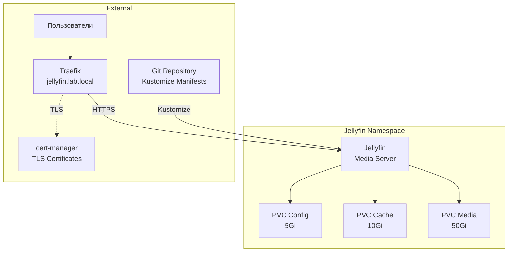

# Jellyfin ArgoCD Application

Этот каталог содержит конфигурацию для развертывания Jellyfin через ArgoCD.

<details>
<summary><strong>🚀 Быстрый старт</strong></summary>

---

**Минимальные шаги для развертывания Jellyfin:**

1. **Разверните cert-manager (обязательно перед Jellyfin):**
   ```bash
   # Применить cert-manager Application
   kubectl apply -f argocd-apps/cert-manager/cert-manager.yaml
   
   # Дождаться готовности cert-manager
   kubectl wait --for=condition=ready pod -l app.kubernetes.io/instance=cert-manager -n cert-manager --timeout=300s
   
   # Создать ClusterIssuer
   kubectl apply -f argocd-apps/cert-manager/clusterissuer-selfsigned.yaml
   
   # Проверить ClusterIssuer
   kubectl get clusterissuer selfsigned-issuer
   ```

2. **Настройте Git репозиторий в ArgoCD:**
   ```bash
   # Обновите repoURL в jellyfin.yaml на ваш Git репозиторий
   # Затем добавьте репозиторий в ArgoCD (если еще не добавлен)
   argocd repo add https://github.com/YOUR_USERNAME/YOUR_REPO.git --name lab-home --type git
   ```

3. **Примените ArgoCD Application для Jellyfin:**
   ```bash
   kubectl apply -f argocd-apps/media-server-stack/jellyfin/jellyfin.yaml
   ```

4. **Дождитесь готовности:**
   ```bash
   kubectl get pods -n jellyfin -w
   # Поды должны быть в состоянии Running
   ```

5. **Войдите в Jellyfin:**
   - URL: `https://jellyfin.lab.local`
   - При первом входе будет запущен мастер настройки

📋 **Детальные инструкции:** см. секции ниже

</details>

<details>
<summary><strong>📋 Описание и компоненты</strong></summary>

---

Jellyfin - это свободная программная система медиа-сервера для управления и потоковой передачи личной коллекции мультимедийных файлов. Это альтернатива проприетарным решениям Emby и Plex для домашнего использования.

**Основные возможности:**

- Управление библиотекой личных видео, домашних записей и музыки
- Потоковое воспроизведение с транскодированием
- Поддержка множества клиентов (web, mobile, TV apps)
- Управление пользователями и доступом
- Получение метаданных из TMDb, TVDb и других источников
- Поддержка субтитров и аудиодорожек
- Live TV и DVR функционал

### Компоненты

- **Deployment** - контейнер Jellyfin с образом `jellyfin/jellyfin:latest`
- **Service** - ClusterIP сервис на порту 80
- **PersistentVolumeClaims** - три PVC для config (5Gi), cache (10Gi) и media (50Gi)
- **Ingress** - доступ через Traefik с TLS
- **Namespace** - `jellyfin`

### Архитектура развертывания



</details>

<details>
<summary><strong>📋 Структура файлов</strong></summary>

---

**Примечание**: Jellyfin использует **Kustomize** (а не Helm), поэтому структура отличается от некоторых других приложений.

```
jellyfin/
├── jellyfin.yaml          # ArgoCD Application манифест (указывает на Kustomize)
├── kustomization.yaml     # Kustomize конфигурация (объединяет ресурсы из base/)
├── base/
│   ├── namespace.yaml     # Namespace манифест
│   ├── pvc.yaml           # PersistentVolumeClaims (config, cache, media)
│   ├── deployment.yaml    # Deployment манифест
│   ├── service.yaml       # Service манифест
│   └── ingress.yaml       # Ingress манифест с TLS
└── README.md              # Этот файл
```

**Отличие от других приложений:**
- **Helm приложения** (GitLab, Rancher, Prometheus Stack) - один файл с inline values
- **Kustomize приложения** (Homepage, Jellyfin) - несколько отдельных манифестов, объединенных через `kustomization.yaml`

**Примечание**: Namespace `jellyfin` создается автоматически через `CreateNamespace=true` в `jellyfin.yaml`.

</details>

<details>
<summary><strong>📋 Предварительные требования</strong></summary>

---

1. **Kubernetes кластер версии 1.23+**
   ```bash
   kubectl version --short
   ```

2. **ArgoCD установлен и настроен**
   ```bash
   kubectl get pods -n argocd
   ```

3. **k3s с Traefik Ingress** (k3s использует Traefik по умолчанию)
   ```bash
   kubectl get ingressclass
   # Должен быть ingressclass traefik
   ```

4. **cert-manager установлен и настроен** (см. секцию "Быстрый старт")
   ```bash
   kubectl get clusterissuer selfsigned-issuer
   ```

6. **Git репозиторий настроен в ArgoCD**
   
   Перед применением Application необходимо:
   - Настроить Git репозиторий в ArgoCD
   - Указать правильный `repoURL` в `jellyfin.yaml`

7. **DNS настроен** для домена `jellyfin.lab.local` (или измените в конфигурации)

8. **Достаточно места на диске** для хранения медиафайлов (по умолчанию 50Gi для media PVC)

</details>

<details>
<summary><strong>⚙️ Установка</strong></summary>

---

### 1. Развертывание cert-manager

Jellyfin требует cert-manager для работы с TLS сертификатами. Разверните cert-manager **до** развертывания Jellyfin:

```bash
# Применить cert-manager Application
kubectl apply -f argocd-apps/cert-manager/cert-manager.yaml

# Дождаться готовности cert-manager
kubectl wait --for=condition=ready pod -l app.kubernetes.io/instance=cert-manager -n cert-manager --timeout=300s

# Проверить статус подов
kubectl get pods -n cert-manager
```

Ожидаемый результат - все поды в состоянии `Running`:
```
NAME                                       READY   STATUS    RESTARTS   AGE
cert-manager-xxxxxxxxxx-xxxxx             1/1     Running   0          2m
cert-manager-cainjector-xxxxxxxxxx-xxxxx  1/1     Running   0          2m
cert-manager-webhook-xxxxxxxxxx-xxxxx     1/1     Running   0          2m
```

### 3. Создание ClusterIssuer

Создайте ClusterIssuer для генерации сертификатов:

```bash
# Применить ClusterIssuer
kubectl apply -f argocd-apps/cert-manager/clusterissuer-selfsigned.yaml

# Проверить статус ClusterIssuer
kubectl get clusterissuer selfsigned-issuer

# Должен быть в состоянии Ready
kubectl describe clusterissuer selfsigned-issuer
```

### 4. Настройка Git репозитория в ArgoCD

Перед применением Application необходимо настроить Git репозиторий:

#### Обновить repoURL в jellyfin.yaml

Отредактируйте `jellyfin.yaml` и замените URL на реальный адрес вашего Git репозитория:

```yaml
source:
  repoURL: https://github.com/YOUR_USERNAME/YOUR_REPO.git
  targetRevision: HEAD
    path: argocd-apps/media-server-stack/jellyfin
```

#### Добавить репозиторий в ArgoCD

**Через kubectl:**
```bash
kubectl apply -f - <<EOF
apiVersion: v1
kind: Secret
metadata:
  name: lab-home-repo
  namespace: argocd
  labels:
    argocd.argoproj.io/secret-type: repository
type: Opaque
stringData:
  type: git
  url: https://github.com/YOUR_USERNAME/YOUR_REPO.git
EOF
```

**Через ArgoCD CLI:**
```bash
argocd repo add https://github.com/YOUR_USERNAME/YOUR_REPO.git \
  --name lab-home \
  --type git
```

### 5. Применение ArgoCD Application для Jellyfin

Примените Application для Jellyfin:

```bash
# Применить Application
kubectl apply -f argocd-apps/media-server-stack/jellyfin/jellyfin.yaml

# Проверить статус Application
kubectl get application jellyfin -n argocd

# Детали Application
kubectl describe application jellyfin -n argocd
```

После развертывания cert-manager автоматически создаст Certificate на основе аннотаций Ingress.

### 6. Проверка статуса развертывания

#### Через ArgoCD CLI

```bash
# Список Applications
argocd app list

# Статус Jellyfin Application
argocd app get jellyfin

# Синхронизация (если не настроена автоматическая)
argocd app sync jellyfin
```

#### Через ArgoCD UI

1. Откройте ArgoCD UI: `http://argocd.lab.local:30080`
2. Войдите с учетными данными admin
3. Найдите Application `jellyfin`
4. Проверьте статус синхронизации

#### Через kubectl

```bash
# Проверить поды Jellyfin
kubectl get pods -n jellyfin

# Проверить PVCs
kubectl get pvc -n jellyfin

# Проверить Certificate
kubectl get certificate -n jellyfin

# Проверить Ingress
kubectl get ingress -n jellyfin
```

### Время развертывания

- **Ожидаемое время**: 2-5 минут
- Зависит от скорости загрузки образа (1-2 Gb)
- Поды должны перейти в состояние `Running`
- Certificate должен стать Ready
- PVCs должны быть Bound

</details>

<details>
<summary><strong>🔍 Доступ и первоначальная настройка</strong></summary>

---

### Доступ к Jellyfin

После успешного развертывания Jellyfin будет доступен по адресу:

- **URL**: `https://jellyfin.lab.local`

### Предупреждение о сертификате (self-signed)

⚠️ При использовании self-signed сертификатов браузер покажет предупреждение о безопасности. Это нормально для тестовой среды. Нажмите "Advanced" → "Proceed to jellyfin.lab.local" для продолжения.

### Первоначальная настройка

При первом доступе к Jellyfin запустится мастер начальной настройки:

1. **Выбор языка** - выберите предпочитаемый язык интерфейса

2. **Создание администратора** - создайте учетную запись администратора:
   - Имя пользователя
   - Пароль (рекомендуется использовать надежный пароль)

3. **Настройка библиотек** - добавьте медиабиблиотеки:
   - Домашнее видео → путь `/media/movies`
   - Семейные архивы → путь `/media/tvshows`
   - Аудиозаписи → путь `/media/music`
   
   **Примечание**: Создайте соответствующие директории для вашей личной коллекции

4. **Язык метаданных** - выберите язык для загрузки метаданных (Русский/English)

5. **Удаленный доступ** - настройка завершена

### Загрузка медиафайлов

Для загрузки медиафайлов в Jellyfin:

**Вариант 1: Через kubectl (рекомендуется для начала)**

```bash
# Получить имя пода Jellyfin
POD_NAME=$(kubectl get pods -n jellyfin -l app=jellyfin -o jsonpath='{.items[0].metadata.name}')

# Создать директории
kubectl exec -n jellyfin $POD_NAME -- mkdir -p /media/movies /media/tvshows /media/music

# Скопировать файлы в контейнер
kubectl cp /path/to/movie.mp4 jellyfin/$POD_NAME:/media/movies/movie.mp4
```

**Вариант 2: Прямой доступ к PVC (для больших объемов)**

```bash
# Создать временный под для доступа к PVC
kubectl run -n jellyfin media-uploader --image=busybox --restart=Never --overrides='
{
  "spec": {
    "containers": [{
      "name": "media-uploader",
      "image": "busybox",
      "command": ["sleep", "3600"],
      "volumeMounts": [{
        "name": "media",
        "mountPath": "/media"
      }]
    }],
    "volumes": [{
      "name": "media",
      "persistentVolumeClaim": {
        "claimName": "jellyfin-media"
      }
    }]
  }
}'

# Копировать файлы
kubectl cp /path/to/media jellyfin/media-uploader:/media

# Удалить временный под
kubectl delete pod -n jellyfin media-uploader
```

### Сканирование библиотек

После загрузки файлов запустите сканирование библиотек в веб-интерфейсе:

1. Перейдите в **Dashboard** → **Libraries**
2. Нажмите кнопку с тремя точками возле библиотеки
3. Выберите **Scan Library**

</details>

<details>
<summary><strong>🔍 Проверка статуса развертывания</strong></summary>

---

### Проверка подов

```bash
# Список всех подов
kubectl get pods -n jellyfin

# Детальная информация
kubectl get pods -n jellyfin -o wide

# Проверка статуса конкретного пода
kubectl describe pod <pod-name> -n jellyfin

# Наблюдение за подами в реальном времени
watch kubectl get pods -n jellyfin
```

Ожидаемый результат - поды в состоянии `Running`:
```
NAME                        READY   STATUS    RESTARTS   AGE
jellyfin-xxxxxxxxxx-xxxxx   1/1     Running   0          2m
```

### Проверка логов

```bash
# Логи Jellyfin
kubectl logs -n jellyfin deployment/jellyfin --tail=50

# Логи конкретного пода
kubectl logs -n jellyfin <pod-name> --tail=100

# Следить за логами в реальном времени
kubectl logs -n jellyfin deployment/jellyfin -f
```

### Проверка PersistentVolumeClaims

```bash
# Список всех PVC
kubectl get pvc -n jellyfin

# Детали конкретного PVC
kubectl describe pvc jellyfin-config -n jellyfin
kubectl describe pvc jellyfin-cache -n jellyfin
kubectl describe pvc jellyfin-media -n jellyfin
```

Ожидаемый результат - все PVC в состоянии `Bound`:
```
NAME              STATUS   VOLUME                                     CAPACITY   ACCESS MODES   STORAGECLASS   AGE
jellyfin-cache    Bound    pvc-xxxxxxxx-xxxx-xxxx-xxxx-xxxxxxxxxxxx   10Gi       RWO            local-path     2m
jellyfin-config   Bound    pvc-xxxxxxxx-xxxx-xxxx-xxxx-xxxxxxxxxxxx   5Gi        RWO            local-path     2m
jellyfin-media    Bound    pvc-xxxxxxxx-xxxx-xxxx-xxxx-xxxxxxxxxxxx   50Gi       RWO            local-path     2m
```

### Проверка сервисов и Ingress

```bash
# Сервисы
kubectl get svc -n jellyfin

# Ingress
kubectl get ingress -n jellyfin

# Детали Ingress
kubectl describe ingress -n jellyfin

# Проверка доступности через curl
curl -I https://jellyfin.lab.local -k
```

### Проверка Certificate

```bash
# Список всех Certificate
kubectl get certificate -n jellyfin

# Детали Certificate
kubectl describe certificate jellyfin-tls -n jellyfin

# Проверить секрет с сертификатом
kubectl get secret jellyfin-tls -n jellyfin
```

### Использование ресурсов

```bash
# Использование ресурсов подами
kubectl top pods -n jellyfin

# События в namespace
kubectl get events -n jellyfin --sort-by='.lastTimestamp'

# Статус всех ресурсов
kubectl get all -n jellyfin
```

</details>

<details>
<summary><strong>⚙️ Конфигурация и ресурсы</strong></summary>

---

### Текущее потребление ресурсов

**Вычислительные ресурсы:**

- **Jellyfin**: 500m CPU / 512Mi RAM (requests), 2000m CPU / 2Gi RAM (limits)
  - Повышенные лимиты необходимы для транскодирования видео

**Хранилище:**

- **Config PVC**: 5Gi для конфигурации приложения
- **Cache PVC**: 10Gi для кэша транскодирования
- **Media PVC**: 50Gi для медиафайлов (можно увеличить по необходимости)

### Изменение размера PVC

Для изменения размера медиа-хранилища отредактируйте `base/pvc.yaml`:

```yaml
apiVersion: v1
kind: PersistentVolumeClaim
metadata:
  name: jellyfin-media
spec:
  resources:
    requests:
      storage: 100Gi  # Увеличьте до нужного размера
```

**Примечание**: Некоторые StorageClass поддерживают динамическое расширение PVC. Проверьте возможности вашего StorageClass.

### Изменение домена

Отредактируйте `base/ingress.yaml`:

```yaml
spec:
  rules:
  - host: ваш-домен.lab.local
  tls:
    - hosts:
        - ваш-домен.lab.local
```

И обновите переменную окружения в `base/deployment.yaml`:

```yaml
env:
- name: JELLYFIN_PublishedServerUrl
  value: "https://ваш-домен.lab.local"
```

### Настройка ресурсов

Для изменения ресурсов отредактируйте `base/deployment.yaml`:

```yaml
resources:
  requests:
    memory: "512Mi"
    cpu: "500m"
  limits:
    memory: "2Gi"
    cpu: "2000m"
```

**Рекомендации для транскодирования:**
- Минимум: 2 CPU cores, 2Gi RAM
- Рекомендуется: 4+ CPU cores, 4Gi+ RAM
- С аппаратным ускорением (GPU): специальная настройка требуется

### Обновление конфигурации

ArgoCD автоматически синхронизирует изменения благодаря настроенной автоматической синхронизации (`automated.syncPolicy`). При изменении файлов в Git репозитории ArgoCD автоматически обновит приложение.

Для ручной синхронизации:

```bash
# Через ArgoCD CLI
argocd app sync jellyfin
```

</details>

<details>
<summary><strong>🔧 Устранение неполадок</strong></summary>

---

### Pod не запускается

**Причина**: Ошибка в конфигурации или недостаточно ресурсов

**Решение**:
```bash
# Проверить логи пода
kubectl logs -n jellyfin deployment/jellyfin

# Проверить события
kubectl describe pod -n jellyfin -l app=jellyfin

# Проверить ресурсы
kubectl top pod -n jellyfin -l app=jellyfin
```

### PVC не создается или остается Pending

**Причина**: Проблема со StorageClass или недостаточно места

**Решение**:
```bash
# Проверить StorageClass
kubectl get storageclass

# Проверить события PVC
kubectl describe pvc -n jellyfin

# Проверить наличие места на нодах
kubectl get nodes
kubectl describe node <node-name>
```

### Ingress не работает

**Причина**: Проблема с DNS или настройками Traefik

**Решение**:
```bash
# Проверить Ingress
kubectl describe ingress jellyfin -n jellyfin

# Проверить Traefik (в k3s встроен в системный namespace)
kubectl get pods -n kube-system | grep traefik

# Проверить логи Traefik
kubectl logs -n kube-system -l app.kubernetes.io/name=traefik
```

### Certificate не создается или не Ready

**Симптомы**:
```bash
kubectl get certificate -n jellyfin
# Certificate в состоянии False (не Ready)
```

**Решение**:
```bash
# 1. Проверить аннотацию в Ingress
kubectl get ingress -n jellyfin -o yaml | grep cert-manager

# 2. Проверить события Certificate
kubectl describe certificate jellyfin-tls -n jellyfin

# 3. Проверить CertificateRequest (если создан)
kubectl get certificaterequest -n jellyfin

# 4. Если проблема сохраняется, удалить секреты для пересоздания
kubectl delete secret jellyfin-tls jellyfin-tls-ca jellyfin-tls-chain -n jellyfin
```

### Jellyfin показывает ошибку при старте

**Причина**: Проблема с volume или permissions

**Решение**:
```bash
# Проверить, что volumes смонтированы правильно
kubectl exec -n jellyfin deployment/jellyfin -- ls -la /config /cache /media

# Проверить права доступа
kubectl exec -n jellyfin deployment/jellyfin -- df -h

# Проверить логи для деталей ошибки
kubectl logs -n jellyfin deployment/jellyfin --tail=200
```

### Транскодирование не работает или медленное

**Причина**: Недостаточно ресурсов CPU/RAM

**Решение**:
```bash
# Проверить использование ресурсов
kubectl top pod -n jellyfin

# Увеличить лимиты ресурсов в deployment.yaml
# Рассмотрите возможность использования GPU для аппаратного ускорения
```

### Application не синхронизируется в ArgoCD

**Причина**: Проблема с Git репозиторием или доступом

**Решение**:
```bash
# Проверить логи ArgoCD
kubectl logs -n argocd -l app.kubernetes.io/name=argocd-application-controller

# Проверить статус Application
kubectl describe application jellyfin -n argocd

# Проверить доступность Git репозитория
argocd repo list

# Попробовать синхронизировать вручную
argocd app sync jellyfin
```

### Jellyfin недоступен после развертывания

**Причина**: Компоненты еще инициализируются

**Решение**:
```bash
# Проверить статус всех подов
kubectl get pods -n jellyfin

# Дождаться готовности подов (STATUS = Running, READY = 1/1)
# Это может занять 2-5 минут для загрузки образа

# Проверить логи Jellyfin
kubectl logs -n jellyfin deployment/jellyfin --tail=100

# Проверить Ingress и Certificate
kubectl get ingress,certificate -n jellyfin
```

</details>

<details>
<summary><strong>🔒 Включение SSL/TLS</strong></summary>

---

⚠️ **ВАЖНО: Правильный порядок развертывания**

1. **Сначала разверните cert-manager:**
   ```bash
   kubectl apply -f argocd-apps/cert-manager/cert-manager.yaml
   ```

2. **Дождитесь готовности cert-manager:**
   ```bash
   kubectl wait --for=condition=ready pod -l app.kubernetes.io/instance=cert-manager -n cert-manager --timeout=300s
   ```

3. **Создайте ClusterIssuer:**
   ```bash
   kubectl apply -f argocd-apps/cert-manager/clusterissuer-selfsigned.yaml
   ```

4. **Проверьте ClusterIssuer:**
   ```bash
   kubectl get clusterissuer selfsigned-issuer
   # Должен быть в состоянии Ready
   ```

5. **Только после этого развертывайте Jellyfin** (уже настроен для использования cert-manager)

**Если Jellyfin развернут до ClusterIssuer:**

Если Jellyfin был развернут до создания ClusterIssuer, Certificate может быть в состоянии `False`. Исправление:

```bash
# Удалить старые TLS секреты
kubectl delete secret jellyfin-tls jellyfin-tls-ca jellyfin-tls-chain -n jellyfin

# cert-manager автоматически создаст новые секреты
# Проверить статус
kubectl get certificate jellyfin-tls -n jellyfin
# Должен стать Ready
```

**Конфигурация для Let's Encrypt (production):**

Для production окружения используйте Let's Encrypt:

1. Создайте ClusterIssuer для Let's Encrypt (см. cert-manager README)
2. Обновите конфигурацию Ingress в `base/ingress.yaml`:
   ```yaml
   annotations:
     cert-manager.io/cluster-issuer: "letsencrypt-prod"  # Вместо selfsigned-issuer
   ```

</details>

<details>
<summary><strong>💡 Рекомендации по оптимизации</strong></summary>

---

### Для production окружения

1. **Используйте Let's Encrypt** вместо self-signed сертификатов

2. **Увеличьте размер media PVC** в соответствии с вашими потребностями:
   ```yaml
   storage: 500Gi  # или больше
   ```

3. **Настройте резервное копирование** PVC с конфигурацией и медиафайлами

4. **Используйте аппаратное ускорение** для транскодирования:
   - Intel QuickSync
   - NVIDIA NVENC
   - AMD AMF

5. **Настройте мониторинг** Jellyfin через ServiceMonitor (если используется Prometheus)

6. **Оптимизируйте транскодирование**:
   - Установите лимиты транскодирования
   - Используйте предварительное транскодирование для популярного контента
   - Настройте качество и битрейт

7. **Используйте внешнее хранилище** для медиафайлов:
   - NFS
   - S3-совместимое хранилище
   - Сетевое хранилище (NAS)

### Для повышения производительности

1. **Увеличьте ресурсы** для транскодирования:
   ```yaml
   resources:
     requests:
       cpu: "2000m"
       memory: "2Gi"
     limits:
       cpu: "4000m"
       memory: "4Gi"
   ```

2. **Используйте SSD** для cache PVC

3. **Настройте CDN** для статического контента

4. **Оптимизируйте сеть**:
   - Используйте прямое соединение для локальных клиентов
   - Настройте bandwidth ограничения

</details>

<details>
<summary><strong>⚠️ Важные замечания</strong></summary>

---

⚠️ **Для тестовой среды:**
- Используется self-signed сертификат (браузер покажет предупреждение)
- Размер media PVC ограничен 50Gi
- Уменьшенные ресурсы для транскодирования
- Подходит для разработки и тестирования

✅ **Для production окружения:**
- Обязательно включите SSL/TLS с Let's Encrypt
- Настройте cert-manager
- Увеличьте размер media PVC
- Настройте резервное копирование
- Увеличьте ресурсы для транскодирования
- Рассмотрите использование GPU
- Используйте внешнее хранилище для медиафайлов

📦 **Хранение медиафайлов:**
- По умолчанию используется local-path (локальное хранилище на ноде)
- Для production рекомендуется использовать сетевое хранилище (NFS, NAS)
- При миграции пода на другую ноду данные могут быть недоступны (если используется local-path)

🎬 **Транскодирование:**
- Транскодирование - ресурсоемкий процесс
- Рекомендуется использовать аппаратное ускорение (GPU)
- Без GPU транскодирование может быть медленным
- Настройте ограничения одновременных транскодирований

</details>

<details>
<summary><strong>📚 Дополнительная информация</strong></summary>

---

- [Официальная документация Jellyfin](https://jellyfin.org/docs/)
- [GitHub репозиторий](https://github.com/jellyfin/jellyfin)
- [Документация по настройке](https://jellyfin.org/docs/general/administration/configuration.html)
- [Клиентские приложения](https://jellyfin.org/downloads/clients/)
- [Форум сообщества](https://forum.jellyfin.org/)
- [Reddit сообщество](https://www.reddit.com/r/jellyfin/)

</details>
