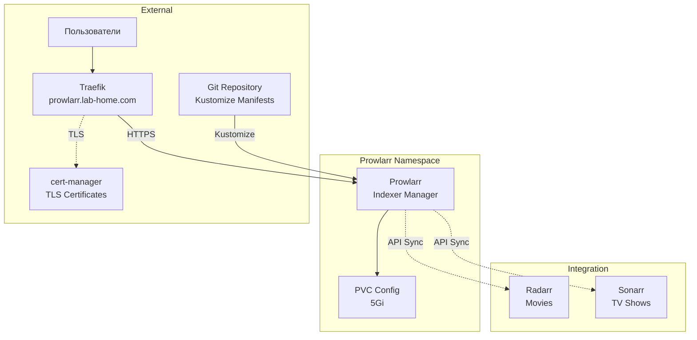

# Prowlarr ArgoCD Application

Этот каталог содержит конфигурацию для развертывания Prowlarr через ArgoCD.

<details>
<summary><strong>🚀Быстрый старт</strong></summary>

---

**Минимальные шаги для развертывания Prowlarr:**

1. **Настройте StorageClass (если еще не настроен):**
   ```bash
   kubectl apply -f https://raw.githubusercontent.com/rancher/local-path-provisioner/v0.0.24/deploy/local-path-storage.yaml
   kubectl patch storageclass local-path -p '{"metadata": {"annotations":{"storageclass.kubernetes.io/is-default-class":"true"}}}'
   ```

2. **Разверните cert-manager (обязательно перед Prowlarr):**
   ```bash
   kubectl apply -f argocd-apps/cert-manager/cert-manager.yaml
   kubectl wait --for=condition=ready pod -l app.kubernetes.io/instance=cert-manager -n cert-manager --timeout=300s
   kubectl apply -f argocd-apps/cert-manager/clusterissuer-selfsigned.yaml
   kubectl get clusterissuer selfsigned-issuer
   ```

3. **Настройте Git репозиторий в ArgoCD:**
   ```bash
   argocd repo add https://github.com/YOUR_USERNAME/YOUR_REPO.git --name lab-home --type git
   ```

4. **Примените ArgoCD Application для Prowlarr:**
   ```bash
   kubectl apply -f argocd-apps/media-server-stack/prowlarr/prowlarr.yaml
   ```

5. **Дождитесь готовности:**
   ```bash
   kubectl get pods -n prowlarr -w
   ```

6. **Войдите в Prowlarr:**
   - URL: `https://prowlarr.lab-home.com`

</details>

<details>
<summary><strong>📋Описание и компоненты</strong></summary>

---

Prowlarr - это менеджер источников медиаконтента для организации личной коллекции. Он интегрируется с приложениями управления медиатекой (Radarr) для централизованного управления подключениями к источникам видео.

**Основные возможности:**

- Централизованное управление источниками медиа для всех приложений коллекции
- Подключение к сетевым хранилищам (NAS, SMB shares)
- Автоматическая синхронизация источников с приложениями управления
- Мониторинг доступности источников
- Управление API ключами для интеграции
- Статистика использования источников

### Компоненты

- **Deployment** - контейнер Prowlarr с образом `linuxserver/prowlarr:latest`
- **Service** - ClusterIP сервис на порту 80
- **PersistentVolumeClaim** - PVC для config (5Gi)
- **Ingress** - доступ через Traefik с TLS
- **Namespace** - `prowlarr`

### Архитектура развертывания



</details>

<details>
<summary><strong>📋Структура файлов</strong></summary>

---

```
prowlarr/
├── prowlarr.yaml          # ArgoCD Application манифест
├── kustomization.yaml     # Kustomize конфигурация
├── base/
│   ├── namespace.yaml     # Namespace манифест
│   ├── pvc.yaml           # PersistentVolumeClaim для config
│   ├── deployment.yaml    # Deployment манифест
│   ├── service.yaml       # Service манифест
│   └── ingress.yaml       # Ingress манифест с TLS
└── README.md              # Этот файл
```

</details>

<details>
<summary><strong>📋Предварительные требования</strong></summary>

---

1. **Kubernetes кластер версии 1.23+**
2. **ArgoCD установлен и настроен**
3. **k3s с Traefik Ingress** (k3s использует Traefik по умолчанию)
4. **StorageClass настроен** для PersistentVolumes
5. **cert-manager установлен и настроен**
6. **Git репозиторий настроен в ArgoCD**
7. **DNS настроен** для домена `prowlarr.lab-home.com`

</details>

<details>
<summary><strong>⚙️Установка</strong></summary>

---

### 1. Настройка StorageClass

```bash
kubectl apply -f https://raw.githubusercontent.com/rancher/local-path-provisioner/v0.0.24/deploy/local-path-storage.yaml
kubectl patch storageclass local-path -p '{"metadata": {"annotations":{"storageclass.kubernetes.io/is-default-class":"true"}}}'
kubectl get storageclass
```

### 2. Развертывание cert-manager

```bash
kubectl apply -f 03-argocd/cert-manager/cert-manager.yaml
kubectl wait --for=condition=ready pod -l app.kubernetes.io/instance=cert-manager -n cert-manager --timeout=300s
kubectl apply -f 03-argocd/cert-manager/clusterissuer-selfsigned.yaml
kubectl get clusterissuer selfsigned-issuer
```

### 3. Применение ArgoCD Application

```bash
kubectl apply -f 03-argocd/media-server-stack/prowlarr/prowlarr.yaml
kubectl get application prowlarr -n argocd
```

### 4. Проверка статуса

```bash
kubectl get pods -n prowlarr
kubectl get pvc -n prowlarr
kubectl get certificate -n prowlarr
kubectl get ingress -n prowlarr
```

</details>

<details>
<summary><strong>🔍Доступ и первоначальная настройка</strong></summary>

---

### Доступ к Prowlarr

- **URL**: `https://prowlarr.lab-home.com`

### Первоначальная настройка

1. **Добавление источников медиа:**
   - Settings → Indexers → Add Indexer
   - Настройте подключения к сетевым хранилищам (NAS, SMB)
   - Добавьте локальные директории для импорта видео

2. **Настройка приложений (Apps):**
   - Settings → Apps → Add Application
   - Выберите Radarr для управления личной видеотекой
   - Укажите URL: `http://radarr.radarr.svc.cluster.local:80`
   - API Key можно получить из настроек соответствующего приложения
   - Включите синхронизацию источников

3. **Проверка подключений:**
   - Протестируйте доступность источников
   - Проверьте интеграцию с Radarr

</details>

<details>
<summary><strong>🔍Проверка статуса развертывания</strong></summary>

---

### Проверка подов

```bash
kubectl get pods -n prowlarr
kubectl describe pod -n prowlarr -l app=prowlarr
kubectl logs -n prowlarr deployment/prowlarr --tail=100
```

### Проверка PVC

```bash
kubectl get pvc -n prowlarr
kubectl describe pvc prowlarr-config -n prowlarr
```

### Проверка Ingress и Certificate

```bash
kubectl get ingress -n prowlarr
kubectl get certificate -n prowlarr
kubectl describe certificate prowlarr-tls -n prowlarr
```

</details>

<details>
<summary><strong>⚙️Конфигурация и ресурсы</strong></summary>

---

### Текущее потребление ресурсов

**Вычислительные ресурсы:**
- **Prowlarr**: 100m CPU / 128Mi RAM (requests), 500m CPU / 512Mi RAM (limits)

**Хранилище:**
- **Config PVC**: 5Gi для конфигурации приложения

### Изменение домена

Отредактируйте `base/ingress.yaml`:

```yaml
spec:
  rules:
  - host: ваш-домен.lab-home.com
  tls:
    - hosts:
        - ваш-домен.lab-home.com
```

### Настройка ресурсов

Отредактируйте `base/deployment.yaml`:

```yaml
resources:
  requests:
    memory: "128Mi"
    cpu: "100m"
  limits:
    memory: "512Mi"
    cpu: "500m"
```

</details>

<details>
<summary><strong>🔧Устранение неполадок</strong></summary>

---

### Pod не запускается

```bash
kubectl logs -n prowlarr deployment/prowlarr
kubectl describe pod -n prowlarr -l app=prowlarr
```

### PVC не создается

```bash
kubectl get storageclass
kubectl describe pvc -n prowlarr
```

### Certificate не создается

```bash
kubectl get certificate -n prowlarr
kubectl describe certificate prowlarr-tls -n prowlarr
kubectl delete secret prowlarr-tls -n prowlarr
```

### Интеграция с Radarr не работает

**Проблема**: Prowlarr не может подключиться к Radarr

**Решение**:
- Проверьте URL: должен быть `http://radarr.radarr.svc.cluster.local:80`
- Проверьте API ключ в Radarr: Settings → General → API Key
- Проверьте что оба пода запущены и доступны

</details>

<details>
<summary><strong>🔒Включение SSL/TLS</strong></summary>

---

⚠️ **ВАЖНО: Правильный порядок развертывания**

1. Сначала разверните cert-manager
2. Создайте ClusterIssuer
3. Только после этого развертывайте Prowlarr

**Если Prowlarr развернут до ClusterIssuer:**

```bash
kubectl delete secret prowlarr-tls -n prowlarr
kubectl get certificate prowlarr-tls -n prowlarr
```

</details>

<details>
<summary><strong>💡Интеграция с другими приложениями</strong></summary>

---

### Интеграция с Radarr

1. В Prowlarr: Settings → Apps → Add Application → Radarr
2. Prowlarr Server: `http://prowlarr.prowlarr.svc.cluster.local:80`
3. Radarr Server: `http://radarr.radarr.svc.cluster.local:80`
4. API Key: из Radarr Settings → General
5. Sync Level: Full Sync

### Автоматическая синхронизация

Prowlarr автоматически синхронизирует источники медиа с подключенными приложениями:
- Добавьте источник в Prowlarr один раз
- Он автоматически станет доступен в подключенных приложениях
- Изменения источников синхронизируются автоматически

</details>