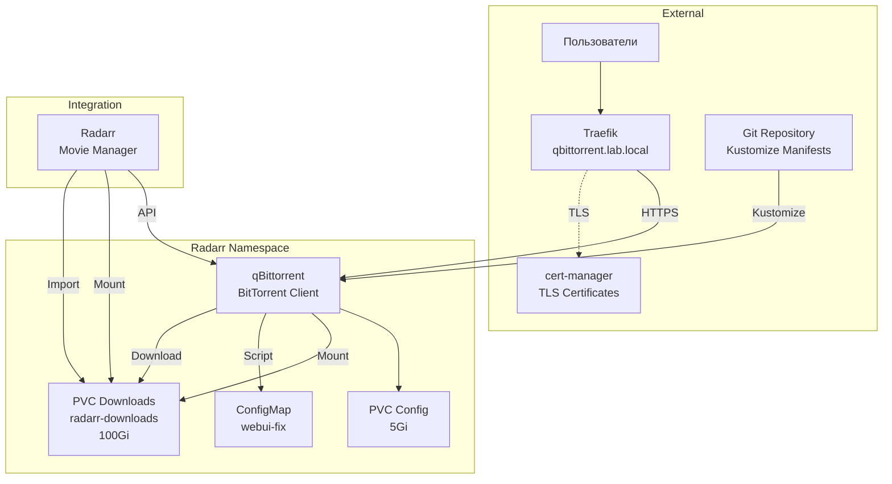

# qBittorrent ArgoCD Application

Этот каталог содержит конфигурацию для развертывания qBittorrent через ArgoCD.

<details>
<summary><strong>🚀Быстрый старт</strong></summary>

---

**Минимальные шаги для развертывания qBittorrent:**

1. **Разверните cert-manager (обязательно перед qBittorrent):**
   ```bash
   kubectl apply -f argocd-apps/cert-manager/cert-manager.yaml
   kubectl wait --for=condition=ready pod -l app.kubernetes.io/instance=cert-manager -n cert-manager --timeout=300s
   kubectl apply -f argocd-apps/cert-manager/clusterissuer-selfsigned.yaml
   kubectl get clusterissuer selfsigned-issuer
   ```

2. **Примените ArgoCD Application для qBittorrent:**
   ```bash
   kubectl apply -f argocd-apps/media-server-stack/qbittorrent/qbittorrent.yaml
   ```

3. **Дождитесь готовности:**
   ```bash
   kubectl get pods -n radarr -w
   ```

4. **Получите временный пароль для первого входа:**
   ```bash
   kubectl logs -n radarr deployment/qbittorrent | grep -i "temporary password"
   ```

5. **Войдите в qBittorrent:**
   - URL: `https://qbittorrent.lab.local`
   - Логин: `admin`
   - Пароль: временный пароль из логов

📋 **Детальные инструкции:** см. секции ниже

</details>

<details>
<summary><strong>📋Описание и компоненты</strong></summary>

---

qBittorrent - это свободный BitTorrent клиент с открытым исходным кодом для получения медиа-контента для личной коллекции. Он интегрируется с приложениями управления медиатекой (Radarr) для автоматического получения файлов.

**Основные возможности:**

- BitTorrent клиент для получения файлов
- Веб-интерфейс для управления
- Интеграция с Radarr через API
- Поддержка категорий для автоматической организации
- Настройка путей загрузки
- Управление приоритетами и очередями
- RSS подписки и автоматическая загрузка

### Компоненты

- **Deployment** - контейнер qBittorrent с образом `linuxserver/qbittorrent:latest`
- **Service** - ClusterIP сервис на порту 80 (проксирует на 8080)
- **PersistentVolumeClaims** - два PVC:
  - `qbittorrent-config` (5Gi) - для конфигурации
  - `radarr-downloads` (100Gi) - общий PVC с Radarr для загрузок
- **ConfigMap** - `qbittorrent-webui-fix` - скрипт для исправления WebUI при доступе через Ingress
- **Ingress** - доступ через Traefik с TLS
- **Namespace** - `radarr` (общий с Radarr для shared downloads PVC)

### Архитектура развертывания



### Особенности конфигурации

- **Общий PVC с Radarr**: PVC `radarr-downloads` монтируется в оба приложения для автоматического импорта завершенных загрузок
- **WebUI Fix**: ConfigMap содержит скрипт, который автоматически отключает Host header validation и CSRF protection при доступе через Ingress
- **LinuxServer.io образ**: Использует `custom-cont-init.d` для выполнения скриптов при старте контейнера

</details>

<details>
<summary><strong>📋Структура файлов</strong></summary>

---

```
qbittorrent/
├── qbittorrent.yaml            # ArgoCD Application манифест
├── kustomization.yaml          # Kustomize конфигурация
├── base/
│   ├── pvc.yaml                # PersistentVolumeClaims (config + downloads)
│   ├── deployment.yaml          # Deployment манифест
│   ├── service.yaml            # Service манифест
│   ├── ingress.yaml            # Ingress манифест с TLS
│   └── configmap-webui-fix.yaml  # ConfigMap для исправления WebUI
└── README.md                   # Этот файл
```

**Примечание**: Namespace `radarr` должен быть создан заранее (обычно создается при развертывании Radarr) или через `CreateNamespace=true` в `qbittorrent.yaml`.

</details>

<details>
<summary><strong>📋Предварительные требования</strong></summary>

---

1. **Kubernetes кластер версии 1.23+**
   ```bash
   kubectl version --short
   ```

2. **ArgoCD установлен и настроен**
   ```bash
   kubectl get pods -n argocd
   ```

3. **k3s с Traefik Ingress** (k3s использует Traefik по умолчанию)
   ```bash
   kubectl get ingressclass
   # Должен быть ingressclass traefik
   ```

4. **cert-manager установлен и настроен** (см. секцию "Быстрый старт")
   ```bash
   kubectl get clusterissuer selfsigned-issuer
   ```

6. **Git репозиторий настроен в ArgoCD**

7. **DNS настроен** для домена `qbittorrent.lab.local` (или измените в конфигурации)

8. **Namespace `radarr` создан** (если qBittorrent развертывается до Radarr, namespace будет создан автоматически)

</details>

<details>
<summary><strong>⚙️Установка</strong></summary>

---

### 1. Развертывание cert-manager

qBittorrent требует cert-manager для работы с TLS сертификатами. Разверните cert-manager **до** развертывания qBittorrent:

```bash
# Применить cert-manager Application
kubectl apply -f argocd-apps/cert-manager/cert-manager.yaml

# Дождаться готовности cert-manager
kubectl wait --for=condition=ready pod -l app.kubernetes.io/instance=cert-manager -n cert-manager --timeout=300s

# Проверить статус подов
kubectl get pods -n cert-manager
```

Ожидаемый результат - все поды в состоянии `Running`:
```
NAME                                       READY   STATUS    RESTARTS   AGE
cert-manager-xxxxxxxxxx-xxxxx             1/1     Running   0          2m
cert-manager-cainjector-xxxxxxxxxx-xxxxx  1/1     Running   0          2m
cert-manager-webhook-xxxxxxxxxx-xxxxx     1/1     Running   0          2m
```

### 3. Создание ClusterIssuer

Создайте ClusterIssuer для генерации сертификатов:

```bash
# Применить ClusterIssuer
kubectl apply -f argocd-apps/cert-manager/clusterissuer-selfsigned.yaml

# Проверить статус ClusterIssuer
kubectl get clusterissuer selfsigned-issuer

# Должен быть в состоянии Ready
kubectl describe clusterissuer selfsigned-issuer
```

### 4. Применение ArgoCD Application для qBittorrent

Примените Application для qBittorrent:

```bash
# Применить Application
kubectl apply -f argocd-apps/media-server-stack/qbittorrent/qbittorrent.yaml

# Проверить статус Application
kubectl get application qbittorrent -n argocd

# Детали Application
kubectl describe application qbittorrent -n argocd
```

После развертывания cert-manager автоматически создаст Certificate на основе аннотаций Ingress.

### 5. Проверка статуса развертывания

#### Через ArgoCD UI

1. Откройте ArgoCD UI: `https://argocd.lab.local`
2. Войдите с учетными данными admin
3. Найдите Application `qbittorrent`
4. Проверьте статус синхронизации

#### Через kubectl

```bash
# Проверить поды qBittorrent
kubectl get pods -n radarr -l app=qbittorrent

# Проверить PVCs
kubectl get pvc -n radarr | grep -E "qbittorrent|downloads"

# Проверить Certificate
kubectl get certificate -n radarr

# Проверить Ingress
kubectl get ingress -n radarr qbittorrent
```

### Время развертывания

- **Ожидаемое время**: 2-5 минут
- Зависит от скорости загрузки образа
- Поды должны перейти в состояние `Running`
- Certificate должен стать Ready
- PVCs должны быть Bound

</details>

<details>
<summary><strong>🔍Доступ и первоначальная настройка</strong></summary>

---

### Доступ к qBittorrent

После успешного развертывания qBittorrent будет доступен по адресу:

- **URL**: `https://qbittorrent.lab.local` или `https://qbittorrent.lab.local:30443`

⚠️ **Важно**: Если видите «default backend - 404», заходите обязательно по **hostname** (`qbittorrent.lab.local`), не по IP. Ingress не матчит запросы по `https://192.168.40.145:30443`. Добавьте в hosts: `192.168.40.145 qbittorrent.lab.local` и откройте `https://qbittorrent.lab.local:30443`.

### Предупреждение о сертификате (self-signed)

⚠️ При использовании self-signed сертификатов браузер покажет предупреждение о безопасности. Это нормально для тестовой среды. Нажмите "Advanced" → "Proceed to qbittorrent.lab.local" для продолжения.

### Первый вход

1. **Получите временный пароль:**
   ```bash
   kubectl logs -n radarr deployment/qbittorrent | grep -i "temporary password"
   ```
   Пример вывода: `The WebUI administrator password was not set. A temporary password is provided for this session: 4TyYY4cnH`

2. **Войдите в qBittorrent:**
   - Откройте `https://qbittorrent.lab.local`
   - **Логин**: `admin`
   - **Пароль**: временный пароль из логов

3. **Установите постоянный пароль:**
   - После первого входа обязательно установите постоянный пароль
   - Settings → Web UI → Authentication
   - Установите новый пароль

### Если форма входа не отображается

**Проблема**: При открытии qBittorrent Web UI сразу появляется "Unauthorized", форма входа не отображается.

**Решение**:

1. **Очистите кеш браузера и cookies** для `qbittorrent.lab.local`:
   - Chrome/Edge: F12 → Application → Cookies → удалите все для домена
   - Или используйте режим инкогнито

2. **Проверьте, что скрипт WebUI fix выполнился:**
   ```bash
   kubectl exec -n radarr deployment/qbittorrent -- \
     cat /config/qBittorrent/qBittorrent.conf | grep -i "WebUI.*HostHeaderValidation\|WebUI.*CSRFProtection"
   ```
   Должно быть: `WebUI\HostHeaderValidation=false` и `WebUI\CSRFProtection=false`

3. **Перезапустите под qBittorrent:**
   ```bash
   kubectl delete pod -n radarr -l app=qbittorrent
   # Подождите 1-2 минуты для перезапуска
   ```

4. **Используйте port-forward (обход Ingress):**
   ```bash
   kubectl port-forward -n radarr deployment/qbittorrent 8080:8080
   # Откройте: http://localhost:8080
   ```

### Настройка путей загрузки

1. **Settings → Downloads**:
   - **Default Save Path**: `/downloads` (соответствует PVC `radarr-downloads`)
   - **Keep incomplete files in**: `/downloads/incomplete` (опционально)
   - **Automatically add files from**: оставьте пустым (Radarr будет отправлять через API)

### Настройка категорий (рекомендуется)

1. **Settings → Categories**:
   - Добавьте категорию `radarr`
   - Это поможет Radarr автоматически определять завершенные загрузки

### Настройка Web UI

1. **Settings → Web UI**:
   - **Port**: `8080` (уже настроено в deployment)
   - **IP address**: `0.0.0.0` (для доступа из кластера)
   - **Authentication**: включено (обязательно!)

### Настройка BitTorrent портов

1. **Settings → Connection**:
   - **Port used for incoming connections**: `6881` (уже настроено)
   - Если используете VPN, настройте соответствующие порты

</details>

<details>
<summary><strong>🔍Проверка статуса развертывания</strong></summary>

---

### Проверка подов

```bash
# Список всех подов qBittorrent
kubectl get pods -n radarr -l app=qbittorrent

# Детальная информация
kubectl get pods -n radarr -l app=qbittorrent -o wide

# Проверка статуса конкретного пода
kubectl describe pod -n radarr -l app=qbittorrent

# Наблюдение за подами в реальном времени
watch kubectl get pods -n radarr -l app=qbittorrent
```

Ожидаемый результат - поды в состоянии `Running`:
```
NAME                          READY   STATUS    RESTARTS   AGE
qbittorrent-xxxxxxxxxx-xxxxx 1/1     Running   0          2m
```

### Проверка логов

```bash
# Логи qBittorrent
kubectl logs -n radarr deployment/qbittorrent --tail=50

# Логи конкретного пода
kubectl logs -n radarr <pod-name> --tail=100

# Следить за логами в реальном времени
kubectl logs -n radarr deployment/qbittorrent -f

# Поиск временного пароля
kubectl logs -n radarr deployment/qbittorrent | grep -i "temporary password"
```

### Проверка PersistentVolumeClaims

```bash
# Список всех PVC
kubectl get pvc -n radarr | grep -E "qbittorrent|downloads"

# Детали конкретного PVC
kubectl describe pvc qbittorrent-config -n radarr
kubectl describe pvc radarr-downloads -n radarr
```

Ожидаемый результат - все PVC в состоянии `Bound`:
```
NAME                STATUS   VOLUME                                     CAPACITY   ACCESS MODES   STORAGECLASS   AGE
qbittorrent-config  Bound    pvc-xxxxxxxx-xxxx-xxxx-xxxx-xxxxxxxxxxxx   5Gi        RWO            local-path     2m
radarr-downloads    Bound    pvc-xxxxxxxx-xxxx-xxxx-xxxx-xxxxxxxxxxxx   100Gi      RWO            local-path     2m
```

### Проверка сервисов и Ingress

```bash
# Сервисы
kubectl get svc -n radarr qbittorrent

# Ingress
kubectl get ingress -n radarr qbittorrent

# Детали Ingress
kubectl describe ingress qbittorrent -n radarr

# Проверка доступности через curl
curl -I https://qbittorrent.lab.local -k
```

### Проверка Certificate

```bash
# Список всех Certificate
kubectl get certificate -n radarr

# Детали Certificate
kubectl describe certificate qbittorrent-tls -n radarr

# Проверить секрет с сертификатом
kubectl get secret qbittorrent-tls -n radarr
```

### Проверка ConfigMap

```bash
# Проверить ConfigMap для WebUI fix
kubectl get configmap qbittorrent-webui-fix -n radarr

# Просмотреть содержимое
kubectl get configmap qbittorrent-webui-fix -n radarr -o yaml
```

### Использование ресурсов

```bash
# Использование ресурсов подами
kubectl top pods -n radarr -l app=qbittorrent

# События в namespace
kubectl get events -n radarr --sort-by='.lastTimestamp' | grep qbittorrent

# Статус всех ресурсов
kubectl get all -n radarr -l app=qbittorrent
```

</details>

<details>
<summary><strong>⚙️Конфигурация и ресурсы</strong></summary>

---

### Текущее потребление ресурсов

**Вычислительные ресурсы:**

- **qBittorrent**: 200m CPU / 256Mi RAM (requests), 1000m CPU / 1Gi RAM (limits)

**Хранилище:**

- **Config PVC**: 5Gi для конфигурации приложения
- **Downloads PVC**: 100Gi для загрузок (общий с Radarr)

### Изменение размера PVC

Для изменения размера хранилища отредактируйте `base/pvc.yaml`:

```yaml
apiVersion: v1
kind: PersistentVolumeClaim
metadata:
  name: radarr-downloads
spec:
  resources:
    requests:
      storage: 200Gi  # Увеличьте до нужного размера
```

**Примечание**: Некоторые StorageClass поддерживают динамическое расширение PVC. Проверьте возможности вашего StorageClass.

### Изменение домена

Отредактируйте `base/ingress.yaml`:

```yaml
spec:
  rules:
  - host: ваш-домен.lab.local
  tls:
    - hosts:
        - ваш-домен.lab.local
```

### Настройка ресурсов

Для изменения ресурсов отредактируйте `base/deployment.yaml`:

```yaml
resources:
  requests:
    memory: "256Mi"
    cpu: "200m"
  limits:
    memory: "1Gi"
    cpu: "1000m"
```

### Обновление конфигурации

ArgoCD автоматически синхронизирует изменения благодаря настроенной автоматической синхронизации (`automated.syncPolicy`). При изменении файлов в Git репозитории ArgoCD автоматически обновит приложение.

Для ручной синхронизации:

```bash
# Через ArgoCD CLI
argocd app sync qbittorrent
```

### Настройка переменных окружения

Для изменения переменных окружения (PUID, PGID, TZ) отредактируйте `base/deployment.yaml`:

```yaml
env:
- name: PUID
  value: "1000"
- name: PGID
  value: "1000"
- name: TZ
  value: "Europe/Moscow"
```

</details>

<details>
<summary><strong>🔧Устранение неполадок</strong></summary>

---

### Pod не запускается

**Причина**: Ошибка в конфигурации или недостаточно ресурсов

**Решение**:
```bash
# Проверить логи пода
kubectl logs -n radarr deployment/qbittorrent

# Проверить события
kubectl describe pod -n radarr -l app=qbittorrent

# Проверить ресурсы
kubectl top pod -n radarr -l app=qbittorrent
```

### PVC не создается или остается Pending

**Причина**: Проблема со StorageClass или недостаточно места

**Решение**:
```bash
# Проверить StorageClass
kubectl get storageclass

# Проверить события PVC
kubectl describe pvc -n radarr | grep -E "qbittorrent|downloads"

# Проверить наличие места на нодах
kubectl get nodes
kubectl describe node <node-name>
```

### Ingress не работает

**Причина**: Проблема с DNS или настройками Traefik

**Решение**:
```bash
# Проверить Ingress
kubectl describe ingress qbittorrent -n radarr

# Проверить Traefik (в k3s встроен в системный namespace)
kubectl get pods -n kube-system | grep traefik

# Проверить логи Traefik
kubectl logs -n kube-system -l app.kubernetes.io/name=traefik

# Если видите "default backend - 404", используйте hostname вместо IP
```

### Certificate не создается или не Ready

**Симптомы**:
```bash
kubectl get certificate -n radarr
# Certificate в состоянии False (не Ready)
```

**Решение**:
```bash
# 1. Проверить аннотацию в Ingress
kubectl get ingress qbittorrent -n radarr -o yaml | grep cert-manager

# 2. Проверить события Certificate
kubectl describe certificate qbittorrent-tls -n radarr

# 3. Проверить CertificateRequest (если создан)
kubectl get certificaterequest -n radarr

# 4. Если проблема сохраняется, удалить секреты для пересоздания
kubectl delete secret qbittorrent-tls qbittorrent-tls-ca qbittorrent-tls-chain -n radarr
```

### qBittorrent показывает "Unauthorized" без формы входа

**Проблема**: При открытии qBittorrent Web UI сразу появляется "Unauthorized", форма входа не отображается.

**Причина**: 
- При первом запуске qBittorrent создает временный пароль, но форма входа не отображается при доступе через Ingress
- Это особенность образа LinuxServer/qBittorrent: если конфиг не существует, WebUI не показывает форму входа при внешнем доступе
- Deployment содержит ConfigMap (`configmap-webui-fix`), который автоматически отключает Host header validation и CSRF для доступа через ingress

**Решение**:

1. **Проверьте, что скрипт WebUI fix выполнился:**
   ```bash
   kubectl exec -n radarr deployment/qbittorrent -- \
     cat /config/qBittorrent/qBittorrent.conf | grep -i "WebUI.*HostHeaderValidation\|WebUI.*CSRFProtection"
   ```
   Должно быть: `WebUI\HostHeaderValidation=false` и `WebUI\CSRFProtection=false`

2. **Перезапустите под qBittorrent:**
   ```bash
   kubectl delete pod -n radarr -l app=qbittorrent
   # Подождите 1-2 минуты для перезапуска
   ```

3. **Используйте временный пароль из логов:**
   ```bash
   kubectl logs -n radarr deployment/qbittorrent | grep -i "temporary password"
   ```
   Пример: `The WebUI administrator password was not set. A temporary password is provided for this session: DDuGyKHeK`

4. **Войдите с временным паролем:**
   - Откройте `https://qbittorrent.lab.local:30443` или через port-forward
   - **Логин**: `admin`
   - **Пароль**: временный пароль из логов

5. **После входа установите постоянный пароль:**
   - Settings → Web UI → Authentication
   - Установите новый пароль

6. **Если проблема сохраняется, используйте port-forward:**
   ```bash
   kubectl port-forward -n radarr deployment/qbittorrent 8080:8080
   # Откройте: http://localhost:8080
   ```

7. **Очистите кеш браузера:**
   - Откройте DevTools (F12) → Application → Cookies → удалите все для `qbittorrent.lab.local`
   - Используйте режим инкогнито
   - Попробуйте другой браузер

### qBittorrent не получает файлы

**Проблема**: Файлы не появляются в qBittorrent

**Решение**:
1. Проверьте, что файлы отправляются из Radarr:
   - Radarr → Activity → Queue - должны быть файлы
2. Проверьте настройки портов в qBittorrent:
   - Settings → Connection → Port used for incoming connections: `6881`
3. Проверьте, что порт открыт (если используете VPN, настройте порты)
4. Проверьте логи qBittorrent: `kubectl logs -n radarr deployment/qbittorrent`

### Radarr не может подключиться к qBittorrent

**Проблема**: При настройке Download Client в Radarr появляется ошибка "Unable to connect to qBittorrent"

**Решение**:
1. Проверьте URL в Radarr: `qbittorrent.radarr.svc.cluster.local:80`
2. Проверьте логин/пароль qBittorrent
3. Проверьте, что qBittorrent запущен: `kubectl get pods -n radarr -l app=qbittorrent`
4. Проверьте сетевую доступность:
   ```bash
   kubectl run -it --rm debug --image=curlimages/curl --restart=Never -- \
     curl -v http://qbittorrent.radarr.svc.cluster.local:80/api/v2/app/version
   ```

### Файлы не импортируются в Radarr

**Проблема**: qBittorrent получил файл, но Radarr не импортирует

**Решение**:
1. Проверьте, что оба монтируют один PVC:
   ```bash
   kubectl get pvc -n radarr | grep downloads
   ```
2. Проверьте пути в контейнерах:
   ```bash
   # В qBittorrent
   kubectl exec -n radarr deployment/qbittorrent -- ls -la /downloads
   
   # В Radarr
   kubectl exec -n radarr deployment/radarr -- ls -la /downloads
   ```
3. Проверьте категорию в qBittorrent (должна быть `radarr`)
4. Проверьте Remote Path Mapping в Radarr (если настроено)
5. Проверьте логи Radarr: `kubectl logs -n radarr deployment/radarr | grep -i import`

### Application не синхронизируется в ArgoCD

**Причина**: Проблема с Git репозиторием или доступом

**Решение**:
```bash
# Проверить логи ArgoCD
kubectl logs -n argocd -l app.kubernetes.io/name=argocd-application-controller

# Проверить статус Application
kubectl describe application qbittorrent -n argocd

# Проверить доступность Git репозитория
argocd repo list

# Попробовать синхронизировать вручную
argocd app sync qbittorrent
```

</details>

<details>
<summary><strong>🔒Включение SSL/TLS</strong></summary>

---

⚠️ **ВАЖНО: Правильный порядок развертывания**

1. **Сначала разверните cert-manager:**
   ```bash
   kubectl apply -f argocd-apps/cert-manager/cert-manager.yaml
   ```

2. **Дождитесь готовности cert-manager:**
   ```bash
   kubectl wait --for=condition=ready pod -l app.kubernetes.io/instance=cert-manager -n cert-manager --timeout=300s
   ```

3. **Создайте ClusterIssuer:**
   ```bash
   kubectl apply -f argocd-apps/cert-manager/clusterissuer-selfsigned.yaml
   ```

4. **Проверьте ClusterIssuer:**
   ```bash
   kubectl get clusterissuer selfsigned-issuer
   # Должен быть в состоянии Ready
   ```

5. **Только после этого развертывайте qBittorrent** (уже настроен для использования cert-manager)

**Если qBittorrent развернут до ClusterIssuer:**

Если qBittorrent был развернут до создания ClusterIssuer, Certificate может быть в состоянии `False`. Исправление:

```bash
# Удалить старые TLS секреты
kubectl delete secret qbittorrent-tls qbittorrent-tls-ca qbittorrent-tls-chain -n radarr

# cert-manager автоматически создаст новые секреты
# Проверить статус
kubectl get certificate qbittorrent-tls -n radarr
# Должен стать Ready
```

**Конфигурация для Let's Encrypt (production):**

Для production окружения используйте Let's Encrypt:

1. Создайте ClusterIssuer для Let's Encrypt (см. cert-manager README)
2. Обновите конфигурацию Ingress в `base/ingress.yaml`:
   ```yaml
   annotations:
     cert-manager.io/cluster-issuer: "letsencrypt-prod"  # Вместо selfsigned-issuer
   ```

</details>

<details>
<summary><strong>💡Интеграция с другими приложениями</strong></summary>

---

### Интеграция с Radarr

qBittorrent интегрируется с Radarr для автоматического получения файлов:

1. **В Radarr**: Settings → Download Clients → Add → qBittorrent
   - **Name**: `qBittorrent`
   - **Host**: `qbittorrent.radarr.svc.cluster.local`
   - **Port**: `80` (Service порт, который проксирует на 8080)
   - **Use SSL**: отключено (внутренний трафик)
   - **Username**: `admin` (или ваш логин qBittorrent)
   - **Password**: ваш пароль qBittorrent
   - **Category**: `radarr` (если настроили категорию в qBittorrent)
   - **Priority**: `1`

2. **В qBittorrent**: Settings → Categories
   - Добавьте категорию `radarr` (рекомендуется)

3. **Результат**: 
   - Radarr автоматически отправляет файлы в qBittorrent
   - qBittorrent получает файлы в `/downloads`
   - Radarr автоматически импортирует завершенные файлы из `/downloads`

### Общий PVC с Radarr

qBittorrent и Radarr используют общий PVC `radarr-downloads` для автоматического импорта:

- **qBittorrent**: монтирует `/downloads` → загружает файлы
- **Radarr**: монтирует `/downloads` → импортирует завершенные файлы

**Проверка общего PVC:**
```bash
# Проверить, что оба пода видят один PVC
kubectl get pvc -n radarr | grep downloads

# Проверить монтирование в qBittorrent
kubectl exec -n radarr deployment/qbittorrent -- ls -la /downloads

# Проверить монтирование в Radarr
kubectl exec -n radarr deployment/radarr -- ls -la /downloads
```

### Проверка доступа из Radarr

```bash
# Проверьте, что qBittorrent доступен из кластера
kubectl run -it --rm debug --image=curlimages/curl --restart=Never -- \
  curl -v http://qbittorrent.radarr.svc.cluster.local:80/api/v2/app/version
```

Должен вернуться JSON с версией qBittorrent.

</details>

<details>
<summary><strong>💡Рекомендации по использованию</strong></summary>

---

### Настройка категорий

Настройте категории в qBittorrent для автоматической организации:
- **radarr**: для файлов, отправленных из Radarr
- Другие категории по необходимости

### Настройка путей

- **Default Save Path**: `/downloads` (соответствует PVC `radarr-downloads`)
- **Keep incomplete files in**: `/downloads/incomplete` (опционально)

### Настройка портов

- **Port used for incoming connections**: `6881` (уже настроено)
- Если используете VPN, настройте соответствующие порты в Settings → Connection → Proxy

### Мониторинг загрузок

- **Transfers**: текущие загрузки
- **Search**: поиск файлов
- **RSS**: RSS подписки (если настроены)
- **Logs**: логи qBittorrent

### Автоматическая загрузка

qBittorrent автоматически получает файлы, отправленные из Radarr:
- Radarr находит файл через Prowlarr
- Radarr отправляет файл в qBittorrent через API
- qBittorrent начинает получение
- После завершения Radarr импортирует файл

</details>

<details>
<summary><strong>⚠️Важные замечания</strong></summary>

---

⚠️ **Для тестовой среды:**
- Используется self-signed сертификат (браузер покажет предупреждение)
- Размер downloads PVC ограничен 100Gi
- Уменьшенные ресурсы
- Подходит для разработки и тестирования

✅ **Для production окружения:**
- Обязательно включите SSL/TLS с Let's Encrypt
- Настройте cert-manager
- Увеличьте размер downloads PVC
- Настройте резервное копирование
- Увеличьте ресурсы при необходимости
- Используйте внешнее хранилище для загрузок (NFS, NAS)

📦 **Хранение загрузок:**
- По умолчанию используется local-path (локальное хранилище на ноде)
- Для production рекомендуется использовать сетевое хранилище (NFS, NAS)
- При миграции пода на другую ноду данные могут быть недоступны (если используется local-path)

🔐 **Безопасность:**
- Обязательно установите постоянный пароль после первого входа
- Не отключайте аутентификацию в production
- Используйте сильный пароль
- Рассмотрите возможность использования VPN для загрузок

</details>

<details>
<summary><strong>📚Дополнительная информация</strong></summary>

---

- [Официальная документация qBittorrent](https://www.qbittorrent.org/documentation.php)
- [GitHub репозиторий](https://github.com/qbittorrent/qBittorrent)
- [LinuxServer.io qBittorrent](https://docs.linuxserver.io/images/docker-qbittorrent)
- [Документация по настройке](https://github.com/qbittorrent/qBittorrent/wiki)
- [Web UI документация](https://github.com/qbittorrent/qBittorrent/wiki/WebUI-API-Documentation)

</details>
