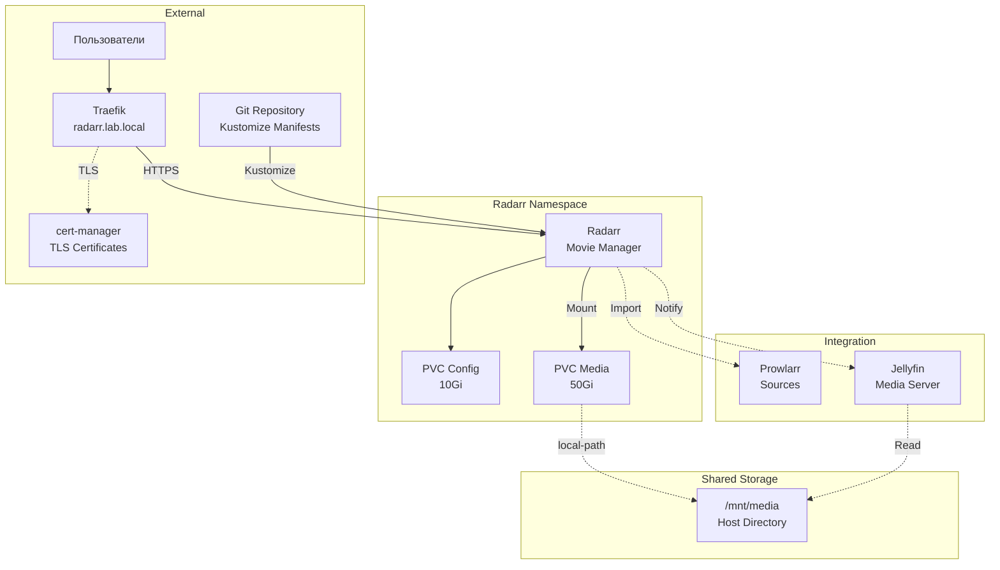

# Radarr ArgoCD Application

Этот каталог содержит конфигурацию для развертывания Radarr через ArgoCD.

<details>
<summary><strong>🚀Быстрый старт</strong></summary>

---

**Минимальные шаги для развертывания Radarr:**

1. **Разверните cert-manager (обязательно перед Radarr):**
   ```bash
   kubectl apply -f argocd-apps/cert-manager/cert-manager.yaml
   kubectl wait --for=condition=ready pod -l app.kubernetes.io/instance=cert-manager -n cert-manager --timeout=300s
   kubectl apply -f argocd-apps/cert-manager/clusterissuer-selfsigned.yaml
   kubectl get clusterissuer selfsigned-issuer
   ```

2. **Разверните Jellyfin (для интеграции медиабиблиотеки):**
   ```bash
   kubectl apply -f argocd-apps/media-server-stack/jellyfin/jellyfin.yaml
   ```

3. **Разверните Prowlarr (для управления индексерами):**
   ```bash
   kubectl apply -f argocd-apps/media-server-stack/prowlarr/prowlarr.yaml
   ```

4. **Настройте Git репозиторий в ArgoCD:**
   ```bash
   argocd repo add https://github.com/YOUR_USERNAME/YOUR_REPO.git --name lab-home --type git
   ```

5. **Примените ArgoCD Application для Radarr:**
   ```bash
   kubectl apply -f argocd-apps/media-server-stack/radarr/radarr.yaml
   ```

6. **Дождитесь готовности:**
   ```bash
   kubectl get pods -n radarr -w
   ```

7. **Войдите в Radarr:**
   - URL: `https://radarr.lab.local`

</details>

<details>
<summary><strong>📋Описание и компоненты</strong></summary>

---

Radarr - это менеджер личной видеотеки для организации домашнего видео и семейных архивов. Он автоматически сортирует, переименовывает и каталогизирует ваши личные видеозаписи.

**Основные возможности:**

- Автоматическая организация видеофайлов
- Календарь и каталогизация по дате съемки
- Мониторинг новых видео из сетевых источников
- Автоматическое переименование и организация файлов
- Профили качества для транскодирования (720p, 1080p, 4K)
- Интеграция с Prowlarr для управления источниками медиа
- Интеграция с Jellyfin для просмотра медиатеки
- Уведомления о новых видео в коллекции

### Компоненты

- **Deployment** - контейнер Radarr с образом `linuxserver/radarr:latest`
- **Service** - ClusterIP сервис на порту 80
- **PersistentVolumeClaims** - два PVC для config (10Gi) и media (50Gi)
- **Ingress** - доступ через Traefik с TLS
- **Namespace** - `radarr`

### Архитектура развертывания



</details>

<details>
<summary><strong>📋Структура файлов</strong></summary>

---

```
radarr/
├── radarr.yaml            # ArgoCD Application манифест
├── kustomization.yaml     # Kustomize конфигурация
├── base/
│   ├── namespace.yaml     # Namespace манифест
│   ├── pvc.yaml           # PersistentVolumeClaims (config + media)
│   ├── deployment.yaml    # Deployment манифест
│   ├── service.yaml       # Service манифест
│   └── ingress.yaml       # Ingress манифест с TLS
└── README.md              # Этот файл
```

</details>

<details>
<summary><strong>📋Предварительные требования</strong></summary>

---

1. **Kubernetes кластер версии 1.23+**
2. **ArgoCD установлен и настроен**
3. **k3s с Traefik Ingress** (k3s использует Traefik по умолчанию)
4. **cert-manager установлен и настроен**
6. **Git репозиторий настроен в ArgoCD**
7. **DNS настроен** для домена `radarr.lab.local`
8. **Prowlarr развернут** (рекомендуется для управления источниками медиа)
9. **Jellyfin развернут** (рекомендуется для интеграции медиабиблиотеки)
10. **Доступ к сетевым хранилищам** или локальным директориям с видео

</details>

<details>
<summary><strong>⚙️Установка</strong></summary>

---

### 1. Развертывание зависимостей

```bash
# cert-manager
kubectl apply -f 03-argocd/cert-manager/cert-manager.yaml
kubectl wait --for=condition=ready pod -l app.kubernetes.io/instance=cert-manager -n cert-manager --timeout=300s
kubectl apply -f 03-argocd/cert-manager/clusterissuer-selfsigned.yaml

# Jellyfin (опционально, но рекомендуется)
kubectl apply -f 03-argocd/media-server-stack/jellyfin/jellyfin.yaml

# Prowlarr (опционально, но рекомендуется)
kubectl apply -f 03-argocd/media-server-stack/prowlarr/prowlarr.yaml
```

### 2. Применение ArgoCD Application

```bash
kubectl apply -f 03-argocd/media-server-stack/radarr/radarr.yaml
kubectl get application radarr -n argocd
```

### 3. Проверка статуса

```bash
kubectl get pods -n radarr
kubectl get pvc -n radarr
kubectl get certificate -n radarr
kubectl get ingress -n radarr
```

</details>

<details>
<summary><strong>🔍Доступ и первоначальная настройка</strong></summary>

---

### Доступ к Radarr

- **URL**: `https://radarr.lab.local`

### Первоначальная настройка

1. **Добавление Root Folder:**
   - Settings → Media Management
   - Root Folders → Add Root Folder
   - Path: `/media/movies`

2. **Подключение источников медиа через Prowlarr:**
   - Settings → Indexers
   - Если Prowlarr настроен, источники добавятся автоматически
   - Или добавьте локальные директории вручную
   - Настройте мониторинг папок с новыми записями

3. **Настройка профилей качества:**
   - Settings → Profiles
   - Настройте желаемые профили качества (HD-1080p, Ultra-HD и т.д.)

4. **Интеграция с Jellyfin:**
   - Settings → Connect → Add → Jellyfin/Emby
   - Host: `http://jellyfin.jellyfin.svc.cluster.local:80`
   - API Key: из Jellyfin Settings → API Keys

5. **Импорт существующих видео:**
   - Movies → Library Import
   - Выберите директорию с существующими видео
   - Radarr автоматически распознает и организует файлы

</details>

<details>
<summary><strong>🔍Проверка статуса развертывания</strong></summary>

---

### Проверка подов

```bash
kubectl get pods -n radarr
kubectl describe pod -n radarr -l app=radarr
kubectl logs -n radarr deployment/radarr --tail=100
```

### Проверка PVC

```bash
kubectl get pvc -n radarr
kubectl describe pvc radarr-config -n radarr
kubectl describe pvc radarr-media -n radarr
```

### Проверка монтирования media

```bash
POD_NAME=$(kubectl get pods -n radarr -l app=radarr -o jsonpath='{.items[0].metadata.name}')
kubectl exec -n radarr $POD_NAME -- ls -la /media
kubectl exec -n radarr $POD_NAME -- df -h
```

### Проверка Ingress и Certificate

```bash
kubectl get ingress -n radarr
kubectl get certificate -n radarr
kubectl describe certificate radarr-tls -n radarr
```

</details>

<details>
<summary><strong>⚙️Конфигурация и ресурсы</strong></summary>

---

### Текущее потребление ресурсов

**Вычислительные ресурсы:**
- **Radarr**: 200m CPU / 256Mi RAM (requests), 1000m CPU / 1Gi RAM (limits)

**Хранилище:**
- **Config PVC**: 10Gi для конфигурации приложения
- **Media PVC**: 50Gi для медиафайлов (можно увеличить)

### Изменение размера Media PVC

Отредактируйте `base/pvc.yaml`:

```yaml
apiVersion: v1
kind: PersistentVolumeClaim
metadata:
  name: radarr-media
spec:
  resources:
    requests:
      storage: 200Gi  # Увеличьте до нужного размера
```

### Общий доступ к media с Jellyfin

**Важно**: Для работы интеграции Radarr и Jellyfin, оба приложения должны иметь доступ к одной и той же директории с медиафайлами.

**Вариант 1: hostPath (простой, но не рекомендуется для production)**

Оба PVC (radarr-media и jellyfin-media) должны указывать на одну директорию на хосте через local-path provisioner.

**Вариант 2: NFS (рекомендуется для production)**

Создайте NFS share и используйте NFS PVC для обоих приложений.

**Вариант 3: Один namespace**

Поместите Radarr и Jellyfin в один namespace и используйте один PVC.

### Настройка ресурсов

Отредактируйте `base/deployment.yaml`:

```yaml
resources:
  requests:
    memory: "256Mi"
    cpu: "200m"
  limits:
    memory: "1Gi"
    cpu: "1000m"
```

</details>

<details>
<summary><strong>🔧Устранение неполадок</strong></summary>

---

### Pod не запускается

```bash
kubectl logs -n radarr deployment/radarr
kubectl describe pod -n radarr -l app=radarr
```

### PVC не создается

```bash
kubectl get storageclass
kubectl describe pvc -n radarr
```

### Media директория недоступна

```bash
POD_NAME=$(kubectl get pods -n radarr -l app=radarr -o jsonpath='{.items[0].metadata.name}')
kubectl exec -n radarr $POD_NAME -- ls -la /media
kubectl exec -n radarr $POD_NAME -- touch /media/test.txt
```

### Интеграция с Prowlarr не работает

**Проблема**: Radarr не получает источники от Prowlarr

**Решение**:
1. В Prowlarr: Settings → Apps → проверьте статус Radarr
2. URL должен быть: `http://radarr.radarr.svc.cluster.local:80`
3. API Key: из Radarr Settings → General → Security → API Key
4. Test Connection в Prowlarr

### Видео не появляются в Jellyfin

**Проблема**: Radarr импортировал видео, но оно не видно в Jellyfin

**Решение**:
1. Проверьте что оба приложения монтируют одну директорию
2. В Jellyfin: Dashboard → Libraries → Scan Library
3. Проверьте права доступа к файлам (PUID/PGID должны совпадать)
4. Проверьте что путь в Radarr (/media/movies) соответствует пути в Jellyfin

</details>

<details>
<summary><strong>🔒Включение SSL/TLS</strong></summary>

---

⚠️ **ВАЖНО: Правильный порядок развертывания**

1. Сначала разверните cert-manager
2. Создайте ClusterIssuer
3. Только после этого развертывайте Radarr

**Если Radarr развернут до ClusterIssuer:**

```bash
kubectl delete secret radarr-tls -n radarr
kubectl get certificate radarr-tls -n radarr
```

</details>

<details>
<summary><strong>💡Интеграция с другими приложениями</strong></summary>

---

### Интеграция с Prowlarr

1. **В Prowlarr**: Settings → Apps → Add Application → Radarr
   - Prowlarr Server: `http://prowlarr.prowlarr.svc.cluster.local:80`
   - Radarr Server: `http://radarr.radarr.svc.cluster.local:80`
   - API Key: из Radarr Settings → General
   - Sync Level: Full Sync

2. **Результат**: Все источники из Prowlarr автоматически появятся в Radarr

### Интеграция с Jellyfin

1. **В Radarr**: Settings → Connect → Add → Jellyfin/Emby
   - Host: `http://jellyfin.jellyfin.svc.cluster.local:80`
   - API Key: из Jellyfin Dashboard → API Keys
   - Notification: On Import, On Upgrade

2. **В Jellyfin**: Dashboard → Libraries
   - Add Media Library → Movies
   - Path: `/media/movies` (должен соответствовать Radarr root folder)

3. **Результат**: 
   - Radarr организует видео в `/media/movies`
   - Jellyfin автоматически обновляет библиотеку
   - Уведомления о новых видео в коллекции

</details>

<details>
<summary><strong>💡Рекомендации по использованию</strong></summary>

---

### Профили качества

Настройте профили в соответствии с вашими потребностями:
- **HD-1080p**: для большинства видео
- **Ultra-HD**: для 4K контента
- **SD**: для экономии места

### Организация файлов

Radarr автоматически организует файлы:
```
/media/movies/
├── Family Vacation (2020)/
│   └── Family Vacation (2020) - 1080p.mkv
├── Birthday Party (2021)/
│   └── Birthday Party (2021) - 4K.mkv
```

### Автоматический импорт

- **Folder Monitoring**: Radarr автоматически отслеживает новые файлы
- **Automatic Import**: автоматический импорт при появлении новых видео
- **Manual Import**: ручной импорт с выбором параметров

### Мониторинг

- Calendar: календарь организации видеоколлекции
- Activity: текущие операции импорта
- Queue: очередь обработки
- History: история действий

</details>