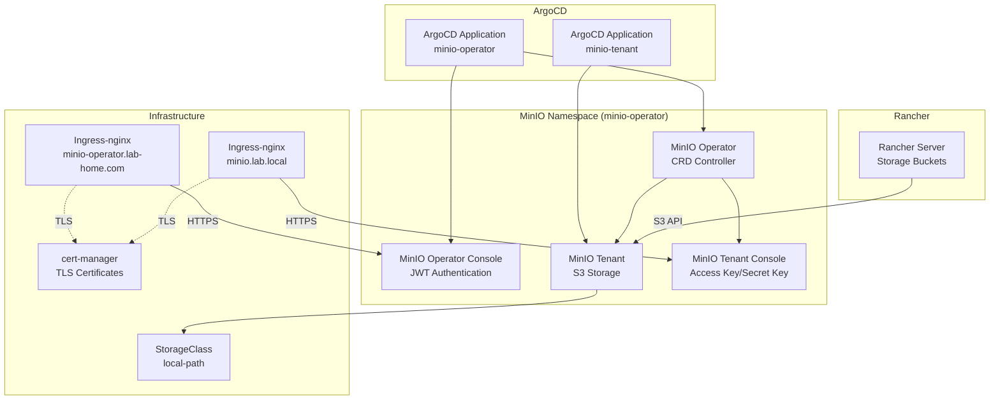

# MinIO Operator ArgoCD Application

Этот каталог содержит конфигурацию для развертывания MinIO Operator и Tenant через ArgoCD. MinIO предоставляет S3-совместимое объектное хранилище, необходимое для работы с Buckets в Rancher.

<details>
<summary><strong>🚀Быстрый старт</strong></summary>

---

**Минимальные шаги для развертывания MinIO:**

1. **Настройте StorageClass (если еще не настроен):**
   ```bash
   # Установить local-path-provisioner
   kubectl apply -f https://raw.githubusercontent.com/rancher/local-path-provisioner/v0.0.24/deploy/local-path-storage.yaml
   
   # Установить local-path как StorageClass по умолчанию
   kubectl patch storageclass local-path -p '{"metadata": {"annotations":{"storageclass.kubernetes.io/is-default-class":"true"}}}'
   ```

2. **Разверните cert-manager (обязательно перед MinIO):**
   ```bash
   # Применить cert-manager Application
   kubectl apply -f argocd-apps/cert-manager/cert-manager.yaml
   
   # Дождаться готовности cert-manager
   kubectl wait --for=condition=ready pod -l app.kubernetes.io/instance=cert-manager -n cert-manager --timeout=300s
   
   # Создать ClusterIssuer
   kubectl apply -f argocd-apps/cert-manager/clusterissuer-selfsigned.yaml
   
   # Проверить ClusterIssuer
   kubectl get clusterissuer selfsigned-issuer
   ```

3. **Примените ArgoCD Application для MinIO Operator:**
   ```bash
   kubectl apply -f argocd-apps/minio/operator/application.yaml
   ```

4. **Дождитесь готовности Operator (2-3 минуты):**
   ```bash
   kubectl get pods -n minio-operator -w
   # Поды minio-operator и console должны быть в состоянии Running
   ```

5. **Создайте MinIO Tenant (через ArgoCD Application):**
   ```bash
   # Применить ArgoCD Application - он автоматически возьмет tenant.yaml из Git
   kubectl apply -f argocd-apps/minio/tenant/application.yaml
   ```
   
   ⚠️ **Важно**: `tenant.yaml` хранится в Git и управляется через ArgoCD. Не нужно применять его вручную - ArgoCD сделает это автоматически после применения `tenant/application.yaml`.

6. **Дождитесь готовности Tenant (3-5 минут):**
   ```bash
   kubectl get pods -n minio-operator -l v1.min.io/tenant=minio-tenant -w
   # Поды должны быть в состоянии Running
   ```

7. **Получите credentials для доступа:**
   ```bash
   # Credentials находятся в Secret storage-configuration
   # Access Key (MINIO_ROOT_USER):
   kubectl get secret storage-configuration -n minio-operator -o jsonpath='{.data.config\.env}' | base64 -d | grep MINIO_ROOT_USER
   
   # Secret Key (MINIO_ROOT_PASSWORD):
   kubectl get secret storage-configuration -n minio-operator -o jsonpath='{.data.config\.env}' | base64 -d | grep MINIO_ROOT_PASSWORD
   
   # По умолчанию:
   # Access Key: minioadmin
   # Secret Key: minioadmin123
   ```

8. **Доступ к MinIO:**
   - **MinIO Tenant Console (веб-интерфейс)**: `https://minio.lab.local`
   - **MinIO Operator Console (JWT)**: `https://minio-operator.lab-home.com`
   - **S3 Endpoint (внутренний)**: `minio-tenant-hl.minio-operator.svc.cluster.local:9000`
   - **Credentials**: `minioadmin` / `minioadmin123` (из Secret `storage-configuration`)

📋**Детальные инструкции:** см. секции ниже

</details>

<details>
<summary><strong>📋Описание и компоненты</strong></summary>

---

MinIO - это высокопроизводительное S3-совместимое объектное хранилище, которое позволяет:

- Создавать и управлять buckets (контейнерами для объектов)
- Хранить файлы, бэкапы, артефакты через S3 API
- Интегрироваться с Rancher для работы с разделом Storage → Buckets
- Использовать веб-интерфейс (MinIO Console) для управления
- Обеспечивать высокую доступность в distributed режиме

### Архитектура развертывания



### Компоненты

- **MinIO Operator**: Управляет жизненным циклом MinIO Tenants через CRD
  - Развертывается через Helm chart из официального репозитория
  - Версия: 5.0.18
  - Namespace: `minio-operator`

- **MinIO Operator Console**: Веб-интерфейс для управления Operator и Tenants
  - Доступ: `https://minio-operator.lab-home.com`
  - **Требует JWT Token** для входа (генерируется через CLI или API)
  - Используется для управления Operator и несколькими Tenants

- **MinIO Tenant**: Экземпляр MinIO с S3-совместимым API
  - Standalone режим: 1 сервер (для тестирования)
  - Distributed режим: минимум 4 сервера (для production)
  - Внутренний Service: `minio-tenant-hl.minio-operator.svc.cluster.local:9000`

- **MinIO Tenant Console**: Веб-интерфейс для управления конкретным Tenant
  - Доступ: `https://minio.lab.local`
  - **Поддерживает вход с Access Key / Secret Key**
  - Используется для управления buckets, пользователями, политиками

- **MinIO Server**: Серверы, которые хранят данные
  - Образ: `minio/minio:RELEASE.2023-09-04T19-57-37Z` (совместимость со старыми CPU)

### ⚠️ Важное примечание о двух типах Console

MinIO Operator предоставляет **два разных Console**:

1. **Operator Console** (`console` сервис, порт 9090)
   - URL: `https://minio-operator.lab-home.com`
   - **Требует JWT Token** - нет формы с Access Key/Secret Key
   - Используется для управления Operator и несколькими Tenants

2. **Tenant Console** (`minio-tenant-console` сервис, порт 9443)
   - URL: `https://minio.lab.local`
   - **Поддерживает вход с Access Key / Secret Key** ✅
   - Используется для управления buckets конкретного Tenant

**Для входа с Access Key / Secret Key используйте Tenant Console** (`https://minio.lab.local`).

</details>

<details>
<summary><strong>📋Структура файлов</strong></summary>

---

```
minio/
├── operator/
│   └── application.yaml      # ArgoCD Application для MinIO Operator (Helm chart)
├── tenant/
│   ├── application.yaml      # ArgoCD Application для MinIO Tenant (создается один раз, указывает на Git)
│   ├── tenant.yaml           # MinIO Tenant CRD + Secret (хранится в Git, применяется ArgoCD автоматически)
│   └── ingress.yaml          # Ingress для MinIO Tenant Console
└── README.md                 # Этот файл
```

**Пояснение структуры:**

- **`operator/application.yaml`**: 
  - Применяется один раз → создает ArgoCD Application для MinIO Operator через Helm chart
  - Источник: `https://operator.min.io/` (Helm chart `operator`, версия `5.0.18`)
  - Создает namespace `minio-operator` автоматически
  - Включает MinIO Operator Console с Ingress на `minio-operator.lab-home.com`

- **`tenant/application.yaml`**: 
  - Применяется один раз → создает ArgoCD Application, который указывает ArgoCD брать `tenant.yaml` из Git
  - Источник: Git репозиторий, путь `argocd-apps/minio/tenant`
  - Использует sync-wave: "1" для синхронизации после Operator

- **`tenant/tenant.yaml`**: 
  - Хранится в Git → ArgoCD автоматически читает и применяет этот файл из репозитория
  - Содержит MinIO Tenant CRD и Secret с credentials
  - Определяет конфигурацию MinIO кластера (серверы, ресурсы, хранилище)

- **`tenant/ingress.yaml`**: 
  - Ingress для Tenant Console (вход с Access Key / Secret Key)
  - Домен: `minio.lab.local`
  - Backend: `minio-tenant-console:9443` (HTTPS)

**Примечание**: Namespace `minio-operator` создается автоматически через `CreateNamespace=true` в `operator/application.yaml`.

</details>

<details>
<summary><strong>📋Предварительные требования</strong></summary>

---

1. **Kubernetes кластер версии 1.23+**
   ```bash
   kubectl version --short
   ```

2. **ArgoCD установлен и настроен**
   ```bash
   kubectl get pods -n argocd
   ```

3. **Ingress-nginx установлен**
   ```bash
   kubectl get pods -n ingress-nginx
   ```

4. **StorageClass настроен** для PersistentVolumes
   ```bash
   kubectl get storageclass
   ```

5. **cert-manager установлен и настроен** (см. секцию "Быстрый старт")
   ```bash
   kubectl get clusterissuer selfsigned-issuer
   ```

6. **DNS настроен** для доменов:
   - `minio.lab.local` (Tenant Console)
   - `minio-operator.lab-home.com` (Operator Console)

</details>

<details>
<summary><strong>⚙️Установка</strong></summary>

---

### 1. Настройка StorageClass

Настройте StorageClass для PersistentVolumes (если еще не настроен):

```bash
# Установить local-path-provisioner
kubectl apply -f https://raw.githubusercontent.com/rancher/local-path-provisioner/v0.0.24/deploy/local-path-storage.yaml

# Установить local-path как StorageClass по умолчанию
kubectl patch storageclass local-path -p '{"metadata": {"annotations":{"storageclass.kubernetes.io/is-default-class":"true"}}}'

# Проверить StorageClass
kubectl get storageclass
```

### 2. Развертывание cert-manager

MinIO требует cert-manager для работы с TLS сертификатами. Разверните cert-manager **до** развертывания MinIO:

```bash
# Применить cert-manager Application
kubectl apply -f argocd-apps/cert-manager/cert-manager.yaml

# Дождаться готовности cert-manager
kubectl wait --for=condition=ready pod -l app.kubernetes.io/instance=cert-manager -n cert-manager --timeout=300s

# Проверить статус подов
kubectl get pods -n cert-manager
```

Ожидаемый результат - все поды в состоянии `Running`:
```
NAME                                       READY   STATUS    RESTARTS   AGE
cert-manager-xxxxxxxxxx-xxxxx             1/1     Running   0          2m
cert-manager-cainjector-xxxxxxxxxx-xxxxx  1/1     Running   0          2m
cert-manager-webhook-xxxxxxxxxx-xxxxx     1/1     Running   0          2m
```

### 3. Создание ClusterIssuer

Создайте ClusterIssuer для генерации сертификатов:

```bash
# Применить ClusterIssuer
kubectl apply -f argocd-apps/cert-manager/clusterissuer-selfsigned.yaml

# Проверить статус ClusterIssuer
kubectl get clusterissuer selfsigned-issuer

# Должен быть в состоянии Ready
kubectl describe clusterissuer selfsigned-issuer
```

### 4. Применение ArgoCD Application для MinIO Operator

Примените Application для MinIO Operator:

```bash
# Применить Application
kubectl apply -f argocd-apps/minio/operator/application.yaml

# Проверить статус Application
kubectl get application minio-operator -n argocd

# Детали Application
kubectl describe application minio-operator -n argocd
```

### 5. Проверка статуса развертывания Operator

#### Через ArgoCD CLI

```bash
# Список Applications
argocd app list

# Статус MinIO Operator Application
argocd app get minio-operator

# Синхронизация (если не настроена автоматическая)
argocd app sync minio-operator
```

#### Через kubectl

```bash
# Проверить поды MinIO Operator
kubectl get pods -n minio-operator

# Проверить CRDs
kubectl get crd | grep minio

# Проверить Certificate для Console
kubectl get certificate -n minio-operator

# Проверить Services
kubectl get svc -n minio-operator
```

Ожидаемый результат - поды в состоянии `Running`:
```
NAME                              READY   STATUS    RESTARTS   AGE
minio-operator-xxxxxxxxxx-xxxxx   1/1     Running   0          2m
console-xxxxxxxxxx-xxxxx          1/1     Running   0          2m
```

### 6. Создание MinIO Tenant

После того, как Operator готов, создайте Tenant через ArgoCD Application:

```bash
# Применить Tenant Application
kubectl apply -f argocd-apps/minio/tenant/application.yaml

# Проверить статус Tenant Application
kubectl get application minio-tenant -n argocd

# Проверить статус Tenant
kubectl get tenant -n minio-operator

# Детали Tenant
kubectl describe tenant minio-tenant -n minio-operator
```

### 7. Проверка готовности Tenant

```bash
# Проверить поды Tenant
kubectl get pods -n minio-operator -l v1.min.io/tenant=minio-tenant

# Проверить Service
kubectl get svc -n minio-operator | grep minio-tenant

# Проверить PVC
kubectl get pvc -n minio-operator

# Проверить Ingress
kubectl get ingress -n minio-operator
```

Ожидаемый результат - поды в состоянии `Running`:
```
NAME                              READY   STATUS    RESTARTS   AGE
minio-tenant-pool-0-0             1/1     Running   0          3m
```

### Время развертывания

- **MinIO Operator**: 2-3 минуты
- **MinIO Tenant**: 3-5 минут
- Зависит от скорости загрузки образов и создания PVC

</details>

<details>
<summary><strong>🔍Доступ и первоначальная настройка</strong></summary>

---

### Доступ к MinIO Tenant Console

После успешного развертывания MinIO Tenant Console будет доступен по адресу:

- **URL**: `https://minio.lab.local`
- **Access Key**: `minioadmin` (из Secret `storage-configuration`, `MINIO_ROOT_USER`)
- **Secret Key**: `minioadmin123` (из Secret `storage-configuration`, `MINIO_ROOT_PASSWORD`)

### Доступ к MinIO Operator Console

MinIO Operator Console доступен по адресу:

- **URL**: `https://minio-operator.lab-home.com`
- **Аутентификация**: JWT Token (генерируется через CLI или API)
- **Примечание**: Для управления buckets используйте Tenant Console с Access Key/Secret Key

### Получение credentials

```bash
# Credentials находятся в Secret storage-configuration
# Показать все переменные из config.env:
kubectl get secret storage-configuration -n minio-operator -o jsonpath='{.data.config\.env}' | base64 -d

# Извлечь только MINIO_ROOT_USER:
kubectl get secret storage-configuration -n minio-operator -o jsonpath='{.data.config\.env}' | base64 -d | grep MINIO_ROOT_USER

# Извлечь только MINIO_ROOT_PASSWORD:
kubectl get secret storage-configuration -n minio-operator -o jsonpath='{.data.config\.env}' | base64 -d | grep MINIO_ROOT_PASSWORD
```

**Примечание**: По умолчанию используются credentials из `tenant/tenant.yaml` (Secret `storage-configuration`):
- Access Key: `minioadmin` (`MINIO_ROOT_USER`)
- Secret Key: `minioadmin123` (`MINIO_ROOT_PASSWORD`)

⚠️ **ВАЖНО**: В production окружении обязательно измените эти значения на безопасные!

### Первый вход в MinIO Tenant Console

1. Откройте браузер: `https://minio.lab.local`
2. На странице `/login` введите:
   - **Access Key**: `minioadmin` (или из Secret `storage-configuration`, ключ `MINIO_ROOT_USER`)
   - **Secret Key**: `minioadmin123` (или из Secret `storage-configuration`, ключ `MINIO_ROOT_PASSWORD`)
3. После входа Console создаст JWT токен автоматически
4. Создайте первый bucket через веб-интерфейс

### S3 Endpoint для доступа из кластера

Для доступа к MinIO из Rancher или других подов используйте:

- **Endpoint**: `minio-tenant-hl.minio-operator.svc.cluster.local:9000`
- **Access Key**: (из Secret)
- **Secret Key**: (из Secret)

### Предупреждение о сертификате (self-signed)

⚠️При использовании self-signed сертификатов браузер покажет предупреждение о безопасности. Это нормально для тестовой среды. Нажмите "Advanced" → "Proceed to minio.lab.local" для продолжения.

</details>

<details>
<summary><strong>🔍Проверка статуса развертывания</strong></summary>

---

### Проверка подов

```bash
# Список всех подов
kubectl get pods -n minio-operator

# Детальная информация
kubectl get pods -n minio-operator -o wide

# Проверка статуса конкретного пода
kubectl describe pod <pod-name> -n minio-operator

# Наблюдение за подами в реальном времени
watch kubectl get pods -n minio-operator
```

### Проверка логов

```bash
# Логи MinIO Operator
kubectl logs -n minio-operator -l name=minio-operator --tail=50

# Логи MinIO Operator Console
kubectl logs -n minio-operator -l app=console --tail=50

# Логи MinIO Tenant
kubectl logs -n minio-operator -l v1.min.io/tenant=minio-tenant --tail=50
```

### Проверка сервисов и Ingress

```bash
# Сервисы
kubectl get svc -n minio-operator

# Ingress
kubectl get ingress -n minio-operator

# Детали Ingress
kubectl describe ingress -n minio-operator

# Проверка доступности через curl
curl -I https://minio.lab.local -k
curl -I https://minio-operator.lab-home.com -k
```

### Проверка Certificate

```bash
# Список всех Certificate
kubectl get certificate -n minio-operator

# Детали Certificate
kubectl describe certificate minio-tenant-console-tls -n minio-operator
kubectl describe certificate minio-operator-console-tls -n minio-operator

# Проверить секрет с сертификатом
kubectl get secret minio-tenant-console-tls -n minio-operator
kubectl get secret minio-operator-console-tls -n minio-operator
```

### Проверка Tenant

```bash
# Список всех Tenant
kubectl get tenant -n minio-operator

# Детали Tenant
kubectl describe tenant minio-tenant -n minio-operator

# Статус Tenant
kubectl get tenant minio-tenant -n minio-operator -o yaml
```

### Использование ресурсов

```bash
# Использование ресурсов подами
kubectl top pods -n minio-operator

# События в namespace
kubectl get events -n minio-operator --sort-by='.lastTimestamp'

# Статус всех ресурсов
kubectl get all -n minio-operator
```

</details>

<details>
<summary><strong>💡Использование MinIO</strong></summary>

---

### Создание bucket через MinIO Tenant Console

1. Откройте `https://minio.lab.local`
2. Войдите с credentials (Access Key / Secret Key)
3. Нажмите "Create Bucket"
4. Укажите имя bucket и настройки
5. Нажмите "Create Bucket"

### Использование MinIO Client (mc)

Установите MinIO Client:

```bash
# Linux
wget https://dl.min.io/client/mc/release/linux-amd64/mc
chmod +x mc
sudo mv mc /usr/local/bin/

# macOS
brew install minio/stable/mc

# Windows
# Скачайте с https://dl.min.io/client/mc/release/windows-amd64/mc.exe
```

Настройка alias:

```bash
# Внутренний доступ (из пода)
mc alias set minio http://minio-tenant-hl.minio-operator.svc.cluster.local:9000 <access-key> <secret-key>

# Внешний доступ (если настроен Ingress)
mc alias set minio https://minio.lab.local <access-key> <secret-key>
```

Создание bucket:

```bash
# Создать bucket
mc mb minio/my-bucket

# Список buckets
mc ls minio

# Загрузить файл
mc cp file.txt minio/my-bucket/

# Скачать файл
mc cp minio/my-bucket/file.txt ./

# Удалить bucket
mc rb minio/my-bucket
```

### Использование через S3 API

MinIO полностью совместим с S3 API. Можно использовать любой S3-совместимый клиент:

```bash
# Пример с AWS CLI
aws --endpoint-url=http://minio-tenant-hl.minio-operator.svc.cluster.local:9000 \
  s3 mb s3://my-bucket \
  --profile minio

# Настройка credentials
aws configure --profile minio
# AWS Access Key ID: <access-key>
# AWS Secret Access Key: <secret-key>
# Default region: us-east-1
# Default output format: json
```

### Создание bucket через kubectl exec с mc

```bash
# Запустить временный Pod с mc и создать bucket
kubectl run -it --rm --image=minio/mc:latest mc-client --restart=Never -n minio-operator -- \
  sh -c 'mc alias set minio http://minio-tenant-hl.minio-operator.svc.cluster.local:9000 minioadmin minioadmin123 && \
  mc mb minio/test-bucket && \
  mc ls minio'
```

**Примечание:** Если образ `minio/mc:latest` несовместим с вашим CPU (ошибка glibc), используйте MinIO Console или обновите CPU.

</details>

<details>
<summary><strong>⚙️Конфигурация и ресурсы</strong></summary>

---

### Текущее потребление ресурсов

**Вычислительные ресурсы:**

- **MinIO Operator**: 100m CPU / 128Mi RAM (requests), 500m CPU / 256Mi RAM (limits)
- **MinIO Operator Console**: 100m CPU / 256Mi RAM (requests), 500m CPU / 512Mi RAM (limits)
- **MinIO Tenant (per server)**: 500m CPU / 512Mi RAM (requests), 2000m CPU / 2Gi RAM (limits)

**Хранилище:**

- **MinIO Tenant**: 10Gi на сервер (настраивается в `tenant/tenant.yaml`)
- Использует StorageClass `local-path`

### Изменение домена

Отредактируйте соответствующие файлы:

**Tenant Console** (`tenant/ingress.yaml`):
```yaml
spec:
  rules:
    - host: ваш-домен.lab-home.com
```

**Operator Console** (`operator/application.yaml`):
```yaml
ingress:
  hosts:
    - ваш-домен.lab-home.com
```

Затем синхронизируйте Application в ArgoCD.

### Настройка ресурсов

Для изменения ресурсов отредактируйте соответствующие файлы:

**MinIO Operator** (`operator/application.yaml`):
```yaml
operator:
  resources:
    requests:
      cpu: 100m
      memory: 128Mi
    limits:
      cpu: 500m
      memory: 256Mi
```

**MinIO Operator Console** (`operator/application.yaml`):
```yaml
console:
  resources:
    requests:
      cpu: 100m
      memory: 256Mi
    limits:
      cpu: 500m
      memory: 512Mi
```

**MinIO Tenant** (`tenant/tenant.yaml`):
```yaml
resources:
  requests:
    cpu: 500m
    memory: 512Mi
  limits:
    cpu: 2000m
    memory: 2Gi
```

### Изменение размера хранилища

Отредактируйте `tenant/tenant.yaml`:

```yaml
volumeClaimTemplate:
  spec:
    resources:
      requests:
        storage: 50Gi  # Увеличьте размер
```

⚠️ **ВАЖНО**: Увеличение размера PVC может потребовать использования StorageClass с поддержкой расширения томов.

### Настройка distributed режима

Для production рекомендуется использовать distributed режим (минимум 4 сервера):

```yaml
pools:
  - name: pool-0
    servers: 4  # Минимум 4 для distributed
    volumesPerServer: 4
```

### Обновление версии MinIO Operator

Измените `targetRevision` в `operator/application.yaml`:

```yaml
source:
  targetRevision: "5.0.18"  # Обновите до нужной версии
```

### Обновление версии MinIO Server

Измените `image` в `tenant/tenant.yaml`:

```yaml
image: minio/minio:RELEASE.2024-01-16T16-07-38Z
```

⚠️ **ВНИМАНИЕ**: Убедитесь, что новая версия совместима с вашим CPU. Некоторые новые версии требуют CPU с поддержкой x86-64-v2.

### Обновление конфигурации

1. Отредактируйте соответствующие файлы
2. Закоммитьте изменения в Git
3. ArgoCD автоматически обнаружит изменения и синхронизирует (если включена автоматическая синхронизация)

</details>

<details>
<summary><strong>🔧Устранение неполадок</strong></summary>

---

### Поды в состоянии Pending

**Причина**: Недостаточно ресурсов или проблема с StorageClass

**Решение**:
```bash
# Проверить события
kubectl describe pod <pod-name> -n minio-operator

# Проверить доступные ресурсы
kubectl top nodes

# Проверить StorageClass
kubectl get storageclass
```

### Поды в CrashLoopBackOff

**Причина**: Ошибка в конфигурации или недостаточно ресурсов

**Решение**:
```bash
# Просмотреть логи пода
kubectl logs -n minio-operator <pod-name> --previous

# Проверить события
kubectl describe pod <pod-name> -n minio-operator

# Проверить ресурсы
kubectl top pod <pod-name> -n minio-operator
```

### Ошибка "MissingCreds" / "empty tenant credentials"

**Симптомы**:
```
Warning: MissingCreds - Tenant is missing root credentials
Current State: empty tenant credentials
```

**Причина**: Operator не может прочитать Secret с credentials или Secret создан неправильно.

**Решение**:

1. **Убедитесь, что Secret создан:**
   ```bash
   kubectl get secret storage-configuration -n minio-operator
   
   # Просмотреть содержимое Secret
   kubectl get secret storage-configuration -n minio-operator -o jsonpath='{.data.config\.env}' | base64 -d
   ```

2. **Проверьте, что Secret содержит правильные переменные:**
   ```bash
   kubectl get secret storage-configuration -n minio-operator -o jsonpath='{.data.config\.env}' | base64 -d | grep -E 'MINIO_ROOT_USER|MINIO_ROOT_PASSWORD'
   ```

3. **Убедитесь, что Tenant ссылается на правильный Secret:**
   ```bash
   kubectl get tenant minio-tenant -n minio-operator -o yaml | grep -A 3 configuration
   # Должно быть: configuration.name: storage-configuration
   ```

4. **Если проблема сохраняется, попробуйте пересоздать Secret и Tenant:**
   ```bash
   # Удалить Tenant
   kubectl delete tenant minio-tenant -n minio-operator
   
   # Удалить Secret
   kubectl delete secret storage-configuration -n minio-operator
   
   # ArgoCD автоматически пересоздаст Tenant и Secret из Git
   ```

### Ошибка ImagePullBackOff

**Симптомы**:
```
ImagePullBackOff: pull access denied, repository does not exist or may require authorization
```

**Причина**: Образ недоступен или требует авторизации.

**Решение**:
```bash
# Проверить текущий образ в Deployment
kubectl get deployment console -n minio-operator -o yaml | grep image:

# Синхронизировать Application в ArgoCD
argocd app sync minio-operator

# Или пересоздать под
kubectl delete pod -l app=console -n minio-operator
```

### Ошибка "Fatal glibc error: CPU does not support x86-64-v2"

**Симптомы**: MinIO Server падает с ошибкой о несовместимости CPU.

**Причина**: Образ MinIO требует CPU с поддержкой x86-64-v2.

**Решение**: Используйте более старую версию MinIO в `tenant/tenant.yaml`:
```yaml
image: minio/minio:RELEASE.2023-09-04T19-57-37Z  # Совместима со старыми CPU
```

### Ingress не работает

**Причина**: Проблема с DNS или настройками ingress-nginx

**Решение**:
```bash
# Проверить Ingress
kubectl describe ingress -n minio-operator

# Проверить ingress-nginx
kubectl get pods -n ingress-nginx

# Проверить логи ingress-nginx
kubectl logs -n ingress-nginx -l app.kubernetes.io/name=ingress-nginx
```

### Certificate не создается или не Ready

**Симптомы**:
```bash
kubectl get certificate -n minio-operator
# Certificate в состоянии False (не Ready)
```

**Решение**:
```bash
# 1. Проверить аннотацию в Ingress
kubectl get ingress -n minio-operator -o yaml | grep cert-manager

# 2. Проверить события Certificate
kubectl describe certificate minio-tenant-console-tls -n minio-operator

# 3. Проверить CertificateRequest (если создан)
kubectl get certificaterequest -n minio-operator
```

### Tenant не создается

**Причина**: Operator не готов или ошибка в конфигурации

**Решение**:
```bash
# Проверить статус Operator
kubectl get pods -n minio-operator -l name=minio-operator

# Проверить события Tenant
kubectl describe tenant minio-tenant -n minio-operator

# Проверить логи Operator
kubectl logs -n minio-operator -l name=minio-operator --tail=100
```

### MinIO недоступен после развертывания

**Причина**: Компоненты еще инициализируются

**Решение**:
```bash
# Проверить статус всех подов
kubectl get pods -n minio-operator

# Дождаться готовности подов (STATUS = Running, READY = 1/1)
# Это может занять 3-5 минут

# Проверить логи MinIO Tenant
kubectl logs -n minio-operator -l v1.min.io/tenant=minio-tenant --tail=100

# Проверить Service
kubectl get svc -n minio-operator | grep minio-tenant
```

### Application не синхронизируется в ArgoCD

**Решение**:
```bash
# Проверить логи ArgoCD
kubectl logs -n argocd -l app.kubernetes.io/name=argocd-application-controller

# Проверить статус Application
kubectl describe application minio-operator -n argocd

# Попробовать синхронизировать вручную
argocd app sync minio-operator
```

### Services показывают статус "Progressing" в ArgoCD

**Причина**: Сервисы типа `LoadBalancer` остаются в `<pending>` External IP без LoadBalancer провайдера.

**Решение**: Это нормальное поведение. ArgoCD Application настроен с `ignoreDifferences` для игнорирования статуса LoadBalancer. Доступ к MinIO работает через Ingress.

</details>

<details>
<summary><strong>⚠️Важные замечания</strong></summary>

---

⚠️ **Для тестовой среды:**
- Используется self-signed сертификат (браузер покажет предупреждение)
- Standalone режим (1 сервер) - не подходит для production
- Уменьшенные ресурсы
- Простые credentials по умолчанию

✅ **Для production окружения:**
- Обязательно измените credentials на безопасные
- Используйте distributed режим (минимум 4 сервера)
- Настройте TLS с Let's Encrypt
- Увеличьте ресурсы
- Настройте мониторинг
- Настройте backup для данных
- Используйте внешний ingress controller с SSL termination
- Настройте RBAC и политики безопасности

</details>
