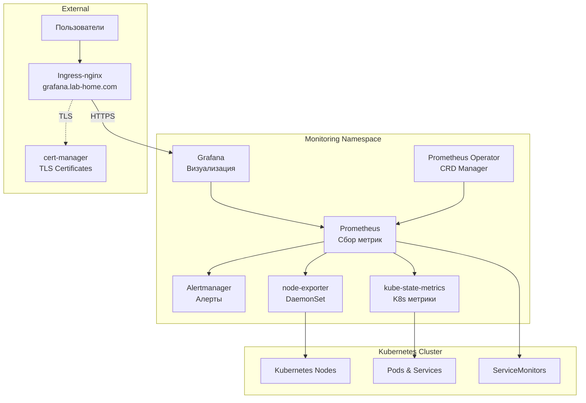

# Prometheus Stack ArgoCD Application

Этот каталог содержит конфигурацию для развертывания полного стека мониторинга (Prometheus + Grafana) через ArgoCD.

<details>
<summary><strong>🚀 Быстрый старт</strong></summary>

---

**Минимальные шаги для развертывания Prometheus Stack:**

1. **Настройте StorageClass (если еще не настроен):**
   ```bash
   # Установить local-path-provisioner
   kubectl apply -f https://raw.githubusercontent.com/rancher/local-path-provisioner/v0.0.24/deploy/local-path-storage.yaml
   
   # Установить local-path как StorageClass по умолчанию
   kubectl patch storageclass local-path -p '{"metadata": {"annotations":{"storageclass.kubernetes.io/is-default-class":"true"}}}'
   ```

2. **Разверните cert-manager (обязательно перед Prometheus Stack):**
   ```bash
   # Применить cert-manager Application
   kubectl apply -f argocd-apps/cert-manager/cert-manager.yaml
   
   # Дождаться готовности cert-manager
   kubectl wait --for=condition=ready pod -l app.kubernetes.io/instance=cert-manager -n cert-manager --timeout=300s
   
   # Создать ClusterIssuer
   kubectl apply -f argocd-apps/cert-manager/clusterissuer-selfsigned.yaml
   
   # Проверить ClusterIssuer
   kubectl get clusterissuer selfsigned-issuer
   ```

3. **Примените ArgoCD Application для Prometheus Stack:**
   ```bash
   kubectl apply -f argocd-apps/prometheus-stack/prometheus-stack.yaml
   ```

4. **Дождитесь готовности (5-10 минут):**
   ```bash
   kubectl get pods -n monitoring -w
   # Все поды должны быть в состоянии Running
   ```

5. **Войдите в Grafana:**
   - URL: `https://grafana.lab-home.com`
   - Username: `admin`
   - Password: `admin` (по умолчанию)

📋 **Детальные инструкции:** см. секции ниже

</details>

<details>
<summary><strong>📋 Описание и компоненты</strong></summary>

---

Полный стек мониторинга для Kubernetes кластера на основе kube-prometheus-stack.

### Компоненты

- **Prometheus** - сбор и хранение метрик (retention: 1 день)
- **Grafana** - визуализация метрик и дашборды
- **Prometheus Operator** - управление Prometheus через CRD
- **Alertmanager** - управление алертами
- **kube-state-metrics** - метрики состояния Kubernetes объектов
- **node-exporter** - метрики нод Kubernetes (DaemonSet)

### Архитектура развертывания



</details>

<details>
<summary><strong>📋 Структура файлов</strong></summary>

---

```
prometheus-stack/
├── prometheus-stack.yaml  # ArgoCD Application манифест с inline Helm values
└── README.md              # Этот файл
```

**Примечание**: Namespace `monitoring` создается автоматически через `CreateNamespace=true` в `prometheus-stack.yaml`.

</details>

<details>
<summary><strong>📋 Предварительные требования</strong></summary>

---

1. **Kubernetes кластер версии 1.23+**
   ```bash
   kubectl version --short
   ```

2. **ArgoCD установлен и настроен**
   ```bash
   kubectl get pods -n argocd
   ```

3. **Ingress-nginx установлен**
   ```bash
   kubectl get pods -n ingress-nginx
   ```

4. **StorageClass настроен** для PersistentVolumes
   ```bash
   kubectl get storageclass
   ```

5. **cert-manager установлен и настроен** (см. секцию "Быстрый старт")
   ```bash
   kubectl get clusterissuer selfsigned-issuer
   ```

6. **DNS настроен** для домена `grafana.lab-home.com` (или измените в конфигурации)

</details>

<details>
<summary><strong>⚙️ Установка</strong></summary>

---

### 1. Настройка StorageClass

Настройте StorageClass для PersistentVolumes (если еще не настроен):

```bash
# Установить local-path-provisioner
kubectl apply -f https://raw.githubusercontent.com/rancher/local-path-provisioner/v0.0.24/deploy/local-path-storage.yaml

# Установить local-path как StorageClass по умолчанию
kubectl patch storageclass local-path -p '{"metadata": {"annotations":{"storageclass.kubernetes.io/is-default-class":"true"}}}'

# Проверить StorageClass
kubectl get storageclass
```

### 2. Развертывание cert-manager

Prometheus Stack требует cert-manager для работы с TLS сертификатами Grafana. Разверните cert-manager **до** развертывания Prometheus Stack:

```bash
# Применить cert-manager Application
kubectl apply -f argocd-apps/cert-manager/cert-manager.yaml

# Дождаться готовности cert-manager
kubectl wait --for=condition=ready pod -l app.kubernetes.io/instance=cert-manager -n cert-manager --timeout=300s

# Проверить статус подов
kubectl get pods -n cert-manager
```

Ожидаемый результат - все поды в состоянии `Running`:
```
NAME                                       READY   STATUS    RESTARTS   AGE
cert-manager-xxxxxxxxxx-xxxxx             1/1     Running   0          2m
cert-manager-cainjector-xxxxxxxxxx-xxxxx  1/1     Running   0          2m
cert-manager-webhook-xxxxxxxxxx-xxxxx     1/1     Running   0          2m
```

### 3. Создание ClusterIssuer

Создайте ClusterIssuer для генерации сертификатов:

```bash
# Применить ClusterIssuer
kubectl apply -f argocd-apps/cert-manager/clusterissuer-selfsigned.yaml

# Проверить статус ClusterIssuer
kubectl get clusterissuer selfsigned-issuer

# Должен быть в состоянии Ready
kubectl describe clusterissuer selfsigned-issuer
```

### 4. Применение ArgoCD Application для Prometheus Stack

Примените Application для Prometheus Stack:

```bash
# Применить Application
kubectl apply -f argocd-apps/prometheus-stack/prometheus-stack.yaml

# Проверить статус Application
kubectl get application prometheus-stack -n argocd

# Детали Application
kubectl describe application prometheus-stack -n argocd
```

После развертывания cert-manager автоматически создаст Certificate для Grafana на основе аннотаций Ingress.

### 5. Проверка статуса развертывания

#### Через ArgoCD CLI

```bash
# Список Applications
argocd app list

# Статус Prometheus Stack Application
argocd app get prometheus-stack

# Синхронизация (если не настроена автоматическая)
argocd app sync prometheus-stack
```

#### Через ArgoCD UI

1. Откройте ArgoCD UI: `http://argocd.lab-home.com:30080`
2. Войдите с учетными данными admin
3. Найдите Application `prometheus-stack`
4. Проверьте статус синхронизации

#### Через kubectl

```bash
# Проверить поды Prometheus Stack
kubectl get pods -n monitoring

# Проверить Certificate для Grafana
kubectl get certificate -n monitoring

# Проверить Ingress
kubectl get ingress -n monitoring
```

### Время развертывания

- **Ожидаемое время**: 5-10 минут
- Зависит от скорости загрузки образов и установки CRD
- Все поды должны перейти в состояние `Running`
- Certificate должен стать Ready

</details>

<details>
<summary><strong>🔍 Доступ и первоначальная настройка</strong></summary>

---

### Доступ к Grafana

После успешного развертывания Grafana будет доступна по адресу:

- **URL**: `https://grafana.lab-home.com`
- **Логин**: `admin`
- **Пароль**: `admin` (по умолчанию, можно изменить в конфигурации)

### Первый вход

1. Откройте браузер: `https://grafana.lab-home.com`
2. Войдите с:
   - Username: `admin`
   - Password: `admin`
3. При первом входе будет предложено изменить пароль (рекомендуется)

### Предупреждение о сертификате (self-signed)

⚠️ При использовании self-signed сертификатов браузер покажет предупреждение о безопасности. Это нормально для тестовой среды. Нажмите "Advanced" → "Proceed to grafana.lab-home.com" для продолжения.

### Доступ к Prometheus

Prometheus доступен через port-forward (по умолчанию не имеет Ingress):

```bash
# Port-forward для доступа к Prometheus
kubectl port-forward -n monitoring svc/prometheus-stack-kube-prom-prometheus 9090:9090

# Откройте http://localhost:9090 в браузере
```

</details>

<details>
<summary><strong>🔍 Проверка статуса развертывания</strong></summary>

---

### Проверка подов

```bash
# Список всех подов
kubectl get pods -n monitoring

# Детальная информация
kubectl get pods -n monitoring -o wide

# Проверка статуса конкретного пода
kubectl describe pod <pod-name> -n monitoring

# Наблюдение за подами в реальном времени
watch kubectl get pods -n monitoring
```

Ожидаемый результат - все поды в состоянии `Running`:
```
NAME                                                     READY   STATUS    RESTARTS   AGE
prometheus-stack-grafana-xxxxxxxxxx-xxxxx               1/1     Running   0          5m
prometheus-stack-kube-prom-operator-xxxxxxxxxx-xxxxx    1/1     Running   0          5m
prometheus-stack-kube-prom-prometheus-0                 2/2     Running   0          5m
prometheus-stack-kube-state-metrics-xxxxxxxxxx-xxxxx    1/1     Running   0          5m
prometheus-stack-prometheus-node-exporter-xxxxx         1/1     Running   0          5m
alertmanager-prometheus-stack-kube-prom-alertmanager-0  2/2     Running   0          5m
```

### Проверка логов

```bash
# Логи Prometheus
kubectl logs -n monitoring -l app.kubernetes.io/name=prometheus --tail=50

# Логи Grafana
kubectl logs -n monitoring -l app.kubernetes.io/name=grafana --tail=50

# Логи Prometheus Operator
kubectl logs -n monitoring -l app.kubernetes.io/name=prometheus-operator --tail=50
```

### Проверка сервисов и Ingress

```bash
# Сервисы
kubectl get svc -n monitoring

# Ingress
kubectl get ingress -n monitoring

# Детали Ingress
kubectl describe ingress -n monitoring

# Проверка доступности через curl
curl -I https://grafana.lab-home.com -k
```

### Проверка Certificate

```bash
# Список всех Certificate
kubectl get certificate -n monitoring

# Детали Certificate
kubectl describe certificate grafana-tls -n monitoring

# Проверить секрет с сертификатом
kubectl get secret grafana-tls -n monitoring
```

### Использование ресурсов

```bash
# Использование ресурсов подами
kubectl top pods -n monitoring

# События в namespace
kubectl get events -n monitoring --sort-by='.lastTimestamp'

# Статус всех ресурсов
kubectl get all -n monitoring
```

</details>

<details>
<summary><strong>⚙️ Конфигурация и ресурсы</strong></summary>

---

### Текущее потребление ресурсов

**Вычислительные ресурсы:**

- **Prometheus**: 250m CPU / 512Mi RAM (requests), 500m CPU / 1Gi RAM (limits)
- **Grafana**: 100m CPU / 256Mi RAM (requests), 250m CPU / 512Mi RAM (limits)
- **Alertmanager**: 100m CPU / 256Mi RAM (requests), 250m CPU / 512Mi RAM (limits)
- **kube-state-metrics**: 50m CPU / 128Mi RAM (requests), 100m CPU / 256Mi RAM (limits)
- **node-exporter**: 50m CPU / 64Mi RAM (requests), 100m CPU / 128Mi RAM (limits)

**Итого (requests)**: ~550m CPU, ~1.2Gi RAM  
**Итого (limits)**: ~1.2 CPU, ~2.4Gi RAM

**Хранилище:**

- **Prometheus**: emptyDir (in-memory, retention: 1 день)
- **Alertmanager**: emptyDir (in-memory)

### Важные настройки

#### ServerSideApply

В конфигурации включен `ServerSideApply=true` в syncOptions для решения проблемы с длинными annotations при установке CRD. Это позволяет ArgoCD устанавливать CRD без ошибок "metadata.annotations: Too long".

#### cleanPrometheusOperatorObjectNames

Включен `cleanPrometheusOperatorObjectNames: true` для совместимости с ArgoCD и предотвращения конфликтов меток.

#### Селекторы ServiceMonitor/PodMonitor

Настроены селекторы для сбора всех метрик:
- `serviceMonitorSelectorNilUsesHelmValues: false`
- `podMonitorSelectorNilUsesHelmValues: false`
- `ruleSelectorNilUsesHelmValues: false`

Это позволяет Prometheus собирать метрики из всех ServiceMonitors и PodMonitors в кластере, независимо от меток.

#### Replicas

Все компоненты настроены на 1 реплику для экономии ресурсов:
- Prometheus: `prometheusSpec.replicas: 1`
- Alertmanager: `alertmanagerSpec.replicas: 1`
- Grafana: `replicas: 1`
- kube-state-metrics: `replicas: 1`

### Изменение домена Grafana

Отредактируйте `prometheus-stack.yaml`:

```yaml
grafana:
  ingress:
    hosts:
      - ваш-домен.lab-home.com
    tls:
      - secretName: grafana-tls
        hosts:
          - ваш-домен.lab-home.com
```

Затем синхронизируйте Application в ArgoCD.

### Настройка ресурсов

Для изменения ресурсов отредактируйте соответствующие секции в `prometheus-stack.yaml`:

```yaml
prometheus:
  prometheusSpec:
    resources:
      requests:
        memory: "512Mi"
        cpu: "250m"
      limits:
        memory: "1Gi"
        cpu: "500m"
```

### Обновление версии

Измените `targetRevision` в `prometheus-stack.yaml`:

```yaml
source:
  targetRevision: "80.10.0"  # Конкретная версия
```

ArgoCD автоматически синхронизирует изменения.

### Обновление конфигурации

1. Отредактируйте `prometheus-stack.yaml`
2. Закоммитьте изменения в Git
3. ArgoCD автоматически обнаружит изменения и синхронизирует (если включена автоматическая синхронизация)

</details>

<details>
<summary><strong>📊 Метрики и мониторинг</strong></summary>

---

### Автоматический сбор метрик

Prometheus автоматически собирает метрики из:

**Встроенные компоненты (автоматически через ServiceMonitor):**
- **Kubernetes nodes** (через node-exporter DaemonSet) - системные метрики нод (CPU, память, диск)
- **Kubernetes pods и services** (через kube-state-metrics) - метрики состояния объектов Kubernetes

**Через ServiceMonitor:**
- Все ServiceMonitor ресурсы в кластере (serviceMonitorSelector настроен на сбор всех)

**Примечание:** Метрики Kubernetes API server обычно доступны через kubelet или требуют дополнительной настройки ServiceMonitor для kube-apiserver.

### ServiceMonitor

Для сбора метрик из приложений создайте ServiceMonitor ресурсы:

```yaml
apiVersion: monitoring.coreos.com/v1
kind: ServiceMonitor
metadata:
  name: ingress-nginx
  namespace: ingress-nginx
spec:
  selector:
    matchLabels:
      app.kubernetes.io/name: ingress-nginx
  endpoints:
    - port: metrics
      interval: 30s
```

### Retention метрик

По умолчанию настроен retention: 1 день для экономии ресурсов. Для production окружения рекомендуется увеличить:

```yaml
prometheus:
  prometheusSpec:
    retention: 7d  # или больше
```

</details>

<details>
<summary><strong>🔧 Устранение неполадок</strong></summary>

---

### Поды в состоянии Pending

**Причина**: Недостаточно ресурсов или проблема с StorageClass

**Решение**:
```bash
# Проверить события
kubectl describe pod <pod-name> -n monitoring

# Проверить доступные ресурсы
kubectl top nodes

# Проверить StorageClass
kubectl get storageclass
```

### Поды в CrashLoopBackOff

**Причина**: Ошибка в конфигурации или недостаточно ресурсов

**Решение**:
```bash
# Просмотреть логи пода
kubectl logs -n monitoring <pod-name> --previous

# Проверить события
kubectl describe pod <pod-name> -n monitoring

# Проверить ресурсы
kubectl top pod <pod-name> -n monitoring
```

### Certificate не создается или не Ready

**Симптомы**:
```bash
kubectl get certificate -n monitoring
# Certificate в состоянии False (не Ready)
```

**Решение**:
```bash
# 1. Проверить аннотацию в Ingress
kubectl get ingress -n monitoring -o yaml | grep cert-manager

# 2. Проверить события Certificate
kubectl describe certificate grafana-tls -n monitoring

# 3. Проверить CertificateRequest (если создан)
kubectl get certificaterequest -n monitoring
```

### Grafana недоступна после развертывания

**Причина**: Компоненты еще инициализируются

**Решение**:
```bash
# Проверить статус всех подов
kubectl get pods -n monitoring

# Дождаться готовности подов (STATUS = Running, READY = 1/1)
# Это может занять 5-10 минут

# Проверить логи Grafana
kubectl logs -n monitoring -l app.kubernetes.io/name=grafana --tail=100

# Проверить Ingress и Certificate
kubectl get ingress,certificate -n monitoring
```

### Ошибка "An error occurred within the plugin" в Grafana

**Причина**: Grafana не может подключиться к Prometheus

**Решение**:
```bash
# Проверить имя сервиса Prometheus
kubectl get svc -n monitoring | grep prometheus

# Ожидаемые сервисы:
# - prometheus-stack-kube-prom-prometheus (основной сервис)
# - prometheus-operated (сервис от Prometheus Operator)

# Проверить статус Prometheus pod
kubectl get pods -n monitoring | grep prometheus
kubectl describe pod -l app.kubernetes.io/name=prometheus -n monitoring

# Проверить доступность Prometheus
kubectl port-forward -n monitoring svc/prometheus-stack-kube-prom-prometheus 9090:9090
# Откройте http://localhost:9090 в браузере
```

### Application не синхронизируется в ArgoCD

**Решение**:
```bash
# Проверить логи ArgoCD
kubectl logs -n argocd -l app.kubernetes.io/name=argocd-application-controller

# Проверить статус Application
kubectl describe application prometheus-stack -n argocd

# Попробовать синхронизировать вручную
argocd app sync prometheus-stack
```

### Проблема с CRD (metadata.annotations: Too long)

**Решение**: В конфигурации уже включен `ServerSideApply=true` в syncOptions. Это должно решить проблему. Если проблема сохраняется:

```bash
# Проверить CRD
kubectl get crd | grep monitoring

# Удалить проблемные CRD (осторожно!)
kubectl delete crd <problematic-crd-name>
# ArgoCD пересоздаст CRD при синхронизации
```

</details>

<details>
<summary><strong>🔒 Включение SSL/TLS</strong></summary>

---

⚠️ **ВАЖНО: Правильный порядок развертывания**

1. **Сначала разверните cert-manager:**
   ```bash
   kubectl apply -f argocd-apps/cert-manager/cert-manager.yaml
   ```

2. **Дождитесь готовности cert-manager:**
   ```bash
   kubectl wait --for=condition=ready pod -l app.kubernetes.io/instance=cert-manager -n cert-manager --timeout=300s
   ```

3. **Создайте ClusterIssuer:**
   ```bash
   kubectl apply -f argocd-apps/cert-manager/clusterissuer-selfsigned.yaml
   ```

4. **Проверьте ClusterIssuer:**
   ```bash
   kubectl get clusterissuer selfsigned-issuer
   # Должен быть в состоянии Ready
   ```

5. **Только после этого развертывайте Prometheus Stack** (уже настроен для использования cert-manager)

**Если Prometheus Stack развернут до ClusterIssuer:**

Если Prometheus Stack был развернут до создания ClusterIssuer, Certificate может быть в состоянии `False`. Исправление:

```bash
# Удалить старые TLS секреты
kubectl delete secret grafana-tls grafana-tls-ca grafana-tls-chain -n monitoring

# cert-manager автоматически создаст новые секреты
# Проверить статус
kubectl get certificate grafana-tls -n monitoring
# Должен стать Ready
```

**Конфигурация для Let's Encrypt (production):**

Для production окружения используйте Let's Encrypt:

1. Создайте ClusterIssuer для Let's Encrypt (см. cert-manager README)
2. Обновите конфигурацию Grafana в `prometheus-stack.yaml`:
   ```yaml
   grafana:
     ingress:
       annotations:
         cert-manager.io/cluster-issuer: "letsencrypt-prod"  # Вместо selfsigned-issuer
       tls:
         - secretName: grafana-tls
           hosts:
             - grafana.lab-home.com
   ```

</details>

<details>
<summary><strong>💡 Рекомендации по оптимизации</strong></summary>

---

### Для production окружения

1. **Увеличьте retention метрик:**
   ```yaml
   prometheus:
     prometheusSpec:
       retention: 7d  # или 30d
   ```

2. **Используйте PersistentVolume для Prometheus:**
   ```yaml
   prometheus:
     prometheusSpec:
       storageSpec:
         volumeClaimTemplate:
           spec:
             storageClassName: local-path
             accessModes: ["ReadWriteOnce"]
             resources:
               requests:
                 storage: 50Gi
   ```

3. **Используйте Let's Encrypt** вместо self-signed сертификатов

4. **Увеличьте ресурсы** для Prometheus и Grafana

5. **Настройте алерты** через Alertmanager

6. **Настройте резервное копирование** данных Prometheus

7. **Включите мониторинг** других компонентов через ServiceMonitors

</details>

<details>
<summary><strong>⚠️ Важные замечания</strong></summary>

---

⚠️ **Для тестовой среды:**
- Используется self-signed сертификат (браузер покажет предупреждение)
- Retention метрик: 1 день (emptyDir)
- Уменьшенные ресурсы
- Подходит для разработки и тестирования

✅ **Для production окружения:**
- Обязательно включите SSL/TLS с Let's Encrypt
- Настройте cert-manager
- Увеличьте retention метрик (7-30 дней)
- Используйте PersistentVolume для Prometheus
- Увеличьте ресурсы
- Настройте алерты через Alertmanager
- Настройте резервное копирование данных
- Настройте мониторинг всех критических компонентов

</details>
