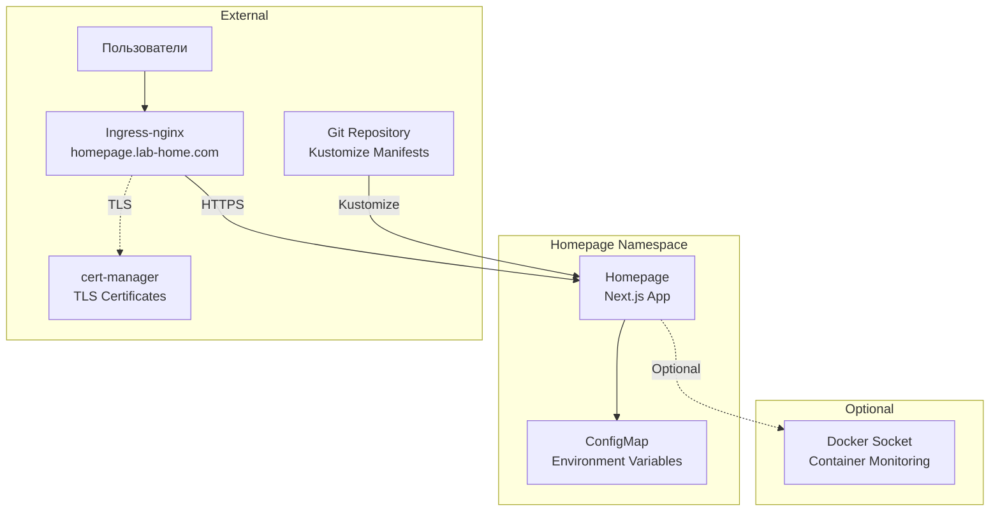

# Homepage ArgoCD Application

Этот каталог содержит конфигурацию для развертывания Homepage через ArgoCD.

<details>
<summary><strong>🚀 Быстрый старт</strong></summary>

---

**Минимальные шаги для развертывания Homepage:**

1. **Настройте StorageClass (если еще не настроен):**
   ```bash
   # Установить local-path-provisioner
   kubectl apply -f https://raw.githubusercontent.com/rancher/local-path-provisioner/v0.0.24/deploy/local-path-storage.yaml
   
   # Установить local-path как StorageClass по умолчанию
   kubectl patch storageclass local-path -p '{"metadata": {"annotations":{"storageclass.kubernetes.io/is-default-class":"true"}}}'
   ```

2. **Разверните cert-manager (обязательно перед Homepage):**
   ```bash
   # Применить cert-manager Application
   kubectl apply -f 03-argocd/cert-manager/cert-manager.yaml
   
   # Дождаться готовности cert-manager
   kubectl wait --for=condition=ready pod -l app.kubernetes.io/instance=cert-manager -n cert-manager --timeout=300s
   
   # Создать ClusterIssuer
   kubectl apply -f 03-argocd/cert-manager/clusterissuer-selfsigned.yaml
   
   # Проверить ClusterIssuer
   kubectl get clusterissuer selfsigned-issuer
   ```

3. **Настройте Git репозиторий в ArgoCD:**
   ```bash
   # Обновите repoURL в homepage.yaml на ваш Git репозиторий
   # Затем добавьте репозиторий в ArgoCD (если еще не добавлен)
   argocd repo add https://github.com/YOUR_USERNAME/YOUR_REPO.git --name lab-home --type git
   ```

4. **Примените ArgoCD Application для Homepage:**
   ```bash
   kubectl apply -f 03-argocd/homepage/homepage.yaml
   ```

5. **Дождитесь готовности:**
   ```bash
   kubectl get pods -n homepage -w
   # Поды должны быть в состоянии Running
   ```

6. **Войдите в Homepage:**
   - URL: `https://homepage.lab-home.com`

📋 **Детальные инструкции:** см. секции ниже

</details>

<details>
<summary><strong>📋 Описание и компоненты</strong></summary>

---

Homepage - это высоко настраиваемая домашняя страница (startpage / application dashboard) с интеграциями Docker и API сервисов. Приложение построено на Next.js и предоставляет:

- Быстрая загрузка (статическая генерация)
- Безопасность (все API запросы проксируются)
- Поддержка множества языков (40+)
- Интеграции с сервисами (100+ сервисов)
- Docker интеграция (мониторинг контейнеров)
- Виджеты (погода, время, поиск и др.)

### Компоненты

- **Deployment** - контейнер Homepage с образом `ghcr.io/gethomepage/homepage:latest`
- **Service** - ClusterIP сервис на порту 80
- **ConfigMap** - базовая конфигурация (переменные окружения)
- **Ingress** - доступ через ingress-nginx с TLS
- **Namespace** - `homepage`

### Архитектура развертывания



</details>

<details>
<summary><strong>📋 Структура файлов</strong></summary>

---

**Примечание**: Homepage использует **Kustomize** (а не Helm), поэтому структура отличается от других приложений.

```
homepage/
├── homepage.yaml          # ArgoCD Application манифест (указывает на Kustomize)
├── kustomization.yaml     # Kustomize конфигурация (объединяет ресурсы из base/)
├── base/
│   ├── namespace.yaml     # Namespace манифест
│   ├── deployment.yaml    # Deployment манифест
│   ├── service.yaml       # Service манифест
│   ├── ingress.yaml       # Ingress манифест с TLS
│   └── configmap.yaml     # ConfigMap с переменными окружения
└── README.md              # Этот файл
```

**Отличие от других приложений:**
- **Другие приложения** (GitLab, Rancher, Prometheus Stack) используют **Helm charts** - один файл с inline values
- **Homepage** использует **Kustomize** - несколько отдельных манифестов, объединенных через `kustomization.yaml`

**Примечание**: Namespace `homepage` создается автоматически через `CreateNamespace=true` в `homepage.yaml`.

</details>

<details>
<summary><strong>📋 Предварительные требования</strong></summary>

---

1. **Kubernetes кластер версии 1.23+**
   ```bash
   kubectl version --short
   ```

2. **ArgoCD установлен и настроен**
   ```bash
   kubectl get pods -n argocd
   ```

3. **Ingress-nginx установлен**
   ```bash
   kubectl get pods -n ingress-nginx
   ```

4. **StorageClass настроен** для PersistentVolumes
   ```bash
   kubectl get storageclass
   ```

5. **cert-manager установлен и настроен** (см. секцию "Быстрый старт")
   ```bash
   kubectl get clusterissuer selfsigned-issuer
   ```

6. **Git репозиторий настроен в ArgoCD**
   
   Перед применением Application необходимо:
   - Настроить Git репозиторий в ArgoCD
   - Указать правильный `repoURL` в `homepage.yaml`

7. **DNS настроен** для домена `homepage.lab-home.com` (или измените в конфигурации)

</details>

<details>
<summary><strong>⚙️ Установка</strong></summary>

---

### 1. Настройка StorageClass

Настройте StorageClass для PersistentVolumes (если еще не настроен):

```bash
# Установить local-path-provisioner
kubectl apply -f https://raw.githubusercontent.com/rancher/local-path-provisioner/v0.0.24/deploy/local-path-storage.yaml

# Установить local-path как StorageClass по умолчанию
kubectl patch storageclass local-path -p '{"metadata": {"annotations":{"storageclass.kubernetes.io/is-default-class":"true"}}}'

# Проверить StorageClass
kubectl get storageclass
```

### 2. Развертывание cert-manager

Homepage требует cert-manager для работы с TLS сертификатами. Разверните cert-manager **до** развертывания Homepage:

```bash
# Применить cert-manager Application
kubectl apply -f 03-argocd/cert-manager/cert-manager.yaml

# Дождаться готовности cert-manager
kubectl wait --for=condition=ready pod -l app.kubernetes.io/instance=cert-manager -n cert-manager --timeout=300s

# Проверить статус подов
kubectl get pods -n cert-manager
```

Ожидаемый результат - все поды в состоянии `Running`:
```
NAME                                       READY   STATUS    RESTARTS   AGE
cert-manager-xxxxxxxxxx-xxxxx             1/1     Running   0          2m
cert-manager-cainjector-xxxxxxxxxx-xxxxx  1/1     Running   0          2m
cert-manager-webhook-xxxxxxxxxx-xxxxx     1/1     Running   0          2m
```

### 3. Создание ClusterIssuer

Создайте ClusterIssuer для генерации сертификатов:

```bash
# Применить ClusterIssuer
kubectl apply -f 03-argocd/cert-manager/clusterissuer-selfsigned.yaml

# Проверить статус ClusterIssuer
kubectl get clusterissuer selfsigned-issuer

# Должен быть в состоянии Ready
kubectl describe clusterissuer selfsigned-issuer
```

### 4. Настройка Git репозитория в ArgoCD

Перед применением Application необходимо настроить Git репозиторий:

#### Обновить repoURL в homepage.yaml

Отредактируйте `homepage.yaml` и замените `YOUR_USERNAME/YOUR_REPO` на реальный URL вашего Git репозитория:

```yaml
source:
  repoURL: https://github.com/YOUR_USERNAME/YOUR_REPO.git
  targetRevision: HEAD
  path: 03-argocd/homepage
```

#### Добавить репозиторий в ArgoCD

**Через kubectl:**
```bash
kubectl apply -f - <<EOF
apiVersion: v1
kind: Secret
metadata:
  name: lab-home-repo
  namespace: argocd
  labels:
    argocd.argoproj.io/secret-type: repository
type: Opaque
stringData:
  type: git
  url: https://github.com/YOUR_USERNAME/YOUR_REPO.git
EOF
```

**Через ArgoCD CLI:**
```bash
argocd repo add https://github.com/YOUR_USERNAME/YOUR_REPO.git \
  --name lab-home \
  --type git
```

### 5. Применение ArgoCD Application для Homepage

Примените Application для Homepage:

```bash
# Применить Application
kubectl apply -f 03-argocd/homepage/homepage.yaml

# Проверить статус Application
kubectl get application homepage -n argocd

# Детали Application
kubectl describe application homepage -n argocd
```

После развертывания cert-manager автоматически создаст Certificate на основе аннотаций Ingress.

### 6. Проверка статуса развертывания

#### Через ArgoCD CLI

```bash
# Список Applications
argocd app list

# Статус Homepage Application
argocd app get homepage

# Синхронизация (если не настроена автоматическая)
argocd app sync homepage
```

#### Через ArgoCD UI

1. Откройте ArgoCD UI: `http://argocd.lab-home.com:30080`
2. Войдите с учетными данными admin
3. Найдите Application `homepage`
4. Проверьте статус синхронизации

#### Через kubectl

```bash
# Проверить поды Homepage
kubectl get pods -n homepage

# Проверить Certificate
kubectl get certificate -n homepage

# Проверить Ingress
kubectl get ingress -n homepage
```

### Время развертывания

- **Ожидаемое время**: 1-2 минуты
- Зависит от скорости загрузки образа
- Поды должны перейти в состояние `Running`
- Certificate должен стать Ready

</details>

<details>
<summary><strong>🔍 Доступ и первоначальная настройка</strong></summary>

---

### Доступ к Homepage

После успешного развертывания Homepage будет доступен по адресу:

- **URL**: `https://homepage.lab-home.com`

### Предупреждение о сертификате (self-signed)

⚠️ При использовании self-signed сертификатов браузер покажет предупреждение о безопасности. Это нормально для тестовой среды. Нажмите "Advanced" → "Proceed to homepage.lab-home.com" для продолжения.

### Конфигурация Homepage

Homepage использует YAML файлы конфигурации, которые должны быть смонтированы в `/app/config`. Текущая конфигурация использует `emptyDir` volume, что означает, что конфигурация теряется при перезапуске пода.

**Конфигурационные файлы:**

Homepage требует следующие конфигурационные файлы в `/app/config`:

- `settings.yaml` - основные настройки
- `services.yaml` - список сервисов и виджетов
- `bookmarks.yaml` - закладки (опционально)
- `providers.yaml` - провайдеры интеграций (опционально)

Документация по конфигурации: https://gethomepage.dev/

</details>

<details>
<summary><strong>🔍 Проверка статуса развертывания</strong></summary>

---

### Проверка подов

```bash
# Список всех подов
kubectl get pods -n homepage

# Детальная информация
kubectl get pods -n homepage -o wide

# Проверка статуса конкретного пода
kubectl describe pod <pod-name> -n homepage

# Наблюдение за подами в реальном времени
watch kubectl get pods -n homepage
```

Ожидаемый результат - поды в состоянии `Running`:
```
NAME                        READY   STATUS    RESTARTS   AGE
homepage-xxxxxxxxxx-xxxxx   1/1     Running   0          1m
```

### Проверка логов

```bash
# Логи Homepage
kubectl logs -n homepage deployment/homepage --tail=50

# Логи конкретного пода
kubectl logs -n homepage <pod-name> --tail=100
```

### Проверка сервисов и Ingress

```bash
# Сервисы
kubectl get svc -n homepage

# Ingress
kubectl get ingress -n homepage

# Детали Ingress
kubectl describe ingress -n homepage

# Проверка доступности через curl
curl -I https://homepage.lab-home.com -k
```

### Проверка Certificate

```bash
# Список всех Certificate
kubectl get certificate -n homepage

# Детали Certificate
kubectl describe certificate homepage-tls -n homepage

# Проверить секрет с сертификатом
kubectl get secret homepage-tls -n homepage
```

### Использование ресурсов

```bash
# Использование ресурсов подами
kubectl top pods -n homepage

# События в namespace
kubectl get events -n homepage --sort-by='.lastTimestamp'

# Статус всех ресурсов
kubectl get all -n homepage
```

</details>

<details>
<summary><strong>⚙️ Конфигурация и ресурсы</strong></summary>

---

### Текущее потребление ресурсов

**Вычислительные ресурсы:**

- **Homepage**: 100m CPU / 128Mi RAM (requests), 500m CPU / 256Mi RAM (limits)

**Хранилище:**

- Конфигурация использует `emptyDir` (in-memory, теряется при перезапуске)

### Базовая конфигурация

Базовая конфигурация находится в `base/configmap.yaml`. По умолчанию настроено:

- `HOMEPAGE_ALLOWED_HOSTS`: `homepage.lab-home.com,localhost`
- `PUID`: `1000`
- `PGID`: `1000`

### Изменение домена

Отредактируйте `base/ingress.yaml`:

```yaml
spec:
  rules:
  - host: ваш-домен.lab-home.com
  tls:
    - hosts:
        - ваш-домен.lab-home.com
```

И обновите `HOMEPAGE_ALLOWED_HOSTS` в `base/configmap.yaml`.

### Настройка ресурсов

Для изменения ресурсов отредактируйте `base/deployment.yaml`:

```yaml
resources:
  requests:
    memory: "128Mi"
    cpu: "100m"
  limits:
    memory: "256Mi"
    cpu: "500m"
```

### Постоянное хранение конфигурации

Для постоянного хранения конфигурации рекомендуется использовать PersistentVolume:

1. **Создайте PersistentVolumeClaim** в `base/pvc.yaml`:

```yaml
apiVersion: v1
kind: PersistentVolumeClaim
metadata:
  name: homepage-config
  namespace: homepage
spec:
  accessModes:
    - ReadWriteOnce
  resources:
    requests:
      storage: 1Gi
```

2. **Обновите deployment.yaml** для использования PVC вместо `emptyDir`:

```yaml
volumes:
- name: config
  persistentVolumeClaim:
    claimName: homepage-config
```

### Docker интеграция (опционально)

Для мониторинга Docker контейнеров необходимо смонтировать Docker socket. Раскомментируйте соответствующий volume в `base/deployment.yaml`:

```yaml
volumes:
- name: docker-sock
  hostPath:
    path: /var/run/docker.sock
    type: Socket
```

И добавьте volumeMount в контейнер:

```yaml
volumeMounts:
- name: docker-sock
  mountPath: /var/run/docker.sock
```

**Важно**: Монтирование Docker socket требует привилегированного доступа и создает потенциальные риски безопасности. Используйте только в доверенных окружениях.

### Обновление конфигурации

ArgoCD автоматически синхронизирует изменения благодаря настроенной автоматической синхронизации (`automated.syncPolicy`). При изменении файлов в Git репозитории ArgoCD автоматически обновит приложение.

Для ручной синхронизации:

```bash
# Через ArgoCD CLI
argocd app sync homepage
```

</details>

<details>
<summary><strong>🔧 Устранение неполадок</strong></summary>

---

### Pod не запускается

**Причина**: Ошибка в конфигурации или недостаточно ресурсов

**Решение**:
```bash
# Проверить логи пода
kubectl logs -n homepage deployment/homepage

# Проверить события
kubectl describe pod -n homepage -l app=homepage

# Проверить ресурсы
kubectl top pod -n homepage -l app=homepage
```

### Ingress не работает

**Причина**: Проблема с DNS или настройками ingress-nginx

**Решение**:
```bash
# Проверить Ingress
kubectl describe ingress homepage -n homepage

# Проверить ingress-nginx
kubectl get pods -n ingress-nginx

# Проверить логи ingress-nginx
kubectl logs -n ingress-nginx -l app.kubernetes.io/name=ingress-nginx
```

### Certificate не создается или не Ready

**Симптомы**:
```bash
kubectl get certificate -n homepage
# Certificate в состоянии False (не Ready)
```

**Решение**:
```bash
# 1. Проверить аннотацию в Ingress
kubectl get ingress -n homepage -o yaml | grep cert-manager

# 2. Проверить события Certificate
kubectl describe certificate homepage-tls -n homepage

# 3. Проверить CertificateRequest (если создан)
kubectl get certificaterequest -n homepage
```

### Конфигурация не загружается

**Причина**: Проблема с volume или конфигурационными файлами

**Решение**:
```bash
# Проверить, что volume смонтирован правильно
kubectl exec -n homepage deployment/homepage -- ls -la /app/config

# Проверить содержимое ConfigMap
kubectl get configmap homepage-config -n homepage -o yaml
```

### Application не синхронизируется в ArgoCD

**Причина**: Проблема с Git репозиторием или доступом

**Решение**:
```bash
# Проверить логи ArgoCD
kubectl logs -n argocd -l app.kubernetes.io/name=argocd-application-controller

# Проверить статус Application
kubectl describe application homepage -n argocd

# Проверить доступность Git репозитория
argocd repo list

# Попробовать синхронизировать вручную
argocd app sync homepage
```

### Homepage недоступен после развертывания

**Причина**: Компоненты еще инициализируются

**Решение**:
```bash
# Проверить статус всех подов
kubectl get pods -n homepage

# Дождаться готовности подов (STATUS = Running, READY = 1/1)
# Это может занять 1-2 минуты

# Проверить логи Homepage
kubectl logs -n homepage deployment/homepage --tail=100

# Проверить Ingress и Certificate
kubectl get ingress,certificate -n homepage
```

</details>

<details>
<summary><strong>🔒 Включение SSL/TLS</strong></summary>

---

⚠️ **ВАЖНО: Правильный порядок развертывания**

1. **Сначала разверните cert-manager:**
   ```bash
   kubectl apply -f 03-argocd/cert-manager/cert-manager.yaml
   ```

2. **Дождитесь готовности cert-manager:**
   ```bash
   kubectl wait --for=condition=ready pod -l app.kubernetes.io/instance=cert-manager -n cert-manager --timeout=300s
   ```

3. **Создайте ClusterIssuer:**
   ```bash
   kubectl apply -f 03-argocd/cert-manager/clusterissuer-selfsigned.yaml
   ```

4. **Проверьте ClusterIssuer:**
   ```bash
   kubectl get clusterissuer selfsigned-issuer
   # Должен быть в состоянии Ready
   ```

5. **Только после этого развертывайте Homepage** (уже настроен для использования cert-manager)

**Если Homepage развернут до ClusterIssuer:**

Если Homepage был развернут до создания ClusterIssuer, Certificate может быть в состоянии `False`. Исправление:

```bash
# Удалить старые TLS секреты
kubectl delete secret homepage-tls homepage-tls-ca homepage-tls-chain -n homepage

# cert-manager автоматически создаст новые секреты
# Проверить статус
kubectl get certificate homepage-tls -n homepage
# Должен стать Ready
```

**Конфигурация для Let's Encrypt (production):**

Для production окружения используйте Let's Encrypt:

1. Создайте ClusterIssuer для Let's Encrypt (см. cert-manager README)
2. Обновите конфигурацию Ingress в `base/ingress.yaml`:
   ```yaml
   annotations:
     cert-manager.io/cluster-issuer: "letsencrypt-prod"  # Вместо selfsigned-issuer
   ```

</details>

<details>
<summary><strong>💡 Рекомендации по оптимизации</strong></summary>

---

### Для production окружения

1. **Используйте PersistentVolume** для хранения конфигурации вместо `emptyDir`

2. **Используйте Let's Encrypt** вместо self-signed сертификатов

3. **Настройте резервное копирование** конфигурационных файлов

4. **Увеличьте ресурсы** при необходимости

5. **Настройте мониторинг** Homepage через ServiceMonitor (если используется Prometheus)

6. **Используйте внешний ingress controller** с SSL termination

</details>

<details>
<summary><strong>⚠️ Важные замечания</strong></summary>

---

⚠️ **Для тестовой среды:**
- Используется self-signed сертификат (браузер покажет предупреждение)
- Конфигурация хранится в `emptyDir` (теряется при перезапуске)
- Уменьшенные ресурсы
- Подходит для разработки и тестирования

✅ **Для production окружения:**
- Обязательно включите SSL/TLS с Let's Encrypt
- Настройте cert-manager
- Используйте PersistentVolume для конфигурации
- Настройте резервное копирование конфигурационных файлов
- Увеличьте ресурсы при необходимости
- Используйте внешний ingress controller с SSL termination

</details>

<details>
<summary><strong>📚 Дополнительная информация</strong></summary>

---

- [Официальная документация Homepage](https://gethomepage.dev/)
- [GitHub репозиторий](https://github.com/gethomepage/homepage)
- [Документация по конфигурации](https://gethomepage.dev/configuration/)
- [Интеграции с сервисами](https://gethomepage.dev/services/)

</details>
