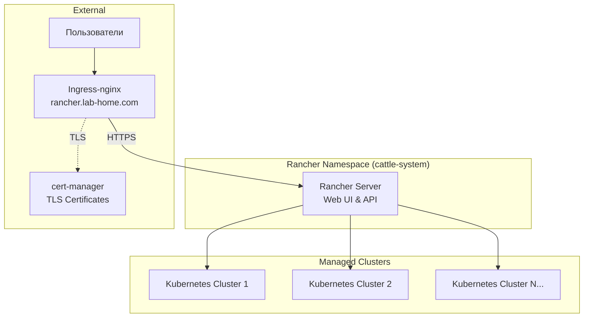

# Rancher ArgoCD Application

Этот каталог содержит конфигурацию для развертывания Rancher через ArgoCD.

<details>
<summary><strong>🚀Быстрый старт</strong></summary>

---

**Минимальные шаги для развертывания Rancher:**

1. **Настройте StorageClass (если еще не настроен):**
   ```bash
   # Установить local-path-provisioner
   kubectl apply -f https://raw.githubusercontent.com/rancher/local-path-provisioner/v0.0.24/deploy/local-path-storage.yaml
   
   # Установить local-path как StorageClass по умолчанию
   kubectl patch storageclass local-path -p '{"metadata": {"annotations":{"storageclass.kubernetes.io/is-default-class":"true"}}}'
   ```

2. **Разверните cert-manager (обязательно перед Rancher):**
   ```bash
   # Применить cert-manager Application
   kubectl apply -f 03-argocd/cert-manager/cert-manager.yaml
   
   # Дождаться готовности cert-manager
   kubectl wait --for=condition=ready pod -l app.kubernetes.io/instance=cert-manager -n cert-manager --timeout=300s
   
   # Создать ClusterIssuer
   kubectl apply -f 03-argocd/cert-manager/clusterissuer-selfsigned.yaml
   
   # Проверить ClusterIssuer
   kubectl get clusterissuer selfsigned-issuer
   ```

3. **Примените ArgoCD Application для Rancher:**
   ```bash
   kubectl apply -f 03-argocd/rancher/rancher.yaml
   ```

4. **Дождитесь готовности (5-10 минут):**
   ```bash
   kubectl get pods -n cattle-system -w
   # Поды должны быть в состоянии Running
   ```

5. **Получите начальный пароль:**
   ```bash
   kubectl get secret -n cattle-system bootstrap-secret -o jsonpath='{.data.bootstrapPassword}' | base64 -d ; echo
   ```

6. **Войдите в Rancher:**
   - URL: `https://rancher.lab-home.com`
   - Username: `admin`
   - Password: (из шага 5)

📋**Детальные инструкции:** см. секции ниже

</details>

<details>
<summary><strong>📋 Описание и компоненты</strong></summary>

---

Rancher - это платформа управления Kubernetes кластерами, которая позволяет:
- Управлять несколькими Kubernetes кластерами из единого интерфейса
- Развертывать и управлять приложениями через Helm charts и каталоги приложений
- Обеспечивать безопасность и политики доступа (RBAC)
- Мониторинг и логирование кластеров
- Управление CI/CD pipelines

### Архитектура развертывания



</details>

<details>
<summary><strong>📋Структура файлов</strong></summary>

---

```
rancher/
├── rancher.yaml          # ArgoCD Application манифест с inline Helm values
└── README.md             # Этот файл
```

**Примечание**: Namespace `cattle-system` создается автоматически через `CreateNamespace=true` в `rancher.yaml`.

</details>

<details>
<summary><strong>📋Предварительные требования</strong></summary>

---

1. **Kubernetes кластер версии 1.23+**
   ```bash
   kubectl version --short
   ```

2. **ArgoCD установлен и настроен**
   ```bash
   kubectl get pods -n argocd
   ```

3. **Ingress-nginx установлен**
   ```bash
   kubectl get pods -n ingress-nginx
   ```

4. **StorageClass настроен** для PersistentVolumes
   ```bash
   kubectl get storageclass
   ```

5. **cert-manager установлен и настроен** (см. секцию "Быстрый старт")
   ```bash
   kubectl get clusterissuer selfsigned-issuer
   ```

6. **DNS настроен** для домена `rancher.lab-home.com` (или измените в конфигурации)

</details>

<details>
<summary><strong>⚙️Установка</strong></summary>

---

### 1. Настройка StorageClass

Настройте StorageClass для PersistentVolumes (если еще не настроен):

```bash
# Установить local-path-provisioner
kubectl apply -f https://raw.githubusercontent.com/rancher/local-path-provisioner/v0.0.24/deploy/local-path-storage.yaml

# Установить local-path как StorageClass по умолчанию
kubectl patch storageclass local-path -p '{"metadata": {"annotations":{"storageclass.kubernetes.io/is-default-class":"true"}}}'

# Проверить StorageClass
kubectl get storageclass
```

### 2. Развертывание cert-manager

Rancher требует cert-manager для работы с TLS сертификатами. Разверните cert-manager **до** развертывания Rancher:

```bash
# Применить cert-manager Application
kubectl apply -f 03-argocd/cert-manager/cert-manager.yaml

# Дождаться готовности cert-manager
kubectl wait --for=condition=ready pod -l app.kubernetes.io/instance=cert-manager -n cert-manager --timeout=300s

# Проверить статус подов
kubectl get pods -n cert-manager
```

Ожидаемый результат - все поды в состоянии `Running`:
```
NAME                                       READY   STATUS    RESTARTS   AGE
cert-manager-xxxxxxxxxx-xxxxx             1/1     Running   0          2m
cert-manager-cainjector-xxxxxxxxxx-xxxxx  1/1     Running   0          2m
cert-manager-webhook-xxxxxxxxxx-xxxxx     1/1     Running   0          2m
```

### 3. Создание ClusterIssuer

Создайте ClusterIssuer для генерации сертификатов:

```bash
# Применить ClusterIssuer
kubectl apply -f 03-argocd/cert-manager/clusterissuer-selfsigned.yaml

# Проверить статус ClusterIssuer
kubectl get clusterissuer selfsigned-issuer

# Должен быть в состоянии Ready
kubectl describe clusterissuer selfsigned-issuer
```

### 4. Применение ArgoCD Application для Rancher

Примените Application для Rancher:

```bash
# Применить Application
kubectl apply -f 03-argocd/rancher/rancher.yaml

# Проверить статус Application
kubectl get application rancher -n argocd

# Детали Application
kubectl describe application rancher -n argocd
```

После развертывания cert-manager автоматически создаст Certificate на основе аннотаций Ingress.

### 5. Проверка статуса развертывания

#### Через ArgoCD CLI

```bash
# Список Applications
argocd app list

# Статус Rancher Application
argocd app get rancher

# Синхронизация (если не настроена автоматическая)
argocd app sync rancher
```

#### Через ArgoCD UI

1. Откройте ArgoCD UI: `http://argocd.lab-home.com:30080`
2. Войдите с учетными данными admin
3. Найдите Application `rancher`
4. Проверьте статус синхронизации

#### Через kubectl

```bash
# Проверить поды Rancher
kubectl get pods -n cattle-system

# Проверить Certificate
kubectl get certificate -n cattle-system

# Проверить Ingress
kubectl get ingress -n cattle-system
```

### Время развертывания

- **Ожидаемое время**: 5-10 минут
- Зависит от скорости загрузки образов
- Поды должны перейти в состояние `Running`
- Certificate должен стать Ready

</details>

<details>
<summary><strong>🔍Доступ и первоначальная настройка</strong></summary>

---

### Доступ к Rancher

После успешного развертывания Rancher будет доступен по адресу:

- **URL**: `https://rancher.lab-home.com`
- **Первый вход**: При первом входе будет запрошен пароль для пользователя `admin`

### Получение начального пароля

Пароль генерируется автоматически и хранится в Kubernetes Secret:

```bash
kubectl get secret -n cattle-system bootstrap-secret -o jsonpath='{.data.bootstrapPassword}' | base64 -d ; echo
```

**Примечание**: Секрет создается после развертывания Rancher. Если секрет отсутствует, подождите несколько минут и проверьте снова.

### Первый вход

1. Откройте браузер: `https://rancher.lab-home.com`
2. Войдите с:
   - Username: `admin`
   - Password: (полученный из секрета)
3. При первом входе будет предложено установить новый пароль (рекомендуется)

### Предупреждение о сертификате (self-signed)

⚠️При использовании self-signed сертификатов браузер покажет предупреждение о безопасности. Это нормально для тестовой среды. Нажмите "Advanced" → "Proceed to rancher.lab-home.com" для продолжения.

</details>

<details>
<summary><strong>🔍Проверка статуса развертывания</strong></summary>

---

### Проверка подов

```bash
# Список всех подов
kubectl get pods -n cattle-system

# Детальная информация
kubectl get pods -n cattle-system -o wide

# Проверка статуса конкретного пода
kubectl describe pod <pod-name> -n cattle-system

# Наблюдение за подами в реальном времени
watch kubectl get pods -n cattle-system
```

Ожидаемый результат - поды в состоянии `Running`:
```
NAME                     READY   STATUS    RESTARTS   AGE
rancher-xxxxxxxxxx-xxxxx 1/1     Running   0          5m
```

### Проверка логов

```bash
# Логи Rancher
kubectl logs -n cattle-system -l app=rancher --tail=50

# Логи конкретного пода
kubectl logs -n cattle-system <pod-name> --tail=100
```

### Проверка сервисов и Ingress

```bash
# Сервисы
kubectl get svc -n cattle-system

# Ingress
kubectl get ingress -n cattle-system

# Детали Ingress
kubectl describe ingress -n cattle-system

# Проверка доступности через curl
curl -I https://rancher.lab-home.com -k
```

### Проверка Certificate

```bash
# Список всех Certificate
kubectl get certificate -n cattle-system

# Детали Certificate
kubectl describe certificate rancher-tls -n cattle-system

# Проверить секрет с сертификатом
kubectl get secret rancher-tls -n cattle-system
```

### Использование ресурсов

```bash
# Использование ресурсов подами
kubectl top pods -n cattle-system

# События в namespace
kubectl get events -n cattle-system --sort-by='.lastTimestamp'

# Статус всех ресурсов
kubectl get all -n cattle-system
```

</details>

<details>
<summary><strong>⚙️Конфигурация и ресурсы</strong></summary>

---

### Текущее потребление ресурсов

**Вычислительные ресурсы:**

- **Rancher Server**: 1000m CPU / 1Gi RAM (requests), 2000m CPU / 2Gi RAM (limits)

**Хранилище:**

- Rancher использует in-memory хранилище для метаданных
- Данные управляемых кластеров хранятся в etcd каждого кластера

### Изменение домена

Отредактируйте `rancher.yaml`:

```yaml
hostname: ваш-домен.lab-home.com
```

И обновите `CATTLE_SERVER_URL`:
```yaml
extraEnv:
  - name: CATTLE_SERVER_URL
    value: https://ваш-домен.lab-home.com
```

Затем синхронизируйте Application в ArgoCD.

### Настройка ресурсов

Для изменения ресурсов отредактируйте `rancher.yaml`:

```yaml
resources:
  limits:
    cpu: 2000m
    memory: 2Gi
  requests:
    cpu: 1000m
    memory: 1Gi
```

### Обновление версии Rancher

Измените `targetRevision` в `rancher.yaml`:

```yaml
source:
  targetRevision: "2.8.5"  # Конкретная версия
  # или
  targetRevision: "*"      # Последняя версия из stable (по умолчанию)
```

ArgoCD автоматически синхронизирует изменения.

### Обновление конфигурации

1. Отредактируйте `rancher.yaml`
2. Закоммитьте изменения в Git
3. ArgoCD автоматически обнаружит изменения и синхронизирует (если включена автоматическая синхронизация)

</details>

<details>
<summary><strong>🔧Устранение неполадок</strong></summary>

---

### Поды в состоянии Pending

**Причина**: Недостаточно ресурсов или проблема с StorageClass

**Решение**:
```bash
# Проверить события
kubectl describe pod <pod-name> -n cattle-system

# Проверить доступные ресурсы
kubectl top nodes

# Проверить StorageClass
kubectl get storageclass
```

### Поды в CrashLoopBackOff

**Причина**: Ошибка в конфигурации или недостаточно ресурсов

**Решение**:
```bash
# Просмотреть логи пода
kubectl logs -n cattle-system <pod-name> --previous

# Проверить события
kubectl describe pod <pod-name> -n cattle-system

# Проверить ресурсы
kubectl top pod <pod-name> -n cattle-system
```

### Ingress не работает

**Причина**: Проблема с DNS или настройками ingress-nginx

**Решение**:
```bash
# Проверить Ingress
kubectl describe ingress -n cattle-system

# Проверить ingress-nginx
kubectl get pods -n ingress-nginx

# Проверить логи ingress-nginx
kubectl logs -n ingress-nginx -l app.kubernetes.io/name=ingress-nginx
```

### Certificate не создается или не Ready

**Симптомы**:
```bash
kubectl get certificate -n cattle-system
# Certificate в состоянии False (не Ready)
```

**Решение**:
```bash
# 1. Проверить аннотацию в Ingress
kubectl get ingress -n cattle-system -o yaml | grep cert-manager

# 2. Проверить события Certificate
kubectl describe certificate rancher-tls -n cattle-system

# 3. Проверить CertificateRequest (если создан)
kubectl get certificaterequest -n cattle-system
```

### Rancher недоступен после развертывания

**Причина**: Компоненты еще инициализируются

**Решение**:
```bash
# Проверить статус всех подов
kubectl get pods -n cattle-system

# Дождаться готовности подов (STATUS = Running, READY = 1/1)
# Это может занять 5-10 минут

# Проверить логи Rancher
kubectl logs -n cattle-system -l app=rancher --tail=100

# Проверить Ingress и Certificate
kubectl get ingress,certificate -n cattle-system
```

### Application не синхронизируется в ArgoCD

**Решение**:
```bash
# Проверить логи ArgoCD
kubectl logs -n argocd -l app.kubernetes.io/name=argocd-application-controller

# Проверить статус Application
kubectl describe application rancher -n argocd

# Попробовать синхронизировать вручную
argocd app sync rancher
```

### Пересоздание Application

```bash
# Удалить Application (не удалит Rancher из кластера)
kubectl delete application rancher -n argocd

# Применить снова
kubectl apply -f 03-argocd/rancher/rancher.yaml
```

</details>

<details>
<summary><strong>🔒Включение SSL/TLS</strong></summary>

---

⚠️ **ВАЖНО: Правильный порядок развертывания**

1. **Сначала разверните cert-manager:**
   ```bash
   kubectl apply -f 03-argocd/cert-manager/cert-manager.yaml
   ```

2. **Дождитесь готовности cert-manager:**
   ```bash
   kubectl wait --for=condition=ready pod -l app.kubernetes.io/instance=cert-manager -n cert-manager --timeout=300s
   ```

3. **Создайте ClusterIssuer:**
   ```bash
   kubectl apply -f 03-argocd/cert-manager/clusterissuer-selfsigned.yaml
   ```

4. **Проверьте ClusterIssuer:**
   ```bash
   kubectl get clusterissuer selfsigned-issuer
   # Должен быть в состоянии Ready
   ```

5. **Только после этого развертывайте Rancher** (уже настроен для использования cert-manager)

**Если Rancher развернут до ClusterIssuer:**

Если Rancher был развернут до создания ClusterIssuer, Certificate может быть в состоянии `False`. Исправление:

```bash
# Удалить старые TLS секреты
kubectl delete secret rancher-tls rancher-tls-ca rancher-tls-chain -n cattle-system

# cert-manager автоматически создаст новые секреты
# Проверить статус
kubectl get certificate rancher-tls -n cattle-system
# Должен стать Ready
```

**Конфигурация для Let's Encrypt (production):**

Для production окружения используйте Let's Encrypt:

1. Создайте ClusterIssuer для Let's Encrypt (см. cert-manager README)
2. Обновите конфигурацию Rancher в `rancher.yaml`:
   ```yaml
   ingress:
     annotations:
       cert-manager.io/cluster-issuer: "letsencrypt-prod"  # Вместо selfsigned-issuer
     tls:
       enabled: true
       source: secret
       secretName: rancher-tls
   ```

</details>

<details>
<summary><strong>💡Рекомендации по оптимизации</strong></summary>

---

### Для production окружения

1. **Увеличьте ресурсы:**
   ```yaml
   resources:
     limits:
       cpu: 4000m
       memory: 4Gi
     requests:
       cpu: 2000m
       memory: 2Gi
   ```

2. **Используйте Let's Encrypt** вместо self-signed сертификатов

3. **Настройте backup для etcd** управляемых кластеров

4. **Включите мониторинг** (интеграция с существующим Prometheus)

5. **Настройте алертинг** для критических событий

6. **Используйте внешний ingress controller** с SSL termination

7. **Настройте RBAC** и политики безопасности

8. **Настройте резервное копирование** конфигурации Rancher

</details>

<details>
<summary><strong>⚠️Важные замечания</strong></summary>

---

⚠️ **Для тестовой среды:**
- Используется self-signed сертификат (браузер покажет предупреждение)
- Уменьшенные ресурсы
- Подходит для разработки и тестирования

✅ **Для production окружения:**
- Обязательно включите SSL/TLS с Let's Encrypt
- Настройте cert-manager
- Увеличьте ресурсы
- Настройте backup для etcd управляемых кластеров
- Используйте внешний ingress controller с SSL termination
- Настройте мониторинг и алертинг
- Настройте RBAC и политики безопасности

</details>
